# Página do admin

Este documento explica o acesso à página do admin, a consulta com pesquisa e paginação, a edição e exclusão de usuários e a exclusão de comentários.

Os caminhos começam na pasta principal do projeto, onde está **index.js**. As linhas indicadas para os prints consideram os arquivos comentados utilizados nesta documentação. Se o código mudar, use também o nome da função para localizar o trecho.

## Objetivo da página

Em **private/admin/admin.html**, o admin encontra as opções de consulta de usuários, comentários e relatórios.

As operações disponíveis são:

- Consultar usuários com pesquisa e paginação.
- Editar nome, e-mail, tipo e avatar de uma conta.
- Excluir outras contas.
- Consultar comentários com pesquisa e paginação.
- Excluir comentários.
- Consultar os logs registrados pelo sistema.

A página não possui edição de comentários nem edição ou exclusão de logs.

As aulas continuam sendo mantidas nos arquivos Markdown. Não existe uma ferramenta de criação ou edição de aulas nessa página.

O funcionamento dos relatórios está detalhado em **DOC_LOGS.md**.

**Print da página inicial do admin:**

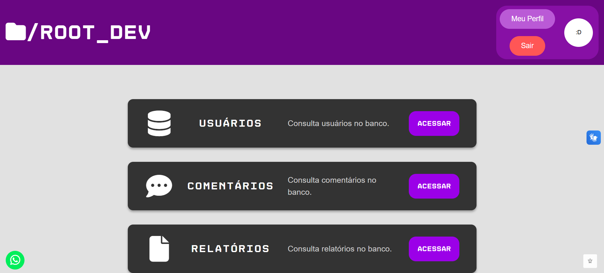

## Arquivos que participam do funcionamento

- **public/admin/loginAdm.html:** formulário de acesso do admin.
- **private/admin/admin.html:** estrutura da página protegida.
- **private/admin/admin.js:** consultas, pesquisa, paginação e montagem dos formulários.
- **routes/admRoutes.js:** rotas de acesso e manutenção.
- **middleware/verificarAdmin.js:** verificação da sessão e do tipo de usuário.
- **controller/admController.js:** validação das operações e preparação das respostas.
- **model/userModel.js:** consulta, atualização e exclusão de usuários.
- **model/comentarioModel.js:** consulta e exclusão de comentários.
- **model/logModel.js:** gravação e consulta dos logs.
- **validacoes/usuarioValidacao.js:** regras dos dados dos usuários.
- **public/admin/admin.css:** responsividade das consultas.
- **public/styles/cadastro-login.css:** responsividade do formulário de edição.

## Como o login do admin é enviado

Em **public/admin/loginAdm.html**, o formulário envia **POST /adm** com e-mail e senha.

Esse acesso utiliza e-mail. O campo não oferece a busca por nome de usuário utilizada no login comum.

Em **routes/admRoutes.js**, a rota encaminha os dados para **loginAdm**, de **controller/admController.js**.

A criação do 1º admin é explicada no **README.md**. Essa página de login não transforma uma conta comum em admin.

**Print do login do admin:**

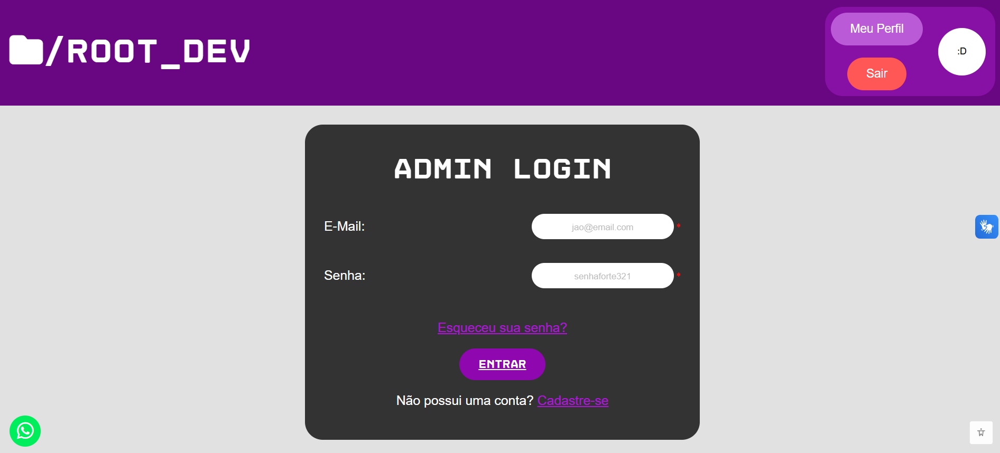

## Como as credenciais são verificadas

Em **controller/admController.js**, **loginAdm(req, res)** lê e-mail e senha de **req.body**.

A função chama **buscarPorEmail**, de **model/userModel.js**, para localizar a conta.

Quando o registro é encontrado, utiliza:

```js
const senhaCorreta = await bcrypt.compare(senha, user.user_pass)
```

A senha informada é comparada com o hash armazenado no banco.

Depois, a função verifica se **user.user_tipo** é igual a **admin**.

- Conta não encontrada ou senha incorreta: status 401.
- Conta com tipo diferente de admin: status 403.
- Falha na consulta ou na comparação: status 500.

A função **buscarPorEmail** entrega o resultado pelo callback. É dentro desse callback que o código continua a verificação do login.

**Print da verificação de acesso do admin:**

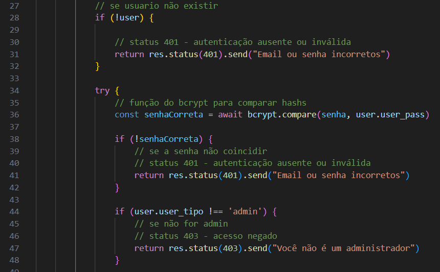

## Como o acesso é concluído

Ainda em **controller/admController.js**, **loginAdm** preenche **req.session.usuario** com id, nome, tipo e avatar.

Depois, registra a ação **Login realizado no acesso do admin** por **model/logModel.js**.

Quando essa etapa termina, o controller redireciona para **/adm/painel**.

Se a gravação do log falhar, o erro é mostrado no terminal e o redirecionamento continua.

**Print da sessão e do redirecionamento do admin:**

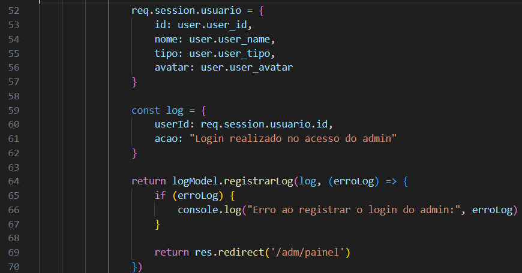

## Como as rotas são protegidas

Em **routes/admRoutes.js**, as rotas de consulta e manutenção utilizam **verificarAdmin** antes do controller.

Em **middleware/verificarAdmin.js**, a função realiza estas verificações:

```js
if (!req.session.usuario) {
    return res.status(401).send("Você precisa fazer login.")
}

if (req.session.usuario.tipo !== 'admin') {
    return res.status(403).send("Acesso negado.")
}
```

Quando as condições são atendidas, **next()** permite continuar para a função da rota.

Essa verificação ocorre no servidor. Não depende apenas da presença ou ausência dos botões na página.

O middleware utiliza o tipo guardado na sessão. Ele não consulta o banco novamente em cada chamada.

**Print da proteção das rotas:**

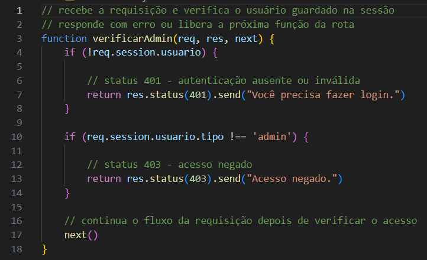

## Como o HTML e o script protegidos são enviados

Em **routes/admRoutes.js**, as rotas **/painel** e **/admin.js** também utilizam **verificarAdmin**.

Em **controller/admController.js**:

- **enviarPainel(req, res):** envia **private/admin/admin.html**.
- **enviarAdminJs(req, res):** envia **private/admin/admin.js**.

As funções usam **res.sendFile** para entregar os arquivos.

Em **private/admin/admin.html**, o script é carregado pelo link **/adm/admin.js**. Ele não é carregado diretamente de uma pasta pública.

**Print das rotas do admin:**

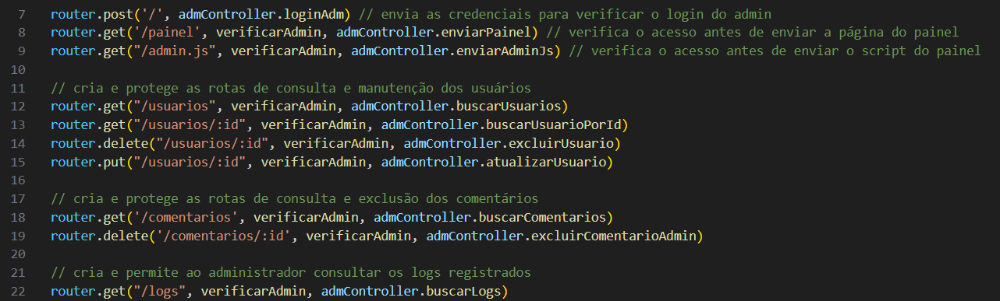

## Como as áreas da página são controladas

Em **private/admin/admin.js**, o objeto **form** guarda referências a:

- **tabelaConsulta:** área que recebe as consultas.
- **admInicio:** opções iniciais da página.
- **botaoVoltar:** controle para retornar ao início.
- **formEdicao:** área do formulário de edição.

No mesmo arquivo, existem 3 funções de organização:

- **abrirConsulta():** mostra o botão de voltar, esconde as opções iniciais e limpa as áreas de consulta e edição.
- **abrirEdicao():** limpa as áreas antes de montar o formulário.
- **voltarInicio():** limpa as áreas abertas e mostra novamente as opções iniciais.

Essas funções alteram a interface. Elas não consultam o banco nem enviam respostas ao servidor.

**Print do controle das áreas da página:**

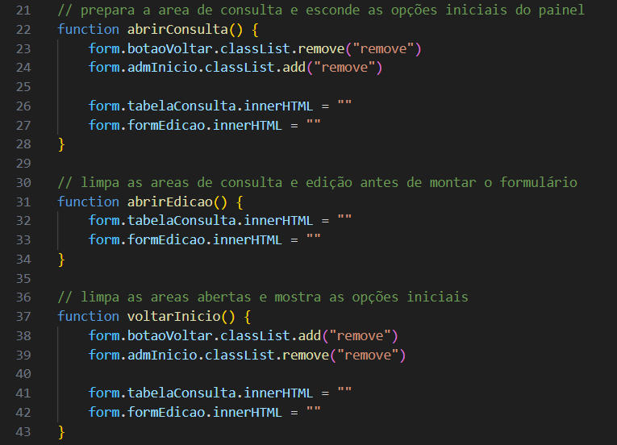

## Como a consulta de usuários começa

Em **private/admin/admin.js**, **mostrarUsuarios(pesquisa = "", pagina = 1)** recebe o termo e a página desejada.

Quando é chamada sem argumentos, consulta a página 1 sem filtro.

A função chama **abrirConsulta**, mostra uma mensagem de carregamento e prepara o link:

```js
const endereco = `/adm/usuarios?pesquisa=${encodeURIComponent(pesquisa)}&pagina=${pagina}`
```

**encodeURIComponent** prepara o termo para ser inserido no link.

Depois, a função envia o fetch, confere **resposta.ok** e lê o JSON.

Os valores de pesquisa e página ficam guardados em **pesquisaUsuariosAtual** e **paginaUsuariosAtual**. Eles são reutilizados ao navegar ou atualizar a consulta.

**Print da solicitação de usuários:**

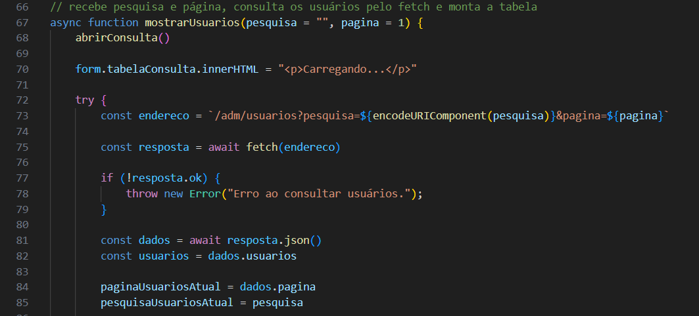

## Como o controller prepara a paginação

Em **controller/admController.js**, **buscarUsuarios(req, res)** recebe **req.query.pesquisa** e **req.query.pagina**.

Sem página informada, utiliza 1.

O limite e o deslocamento são calculados assim:

```js
const limite = 50
const deslocamento = (pagina - 1) * limite
```

**limite** define a quantidade máxima exibida. **deslocamento** informa quantos registros precisam ser pulados.

- Página 1: deslocamento 0.
- Página 2: deslocamento 50.
- Página 3: deslocamento 100.

O controller verifica se a página é um inteiro seguro maior ou igual a 1, se o deslocamento é um inteiro seguro e se a pesquisa é um texto.

Valores recusados recebem status 400.

**Print da validação da paginação:**

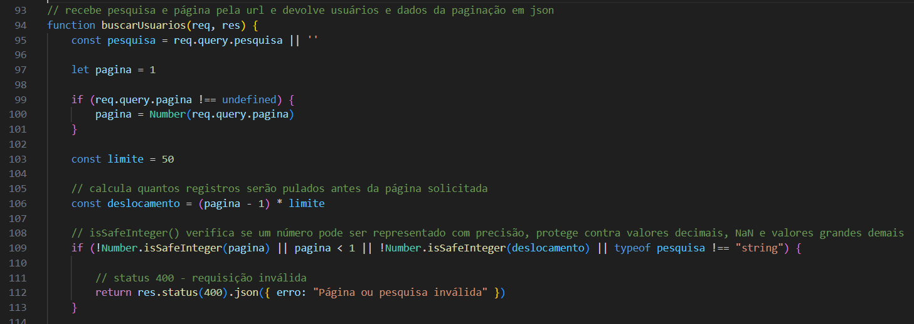

## Como a consulta usa o limite no banco

Em **model/userModel.js**, **buscarTodosUsuarios(pesquisa, limite, deslocamento, callback)** recebe os valores preparados pelo controller.

Quando existe pesquisa, o SQL procura correspondências em:

- Nome.
- E-mail.
- Tipo de usuário.
- Id convertido para texto.

A consulta utiliza **LIKE** com o termo entre **%**. Isso permite encontrar o termo dentro do valor de um campo.

**CAST(user_id AS CHAR)** permite comparar o id como texto.

Os valores são enviados separadamente ao SQL, pelos parâmetros da consulta.

Ao final, a consulta utiliza:

```sql
ORDER BY user_id ASC
LIMIT ? OFFSET ?
```

**ORDER BY** organiza os registros pelo id. **LIMIT** restringe a quantidade retornada. **OFFSET** pula os registros anteriores à página solicitada.

O banco devolve apenas o trecho solicitado, em vez de enviar todos os usuários para o navegador.

## Como o sistema identifica a próxima página

Em **controller/admController.js**, **buscarUsuarios** solicita **limite + 1** registros ao model.

Como o limite exibido é 50, a consulta pode devolver até 51 registros.

O controller verifica:

```js
const temProxima = usuarios.length > limite

if (temProxima) {
    usuarios.pop()
}
```

Se houver 51 registros, existe uma próxima página. **pop()** remove o registro extra antes da resposta.

O JSON enviado contém:

```js
return res.status(200).json({
    usuarios: usuarios,
    pagina: pagina,
    temProxima: temProxima
})
```

O navegador recebe no máximo 50 usuários e a informação necessária para controlar o botão Próxima.

Esse modelo não calcula o total de páginas. Ele informa somente se existem mais resultados depois da página atual.

**Print da identificação da próxima página:**

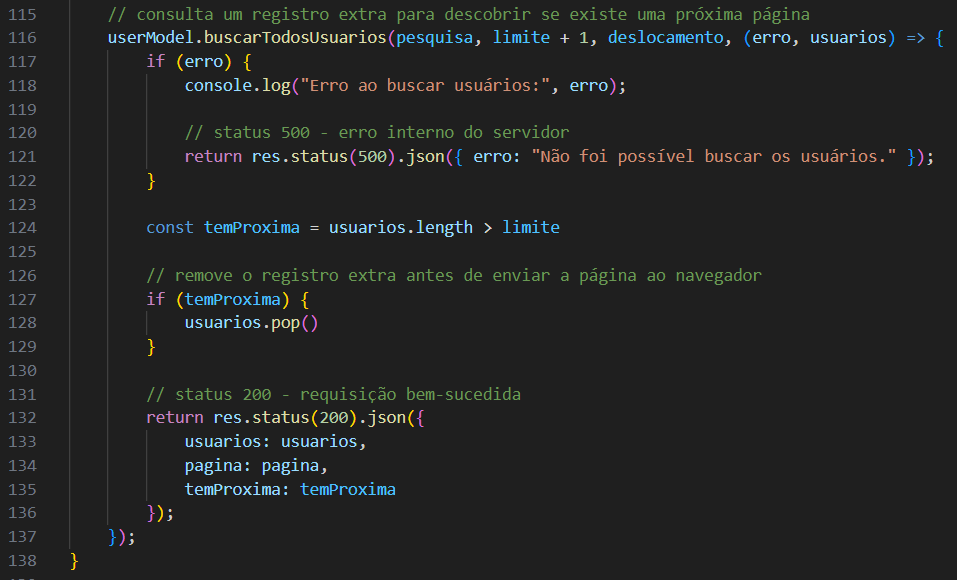

## Como os usuários são exibidos

Em **private/admin/admin.js**, **mostrarUsuarios** monta a estrutura da consulta com pesquisa, tabela e paginação.

Depois, **forEach** percorre os usuários recebidos.

Para cada usuário, **insertAdjacentHTML("beforeend", ...)** acrescenta uma linha com células e botões.

**lastElementChild** encontra a linha recém-criada, e **querySelectorAll("td")** encontra suas células.

Os valores são preenchidos com **innerText**:

```js
colunas[0].innerText = usuario.user_id
colunas[1].innerText = usuario.user_name
colunas[2].innerText = usuario.user_email
colunas[3].innerText = usuario.user_tipo
colunas[4].innerText = usuario.user_avatar
```

Os botões recebem eventos que chamam **editarUsuario** ou **excluirUsuario** com o id daquele registro.

Se a lista estiver vazia, a tabela apresenta a mensagem de que nenhum usuário foi encontrado naquela página.

**Print do preenchimento das linhas:**

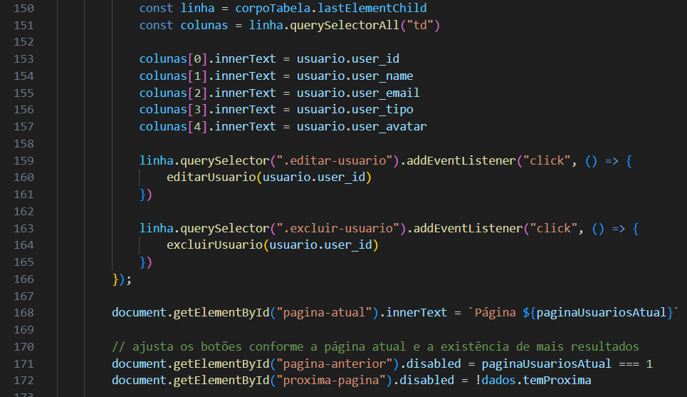

**Print da consulta de usuários:**

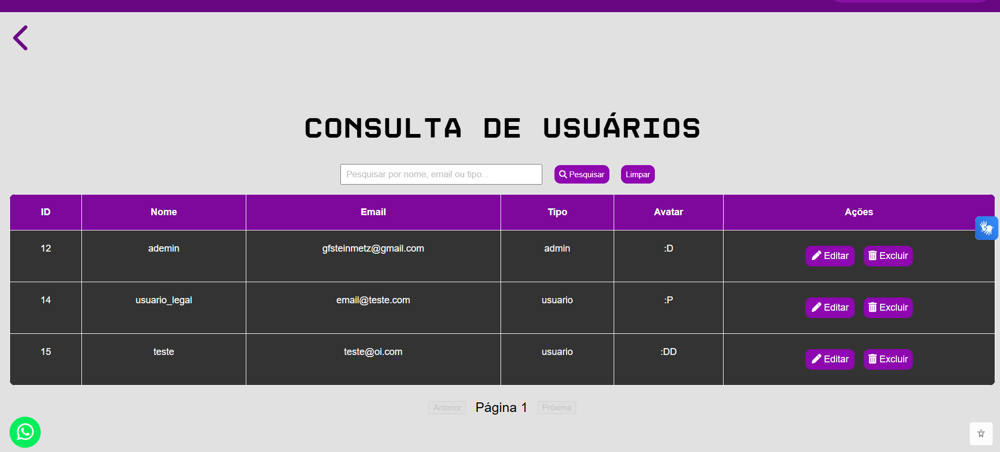

## Como a navegação e a pesquisa funcionam

Em **private/admin/admin.js**, **mudarPaginaUsuarios(direcao)** recebe:

- **-1:** voltar uma página.
- **1:** avançar uma página.

A função soma esse valor à página atual e impede resultados menores que 1. Depois, chama **mostrarUsuarios** mantendo a pesquisa.

Na montagem da consulta:

- Anterior fica desabilitado na página 1.
- Próxima fica desabilitado quando **temProxima** é falso.

Em **pesquisarUsuarios(event)**, **preventDefault** impede o envio comum do formulário. A função lê o campo e chama **mostrarUsuarios(pesquisa, 1)**.

Uma nova pesquisa começa na página 1 para não reutilizar uma posição de outra consulta.

**limparPesquisa()** chama **mostrarUsuarios("", 1)**, removendo o filtro.

**Print das funções de pesquisa de usuários:**

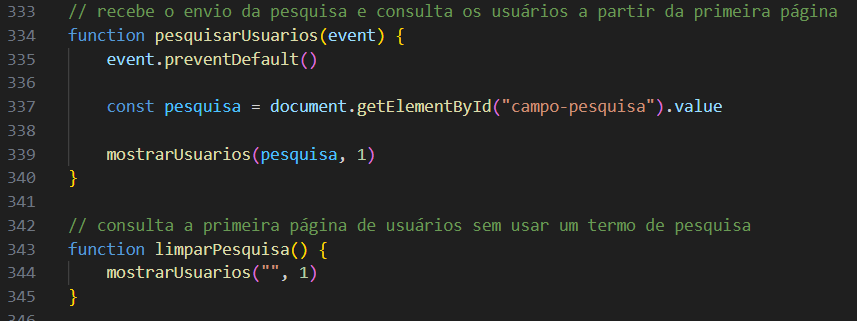

## Como o formulário de edição é aberto

Em **private/admin/admin.js**, **editarUsuario(id)** recebe o id escolhido e consulta **GET /adm/usuarios/:id**.

Em **controller/admController.js**, **buscarUsuarioPorId(req, res)** lê o id e chama **buscarPorId**, de **model/userModel.js**.

O model consulta os dados sem selecionar **user_pass**.

- Se ocorrer erro, o controller responde com 500.
- Se a conta não existir, responde com 404.
- Se a conta existir, devolve seus dados em JSON.

De volta a **private/admin/admin.js**, **editarUsuario** chama **abrirEdicao** e monta o formulário com nome, e-mail, tipo e avatar.

Essa operação não oferece alteração de senha.

## Como a prévia do avatar funciona na edição

Em **private/admin/admin.js**, os elementos do formulário são criados depois da consulta.

Por isso, **editarUsuario** busca o campo de avatar somente após inserir o formulário:

```js
const campoAvatar = document.getElementById("edit-avatar")

campoAvatar.value = usuario.user_avatar || ""

campoAvatar.addEventListener("input", atualizarPreviewAvatarAdm)

atualizarPreviewAvatarAdm()
```

A chamada final mostra o avatar atual antes de qualquer digitação.

No mesmo arquivo, **atualizarPreviewAvatarAdm()** lê **edit-avatar** e preenche **avatar-previa** com **innerText**. Quando o campo está vazio, utiliza **:D**.

**Print da ligação da prévia do avatar:**

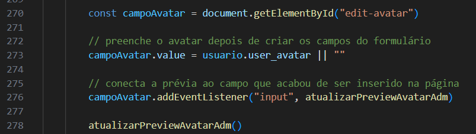

**Print da edição de usuário:**

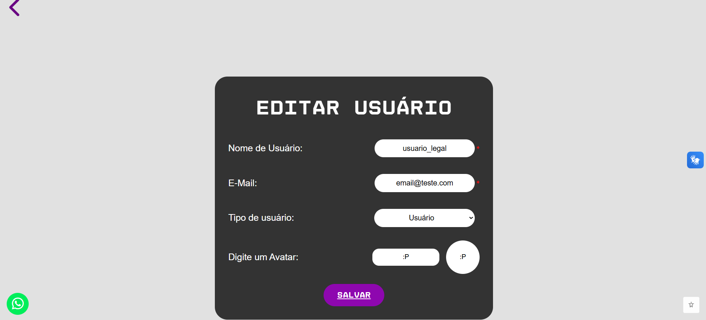

## Como a edição é enviada

Em **private/admin/admin.js**, **salvarEdicao(event, id)** recebe o envio do formulário e o id da conta editada.

A função utiliza **event.preventDefault**, lê os campos e monta **usuarioAtualizado**.

Depois, envia **PUT /adm/usuarios/:id** com o corpo em JSON.

O objeto contém:

- **nome**
- **email**
- **tipo**
- **avatar**

Se o avatar estiver vazio, o script envia **:D**.

**Print do envio da edição:**

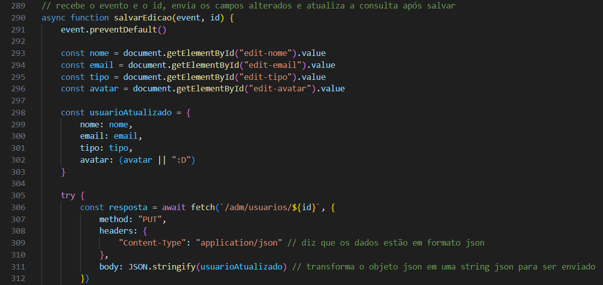

## Como o controller valida a edição

Em **controller/admController.js**, **atualizarUsuario(req, res)** recebe o id pela rota e os campos por **req.body**.

A função verifica se o id é um inteiro seguro maior que 0.

Nome, e-mail e avatar passam por **validarDadosUsuario**, de **validacoes/usuarioValidacao.js**.

O tipo é verificado separadamente e precisa ser **usuario** ou **admin**.

Depois, o controller chama **buscarUsuarioDuplicado**, de **model/userModel.js**, ignorando o id da conta editada.

- Dados inválidos: status 400.
- Nome ou e-mail de outra conta: status 409.
- Falha ao consultar ou atualizar: status 500.
- Conta não encontrada na atualização: status 404.

O controller também trata **ER_DUP_ENTRY** caso o banco identifique duplicidade durante o UPDATE.

**Print da validação dos campos e do tipo:**

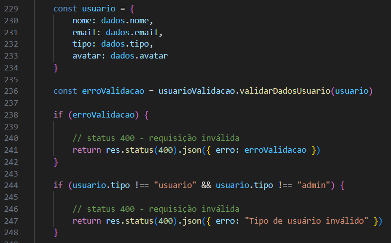

## Como a edição é gravada e concluída

Em **model/userModel.js**, **atualizarUsuario(id, usuario, callback)** atualiza nome, e-mail, tipo e avatar pelo id informado.

A função devolve o resultado ao controller.

Em **controller/admController.js**, **atualizarUsuario** registra a ação com:

- O id do admin que realizou a operação.
- A descrição da alteração.
- O id da conta editada dentro da descrição.

Depois, devolve a mensagem de sucesso.

Em **private/admin/admin.js**, **salvarEdicao** chama **verificarLogin()**, de **public/scripts/navbar-auth.js**, para atualizar a navegação conforme a sessão atual.

Por fim, mostra a mensagem e retorna à consulta, mantendo a pesquisa e a página utilizadas.

## Como um usuário é excluído

Em **private/admin/admin.js**, **excluirUsuario(id)** pede confirmação e envia **DELETE /adm/usuarios/:id**.

Em **controller/admController.js**, **excluirUsuario(req, res)** verifica se o id é válido.

A função também impede a exclusão da própria conta por essa consulta:

```js
if (id === Number(req.session.usuario.id)) {
    return res.status(400).json({ erro: "Você não pode excluir sua própria conta" })
}
```

A exclusão do próprio perfil possui outro fluxo, explicado em **DOC_PERFIL.md**.

Depois das verificações, o controller chama **excluirUsuario**, de **model/userModel.js**.

**Print das verificações para excluir um usuário:**

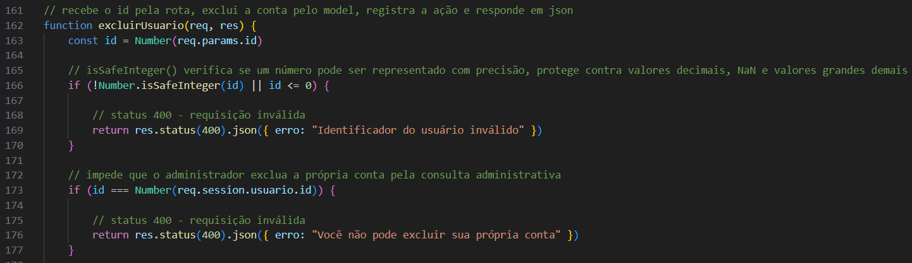

## Como os vínculos afetam a exclusão

Em **model/userModel.js**, **excluirUsuario** executa o DELETE da conta.

As regras das chaves estrangeiras determinam o destino dos registros vinculados:

- Comentários: removidos com **ON DELETE CASCADE**.
- Recuperações: removidas com **ON DELETE CASCADE**.
- Logs anteriores: preservados com **ON DELETE SET NULL**.

Essas regras precisam acompanhar a estrutura do banco.

Em **controller/admController.js**, se o banco retornar **ER_ROW_IS_REFERENCED_2**, a função responde com 409, indicando que existem vínculos que impedem a exclusão.

Depois da remoção, o controller registra o id do admin e identifica a conta excluída na descrição do log.

Em **private/admin/admin.js**, a consulta é atualizada mantendo a pesquisa e a página.

Se a exclusão retirar o último registro daquela página, ela pode ficar vazia. O código não retorna automaticamente para a página anterior.

## Como os comentários são consultados

Em **private/admin/admin.js**, **mostrarComentarios(pesquisa = "", pagina = 1)** consulta **GET /adm/comentarios**.

Em **controller/admController.js**, **buscarComentarios(req, res)** utiliza o mesmo funcionamento de paginação dos usuários:

- Lê pesquisa e página.
- Define o limite de 50 registros.
- Calcula o deslocamento.
- Valida os parâmetros.
- Solicita 51 registros para identificar a próxima página.
- Remove o registro extra.
- Devolve comentários, página e **temProxima**.

Em **model/comentarioModel.js**, **buscarTodosComentarios** permite pesquisar por:

- Texto do comentário.
- Nome do autor.
- Categoria.
- Tópico.
- Id do comentário.

A consulta relaciona os comentários aos usuários e ordena por data decrescente e id decrescente.

## Como a consulta de comentários é montada

Em **private/admin/admin.js**, **mostrarComentarios** cria as linhas e preenche os valores com **innerText**.

A consulta mostra:

- Id.
- Autor.
- Categoria.
- Tópico.
- Texto.
- Data.
- Ação de exclusão.

A data é apresentada com:

```js
new Date(comentario.com_data).toLocaleString("pt-BR")
```

**mudarPaginaComentarios**, **pesquisarComentarios** e **limparPesquisaComentarios** controlam a navegação e o filtro.

A lógica é equivalente à consulta de usuários, mas utiliza variáveis próprias para preservar o estado dos comentários.

**Print do preenchimento dos comentários:**

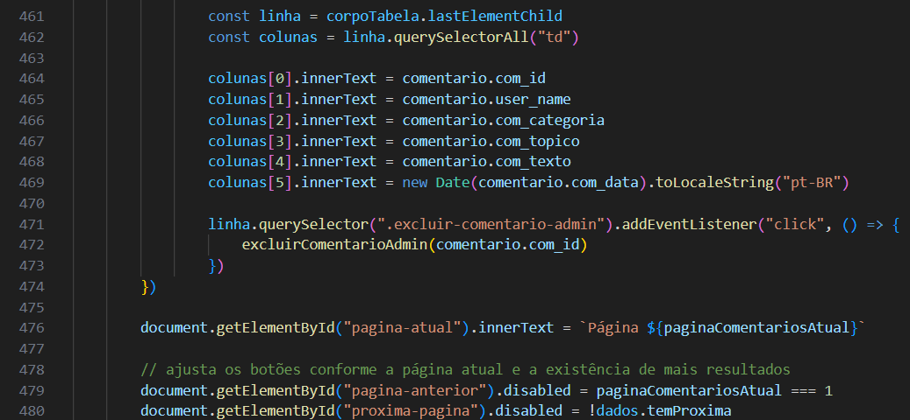

**Print da consulta de comentários:**

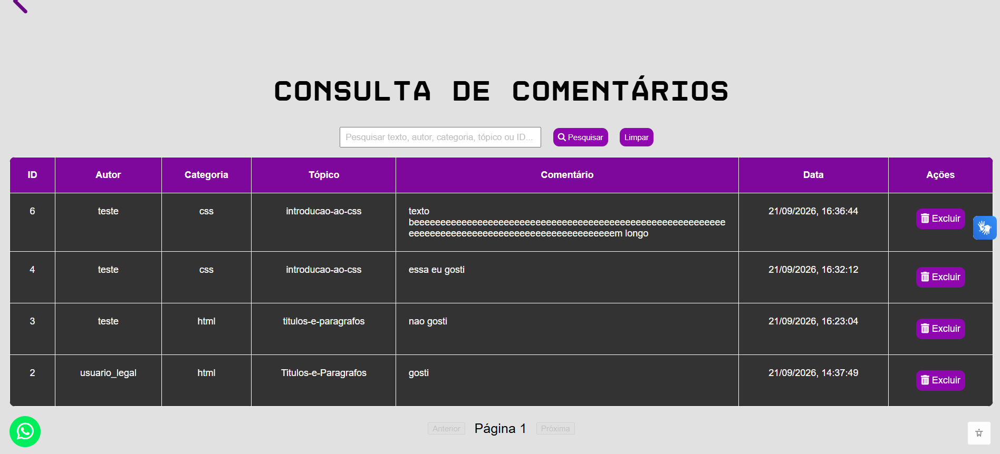

## Como o admin exclui um comentário

Em **private/admin/admin.js**, **excluirComentarioAdmin(id)** pede confirmação e envia **DELETE /adm/comentarios/:id**.

A função trata os status 401 e 403 antes de ler o JSON, pois a resposta do middleware de acesso pode ser um texto.

Em **controller/admController.js**, **excluirComentarioAdmin(req, res)** valida o id e chama a função correspondente de **model/comentarioModel.js**.

O model exclui pelo id do comentário. Nessa operação, não exige que o admin seja o autor, pois a autorização depende da rota protegida.

Se nenhum registro for removido, o controller responde com 404. Se ocorrer falha no banco, responde com 500.

Depois da exclusão, registra a ação com o id do admin e o id do comentário na descrição.

No navegador, a consulta é carregada novamente mantendo o filtro e a página.

**Print da solicitação de exclusão de comentário:**

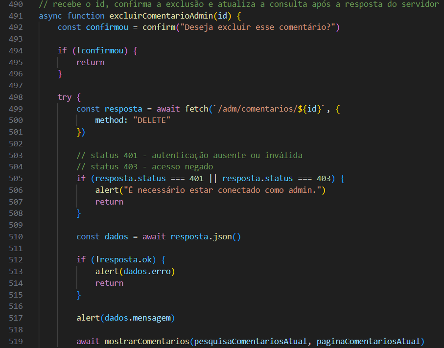

## Como os relatórios são acessados

Em **private/admin/admin.js**, **mostrarLogs(pesquisa = "", pagina = 1)** consulta **GET /adm/logs** e monta a lista de registros.

As funções **mudarPaginaLogs**, **pesquisarLogs** e **limparPesquisaLogs** controlam a página e o filtro dessa consulta.

Em **controller/admController.js**, **buscarLogs** prepara a paginação e chama **buscarTodosLogs**, de **model/logModel.js**.

Essa consulta não possui botões de edição ou exclusão. Os detalhes da gravação e da apresentação estão em **DOC_LOGS.md**.

## Como as tabelas se adaptam às telas

Em **public/admin/admin.css**, a responsividade das consultas utiliza uma área de rolagem ao redor da tabela.

As regras principais são:

- **#tabela-consulta** com **min-width: 0:** permite que a área encolha.
- **.tabela-rolagem** com **overflow-x: auto:** mantém a rolagem horizontal dentro dessa área.
- **.tabela-admin** com **min-width: 800px:** preserva espaço para as colunas, mesmo quando a tela é menor.
- **overflow-wrap: anywhere:** permite quebrar textos longos nas células.

Assim, a tabela pode ser rolada horizontalmente sem exigir que toda a página tenha a mesma largura.

A paginação utiliza **flex-wrap: wrap**, permitindo reorganizar seus controles quando falta espaço.

Até 700 pixels, o formulário de pesquisa passa a se organizar em coluna. O formulário de edição também utiliza as regras compartilhadas de **public/styles/cadastro-login.css**.

**Print das regras de rolagem:**

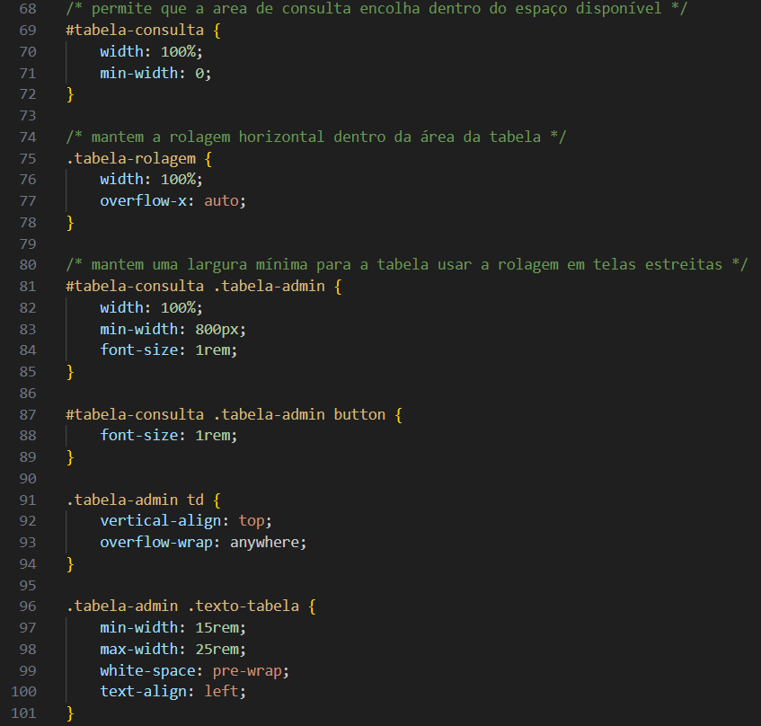

**Print da consulta em tela de celular:**

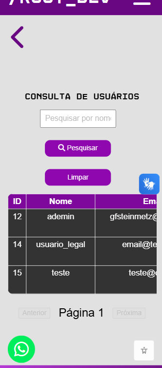
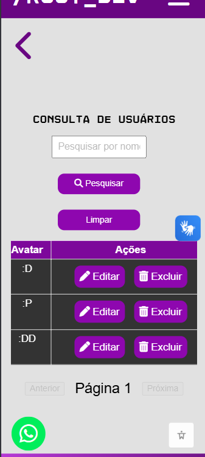

## Como manter as consultas

Em **private/admin/admin.js**, mantenha correspondência entre as colunas criadas e os índices utilizados para preenchê-las.

Se uma coluna for adicionada, atualize o cabeçalho, as células, os valores preenchidos e o **colspan** da mensagem de lista vazia.

Em **controller/admController.js**, alterações no limite precisam manter a consulta com o registro extra e a remoção desse registro antes da resposta.

Em **routes/admRoutes.js**, novas operações da página do admin precisam continuar utilizando **verificarAdmin**.

Operações que alteram registros devem manter a integração com **model/logModel.js** depois da confirmação da alteração.

As regras de validação e os relacionamentos do banco precisam acompanhar qualquer novo campo ou operação.