# Banco de dados

## Como o projeto armazena as informações

O ROOT DEV utiliza o MySQL para armazenar usuários, comentários, recuperações de senha e logs.

Os conteúdos das aulas ficam em arquivos Markdown no servidor. O banco guarda as informações dos comentários relacionados a essas aulas, mas não armazena o texto dos conteúdos didáticos.

As tabelas usadas pelo sistema são:

- **tb_usuarios:** guarda os dados das contas.
- **tb_comentarios:** guarda os comentários publicados nas aulas.
- **tb_recuperacoes:** guarda as solicitações de recuperação de senha.
- **tb_logs_acesso:** guarda os registros das ações acompanhadas pelo sistema.

As instruções para preparar o banco e cadastrar o 1º admin ficam no **README.md**.

## Comunicação entre o código e o banco

O arquivo **config/database.js** cria a conexão com o MySQL.

Os arquivos da pasta **model** utilizam essa conexão para executar as consultas. Cada model concentra as operações relacionadas à sua parte do sistema:

- **model/userModel.js:** cadastro, consulta, edição e exclusão de usuários.
- **model/comentarioModel.js:** publicação, consulta e exclusão de comentários.
- **model/recuperacaoModel.js:** criação, consulta e conclusão das recuperações de senha.
- **model/logModel.js:** registro e consulta dos logs.

O fluxo de uma solicitação funciona assim:

1. O JavaScript da página envia uma requisição com **fetch**.
2. A rota encaminha a requisição para o controller.
3. O controller verifica os dados recebidos e as permissões necessárias.
4. O controller chama uma função do model.
5. O model executa o comando SQL.
6. O banco devolve o resultado ao model.
7. O model entrega o resultado ao controller por uma **callback**.
8. O controller envia a resposta para a página.

O model não responde diretamente ao navegador. Ele recebe os dados necessários para a consulta e devolve o resultado ao controller.

## Conexão com o MySQL

No arquivo **config/database.js**, a função **mysql.createConnection()** recebe as configurações usadas para localizar e acessar o banco:

- **host:** local onde o MySQL está funcionando.
- **port:** porta usada na conexão.
- **user:** usuário do MySQL.
- **password:** senha desse usuário.
- **database:** nome do banco utilizado pelo projeto.

O usuário informado nessa configuração é uma conta do MySQL. Ele não é o mesmo que o usuário cadastrado na tabela **tb_usuarios**.

Depois, **conexao.connect()** tenta estabelecer a conexão. Se ocorrer um erro, o código mostra esse erro no terminal. Quando a conexão funciona, uma mensagem informa que o banco foi conectado.

No final do arquivo, **module.exports** permite que os models utilizem a mesma conexão.

**Print do código de conexão:**

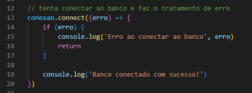

## Identificação e relacionamento dos registros

Cada tabela possui uma **chave primária**, que identifica seus registros:

- **user_id:** identifica o usuário.
- **com_id:** identifica o comentário.
- **rec_id:** identifica a recuperação.
- **log_id:** identifica o log.

Esses campos utilizam **AUTO_INCREMENT**. Isso faz o banco gerar o ID quando um registro é inserido.

Os IDs não representam a quantidade atual de registros. Se um registro for excluído, podem existir intervalos entre os números.

As tabelas de comentários, recuperações e logs também possuem uma **chave estrangeira**, que aponta para o usuário relacionado ao registro.

Uma chave estrangeira impede, por exemplo, que um comentário seja salvo com o ID de um usuário que não existe.

## Tabela tb_usuarios

A tabela **tb_usuarios** armazena as contas utilizadas no site.

Seus campos são:

- **user_id:** identificação do usuário, gerada automaticamente.
- **user_name:** nome utilizado no cadastro e no login.
- **user_email:** e-mail usado no cadastro, no login e na recuperação de senha.
- **user_pass:** hash da senha.
- **user_tipo:** identifica se a conta é **usuario** ou **admin**.
- **user_avatar:** representação textual escolhida para o avatar.

O nome permite até **80 caracteres**. O campo de e-mail comporta **255 caracteres**, mas a validação da aplicação limita a entrada a **254 caracteres**.

O avatar permite até **10 caracteres**, conforme a validação utilizada no projeto. Quando o usuário não informa um avatar, o código utiliza **:D**.

O campo **user_pass** comporta o hash produzido pelo bcrypt. A senha digitada não é salva diretamente nesse campo.

O campo **user_tipo** possui **usuario** como valor padrão. O cadastro público não permite que a pessoa escolha o tipo **admin**.

O telefone não faz parte da estrutura atual do cadastro.

### Nome e e-mail únicos

Na tabela **tb_usuarios**, os campos **user_name** e **user_email** possuem índices **UNIQUE**.

Isso impede que o banco aceite registros duplicados nesses campos.

O controller consulta a existência de outro usuário com os mesmos dados antes de salvar. Mesmo assim, a restrição no banco continua sendo necessária, pois protege os dados caso solicitações simultâneas tentem cadastrar o mesmo nome ou e-mail.

No arquivo **model/userModel.js**, a função **buscarUsuarioDuplicado()** recebe:

- O nome informado.
- O e-mail informado.
- O ID que deve ser ignorado na consulta.
- A callback que receberá o resultado.

Na edição, o ID ignorado é o da própria conta. Assim, manter o nome ou o e-mail atual não é considerado uma duplicação.

O trecho principal da consulta é:

```sql
WHERE (user_name = ? OR user_email = ?)
AND user_id <> ?
LIMIT 1
```

O símbolo **<>** significa diferente. Nesse caso, a consulta procura outra conta com o mesmo nome ou e-mail.

**Print da consulta de duplicidade:**

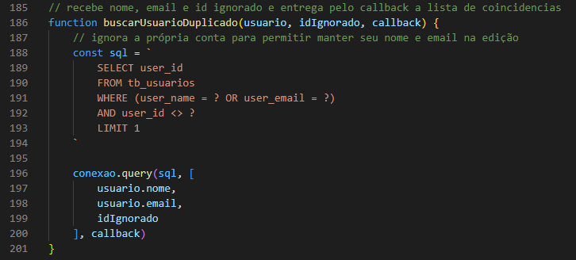

## Cadastro e armazenamento da senha

No arquivo **model/userModel.js**, a função **criarUsuario()** recebe um objeto com os dados do cadastro e uma callback.

Antes de inserir o usuário, ela utiliza:

```js
const senhaHash = await bcrypt.hash(user.senha, 10)
```

O bcrypt transforma a senha em um hash. Esse hash é usado posteriormente para verificar a senha durante o login.

Depois, a função executa o comando:

```sql
INSERT INTO tb_usuarios
    (user_name, user_email, user_pass, user_avatar)
VALUES (?, ?, ?, ?)
```

Os valores enviados são o nome, o e-mail, o hash da senha e o avatar.

O **user_id** não aparece no comando porque é gerado pelo banco. O **user_tipo** também não aparece porque utiliza o valor padrão definido na tabela.

A confirmação de senha não é armazenada. Ela serve apenas para verificar se a pessoa digitou a senha desejada durante o preenchimento.

**Print do cadastro no banco:**

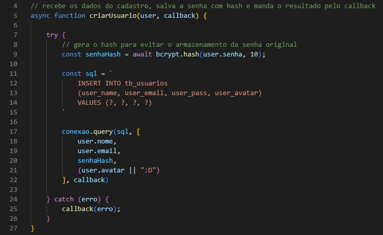

## Tabela tb_comentarios

A tabela **tb_comentarios** armazena os comentários publicados nas aulas.

Seus campos são:

- **com_id:** identificação do comentário, gerada automaticamente.
- **com_user_id:** ID do usuário que publicou o comentário.
- **com_texto:** texto do comentário, limitado a **1000 caracteres**.
- **com_data:** data e hora da publicação.
- **com_topico:** identificação do tópico, com capacidade de **50 caracteres**.
- **com_categoria:** identificação da categoria, com capacidade de **20 caracteres**.

O campo **com_data** utiliza **DEFAULT CURRENT_TIMESTAMP**. Quando o comentário é inserido sem informar uma data, o banco registra o momento da inserção.

O campo **com_user_id** aponta para **user_id**, da tabela **tb_usuarios**.

### Relação dos comentários com as aulas

As categorias e os tópicos das aulas ficam organizados nos arquivos Markdown. Por isso, **com_categoria** e **com_topico** não possuem chaves estrangeiras apontando para outra tabela.

No arquivo **controller/comentarioController.js**, a função **salvarComentario()** verifica a categoria, o tópico e a existência do arquivo da aula antes de chamar o model.

Essa verificação é responsabilidade do back-end, pois o MySQL não verifica a existência de arquivos Markdown.

No arquivo **model/comentarioModel.js**, a função **salvarComentario()** recebe os dados já verificados e executa a inserção.

O ID do autor deve vir da sessão autenticada. Ele não deve ser escolhido livremente pelos dados enviados no formulário.

**Print da inserção de comentários:**

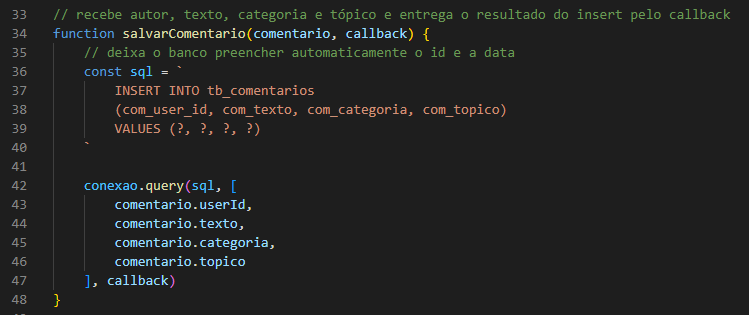

### Alterações nos arquivos das aulas

Renomear ou excluir um arquivo Markdown não altera automaticamente os comentários existentes.

Os comentários continuam armazenados com os valores antigos de **com_categoria** e **com_topico**.

Se uma aula for renomeada ou movida, é necessário avaliar esses registros para manter a ligação correta entre a aula e seus comentários.

## Tabela tb_recuperacoes

A tabela **tb_recuperacoes** armazena as solicitações de recuperação de senha.

Seus campos são:

- **rec_id:** identificação da solicitação, gerada automaticamente.
- **tb_usuarios_user_id:** ID da conta que solicitou a recuperação.
- **rec_codigo:** hash do código enviado por e-mail.
- **rec_expiracao:** data e hora em que a solicitação deixa de ser válida.
- **rec_usado:** informa se a recuperação já foi utilizada.

O campo **rec_codigo** possui capacidade de **255 caracteres** para armazenar o hash. O código recebido por e-mail possui **8 caracteres**, mas não é salvo diretamente no banco.

O campo **rec_usado** começa com **0**. Depois que a recuperação é concluída, ele passa para **1**.

Ter **rec_usado = 0** não garante, sozinho, que uma solicitação possa ser utilizada. Ela também precisa estar dentro do prazo e atender às demais verificações do sistema.

### Criação da recuperação

No arquivo **model/recuperacaoModel.js**, a função **criarRecuperacao()** recebe o ID do usuário, o código gerado e a callback.

Ela cria o hash do código com bcrypt e executa a inserção.

A data de expiração é calculada no SQL:

```sql
DATE_ADD(NOW(), INTERVAL 10 MINUTE)
```

Nesse trecho:

- **NOW()** representa a data e a hora atuais do banco.
- **INTERVAL 10 MINUTE** representa o prazo de **10 minutos**.
- **DATE_ADD()** soma esse prazo ao momento atual.

O campo **rec_usado** utiliza o valor padrão **0**, definido na tabela.

**Print da criação da recuperação:**

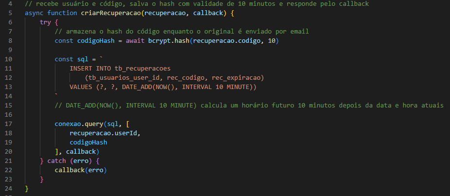

### Consulta da recuperação mais recente

No arquivo **model/recuperacaoModel.js**, a função **buscarUltimaRecuperacao()** consulta as solicitações do usuário.

Ela utiliza:

```sql
ORDER BY rec_id DESC
LIMIT 1
```

O **DESC** organiza os IDs do maior para o menor. O **LIMIT 1** faz a consulta devolver apenas o registro mais recente.

Uma nova solicitação pode tornar a anterior inutilizável pelo fluxo do sistema mesmo que o registro anterior ainda tenha **rec_usado = 0**.

Os registros antigos não são apagados automaticamente apenas porque o prazo terminou.

### Alteração da senha e uso da recuperação

No arquivo **model/recuperacaoModel.js**, a função **concluirRecuperacao()** recebe os dados da recuperação autorizada, a nova senha e a callback.

Ela cria o hash da nova senha e utiliza um comando **UPDATE** que altera as tabelas **tb_usuarios** e **tb_recuperacoes** na mesma operação.

Essa consulta:

- Atualiza **user_pass** com o novo hash.
- Altera **rec_usado** para **1**.
- Confere o usuário, o e-mail e o ID da recuperação.
- Exige que a recuperação ainda não tenha sido utilizada.
- Exige que o prazo ainda não tenha terminado.
- Verifica se não existe uma solicitação mais recente.

Fazer as alterações no mesmo comando evita atualizar a senha separadamente da marcação de uso da recuperação.

**Print da conclusão da recuperação:**

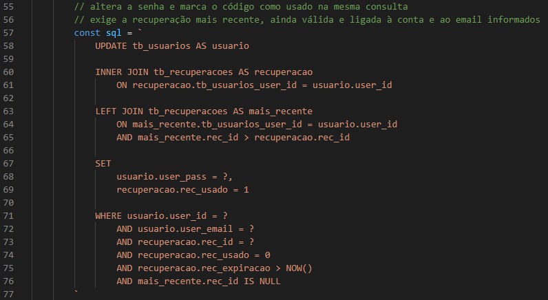

## Tabela tb_logs_acesso

A tabela **tb_logs_acesso** armazena os registros das ações acompanhadas pelo sistema.

Seus campos são:

- **log_id:** identificação do log, gerada automaticamente.
- **tb_usuarios_user_id:** ID do usuário relacionado à ação, quando houver.
- **log_acao:** descrição da ação, com capacidade de **100 caracteres**.
- **log_data:** data e hora do registro.

O campo **log_data** utiliza **DEFAULT CURRENT_TIMESTAMP**, portanto a data é preenchida automaticamente pelo banco.

O campo **tb_usuarios_user_id** aceita **NULL**. Isso permite manter registros sem vínculo com uma conta existente.

No arquivo **model/logModel.js**, a função **registrarLog()** recebe um objeto com **userId** e **acao**, além da callback.

O comando insere apenas o vínculo com o usuário e a descrição. O ID do log e sua data são preenchidos pelo banco.

A gravação de logs depende das chamadas feitas pelo back-end. A tabela não registra automaticamente toda alteração realizada no banco.

**Print do registro de logs:**

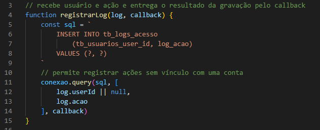

### Nome do usuário nos relatórios

A tabela **tb_logs_acesso** não guarda uma cópia do nome do usuário.

No arquivo **model/logModel.js**, a função **buscarTodosLogs()** consulta o nome atual na tabela **tb_usuarios**.

Por isso, quando uma pessoa altera seu nome, os logs vinculados à conta passam a mostrar esse nome atualizado.

Se a conta for excluída, o vínculo passa a ser **NULL** e o registro do log continua existindo.

A página do admin permite consultar esses registros. O projeto não oferece botões para editar ou excluir logs nessa página.

## Relacionamentos e exclusão de usuários

A tabela **tb_usuarios** possui relacionamentos **1:N** com as demais tabelas.

Isso significa que:

- Um usuário pode publicar vários comentários.
- Um usuário pode solicitar várias recuperações de senha.
- Um usuário pode estar relacionado a vários logs.

As regras de exclusão foram definidas nas chaves estrangeiras.

### Comentários com ON DELETE CASCADE

Na tabela **tb_comentarios**, a chave estrangeira de **com_user_id** utiliza **ON DELETE CASCADE**.

Quando uma conta é excluída, o banco também exclui os comentários dessa conta.

Essa regra funciona a partir da exclusão do usuário. Excluir um comentário não exclui seu autor.

### Recuperações com ON DELETE CASCADE

Na tabela **tb_recuperacoes**, a chave estrangeira de **tb_usuarios_user_id** também utiliza **ON DELETE CASCADE**.

Quando a conta é excluída, suas solicitações de recuperação são removidas pelo banco.

### Logs com ON DELETE SET NULL

Na tabela **tb_logs_acesso**, a chave estrangeira utiliza **ON DELETE SET NULL**.

Quando uma conta é excluída:

- O log permanece no banco.
- A descrição da ação permanece.
- A data permanece.
- O campo **tb_usuarios_user_id** passa a ser **NULL**.

Essa regra exige que o campo aceite **NULL**.

No arquivo **model/userModel.js**, a função **excluirUsuario()** executa a exclusão da conta. O próprio banco aplica as regras das chaves estrangeiras aos registros relacionados.

Essas regras também se aplicam quando a exclusão do usuário é executada diretamente no MySQL.

**Print dos relacionamentos no MER:**

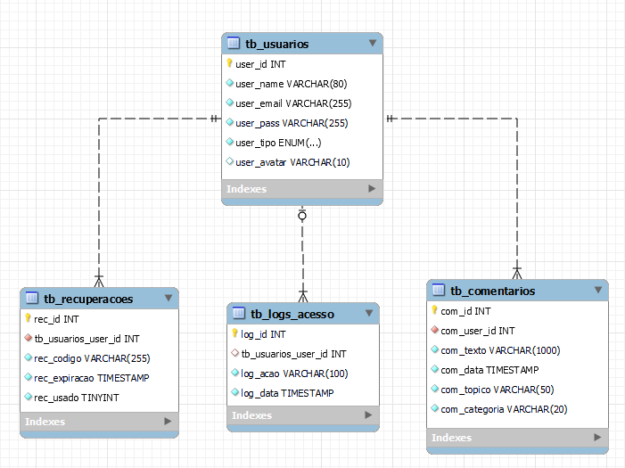

**Print das regras de exclusão:**

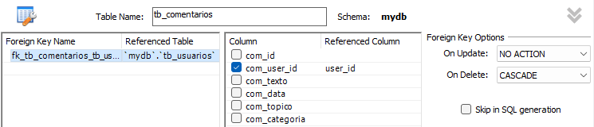
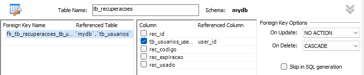
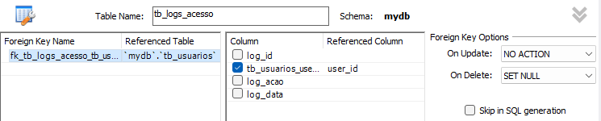

## Como os valores são enviados nas consultas

No arquivo **model/userModel.js**, a função **criarUsuario()** utiliza **?** no comando SQL e envia os valores separadamente para **conexao.query()**.

O mesmo padrão aparece nos outros models.

Exemplo:

```js
conexao.query(sql, [
    user.nome,
    user.email,
    senhaHash,
    user.avatar || ":D"
], callback)
```

Cada valor ocupa o lugar do **?** correspondente, seguindo a ordem do array.

Isso evita montar o comando SQL colocando diretamente o texto digitado pelo usuário dentro da consulta.

A biblioteca mysql2 trata os valores recebidos. As verificações do controller continuam necessárias para conferir tamanho, formato, permissões e outras regras do sistema.

A callback recebe o erro ou o resultado da operação:

- Nas consultas **SELECT**, o resultado normalmente contém os registros encontrados.
- Nas operações **INSERT**, o resultado pode informar o ID criado em **insertId**.
- Nas operações **UPDATE** e **DELETE**, o resultado fornece informações como **affectedRows**.

Algumas funções do model devolvem todos os registros encontrados. Outras utilizam a posição **[0]** para devolver apenas o registro esperado.

## Consultas que combinam tabelas

No arquivo **model/comentarioModel.js**, a função **buscarPorTopico()** combina comentários com os dados dos autores usando **INNER JOIN**.

Assim, a consulta consegue devolver o texto, a data, o nome e o avatar utilizados na exibição dos comentários.

No arquivo **model/logModel.js**, a função **buscarTodosLogs()** utiliza **LEFT JOIN**.

Essa diferença é necessária porque um log pode continuar existindo sem um usuário associado. O **LEFT JOIN** mantém o log no resultado mesmo quando não encontra uma conta correspondente.

**Print da consulta de logs com usuários:**

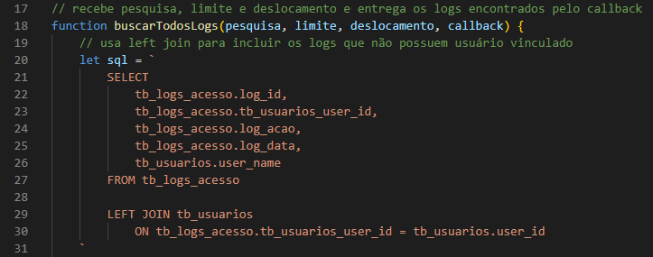

## Pesquisa e paginação

No arquivo **model/userModel.js**, a função **buscarTodosUsuarios()** recebe:

- **pesquisa:** texto usado para filtrar os registros.
- **limite:** quantidade máxima de registros que a consulta deve retornar.
- **deslocamento:** quantidade de registros que devem ser pulados.
- **callback:** função que receberá o resultado.

As consultas de comentários e logs seguem um padrão semelhante.

### Pesquisa com LIKE

No arquivo **model/userModel.js**, a função **buscarTodosUsuarios()** utiliza **LIKE** para procurar o texto informado em campos como nome e e-mail.

O termo de pesquisa recebe **%** antes e depois.

Por exemplo, **%ana%** permite encontrar valores que contenham **ana** em alguma parte do texto.

Para pesquisar IDs como texto, a consulta utiliza **CAST(... AS CHAR)**.

Os valores da pesquisa continuam sendo enviados separadamente pelos **?**.

### Limite e deslocamento

No arquivo **controller/admController.js**, as funções de consulta calculam o deslocamento:

```js
const deslocamento = (pagina - 1) * limite
```

Com **50 registros por página**:

- A página **1** começa no deslocamento **0**.
- A página **2** começa no deslocamento **50**.
- A página **3** começa no deslocamento **100**.

No arquivo **model/userModel.js**, a função **buscarTodosUsuarios()** aplica esses valores:

```sql
LIMIT ? OFFSET ?
```

O controller solicita **51 registros** para descobrir se existe uma próxima página. Quando recebe o registro adicional, remove esse item da resposta e informa que há mais resultados.

O navegador recebe até **50 registros por vez**, evitando montar toda a tabela de uma vez.

O **ORDER BY** define a ordem dos resultados antes da aplicação do limite.

**Print da pesquisa e paginação no model:**

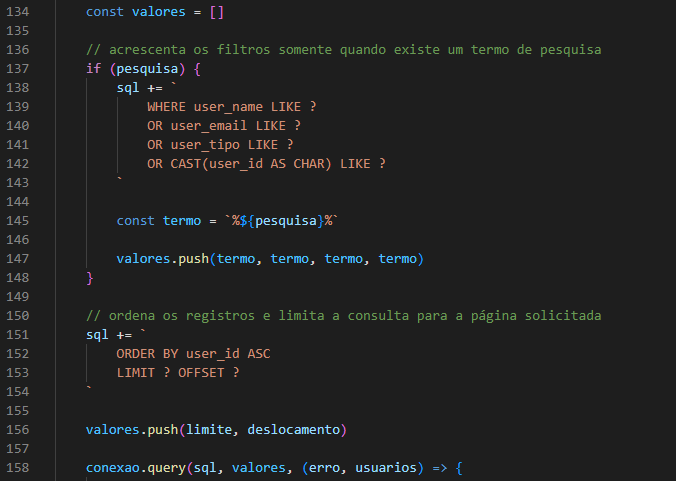

## Cuidados ao alterar a estrutura

O MER, o banco utilizado e o código precisam representar a mesma estrutura.

Alterar o MER não modifica automaticamente um banco que já está em uso. Da mesma forma, alterar uma tabela diretamente no MySQL não atualiza o MER.

Ao adicionar ou modificar um campo:

1. Atualize sua definição no MER.
2. Aplique a mudança no banco utilizado pelo projeto, preservando os dados necessários.
3. Revise os comandos SQL dos models que utilizam a tabela.
4. Atualize as validações dos controllers.
5. Ajuste os formulários e scripts quando o campo aparecer na interface.
6. Atualize a documentação relacionada.

Não é necessário recriar o banco inteiro para cada alteração. Recriar tabelas pode apagar dados existentes.

Os nomes das colunas precisam ser respeitados exatamente como estão definidos. Por exemplo:

- Comentários utilizam **com_user_id**.
- Recuperações utilizam **tb_usuarios_user_id**.
- Logs utilizam **tb_usuarios_user_id**.

Embora esses campos apontem para **tb_usuarios.user_id**, seus nomes são diferentes.

Os prints de código indicados neste documento usam a versão analisada do projeto. Se novas alterações mudarem as linhas, localize a função informada e enquadre o mesmo trecho.