# Cadastro, login e logout

Este documento explica como o sistema cria contas, verifica os dados do cadastro, realiza o login e encerra a sessão.

Os caminhos começam na pasta principal do projeto, onde está **index.js**. As linhas indicadas para os prints consideram os arquivos comentados utilizados nesta documentação. Se o código mudar, use também o nome da função para localizar o trecho.

## Arquivos que participam do funcionamento

- **public/cadastro.html:** formulário de criação da conta.
- **public/login.html:** formulário de login.
- **public/scripts/previa-avatar.js:** atualização da prévia do avatar no cadastro.
- **public/scripts/navbar-auth.js:** atualização dos controles do header conforme a sessão.
- **index.js:** configuração da leitura dos formulários, da sessão e do grupo de rotas.
- **routes/userRoutes.js:** rotas de cadastro, login, sessão e logout.
- **controller/userController.js:** validação das operações e envio das respostas.
- **validacoes/usuarioValidacao.js:** regras dos dados pessoais e da senha.
- **model/userModel.js:** consultas e gravação dos usuários.
- **model/logModel.js:** registro das ações realizadas.
- **public/styles/cadastro-login.css:** responsividade dos formulários.

Os detalhes compartilhados de sessão, header e footer estão em **DOC_GLOBAL.md**.

## Como o formulário de cadastro envia os dados

Em **public/cadastro.html**, o formulário possui esta configuração:

```html
<form action="/usuarios/cadastro" method="POST" class="white-text" id="formCadastro">
```

**action** define a rota que recebe os dados. **method="POST"** indica que os campos serão enviados no corpo da requisição.

Os campos enviados são identificados pelo atributo **name**:

- **nome:** nome de usuário.
- **email:** e-mail da conta.
- **senha:** senha escolhida.
- **confirmar-senha:** repetição da senha.
- **avatar:** representação textual do avatar.

O **id** identifica o elemento dentro da página. O **name** define o nome do campo enviado ao servidor.

Esse formulário utiliza o envio comum do HTML. Não existe uma função de fetch responsável pelo cadastro nessa página.

Em **index.js**, **express.urlencoded** lê os campos enviados e os disponibiliza em **req.body**.

**Print dos campos do cadastro:**

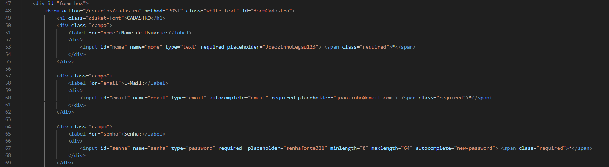

**Print da página de cadastro:**

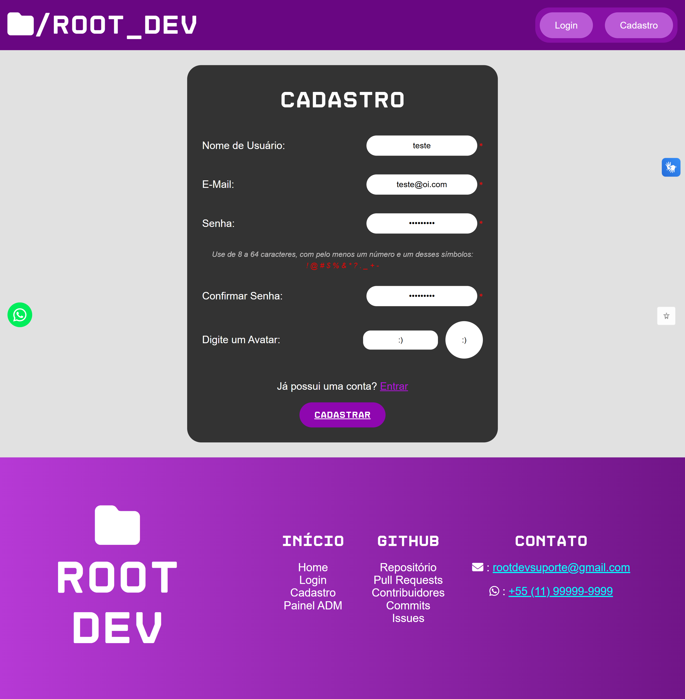

## Como a prévia do avatar funciona

Em **public/scripts/previa-avatar.js**, **atualizarPreviaAvatar()** lê o campo **avatar** e preenche o elemento **avatar-previa**.

Quando o campo está vazio, a prévia utiliza **:D**.

O evento **input** chama a função durante a digitação. Essa operação altera somente a prévia da página. O avatar é enviado ao servidor quando o formulário de cadastro é submetido.

O funcionamento desse script também está explicado em **DOC_GLOBAL.md**.

## Como a rota recebe o cadastro

Em **index.js**, as rotas de usuário são ligadas ao início **/usuarios**.

Em **routes/userRoutes.js**, a rota de cadastro é:

```js
router.post('/cadastro', limitarCadastro, userController.criarUsuario)
```

A requisição passa por **limitarCadastro** antes de chegar a **criarUsuario**, de **controller/userController.js**.

O limitador permite 10 tentativas por IP em 5 minutos:

```js
const limitarCadastro = rateLimit({
    windowMs: 5 * 60 * 1000,
    limit: 10,
    standardHeaders: "draft-8",
    legacyHeaders: false,
    message: {
        erro: "Muitas tentativas de cadastro. Aguarde 5 minutos antes de tentar novamente."
    }
})
```

- **windowMs:** duração da janela de contagem em milissegundos.
- **limit:** quantidade de tentativas permitidas.
- **standardHeaders:** formato dos cabeçalhos que informam o limite.
- **legacyHeaders:** desativa os cabeçalhos antigos da biblioteca.
- **message:** resposta enviada quando o limite é atingido.

A contagem considera tentativas, não apenas cadastros concluídos. Ao ultrapassar o limite, a biblioteca responde com status 429 e não encaminha aquela tentativa ao controller.

Esse limitador pertence à rota de cadastro. A rota de login não utiliza esse mesmo limitador no código atual.

**Print do limitador de cadastro:**

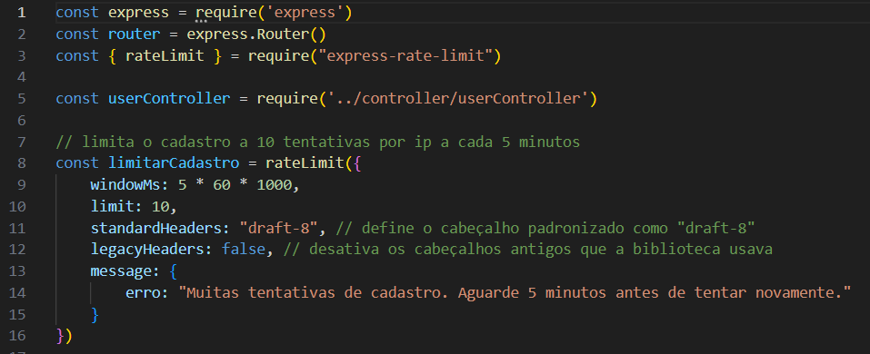

## Como o controller prepara os dados

Em **controller/userController.js**, **criarUsuario(req, res)** recebe o formulário.

A função começa preparando os dados:

```js
const dados = req.body || {}

const usuario = {
    nome: dados.nome,
    email: dados.email,
    senha: dados.senha,
    avatar: dados.avatar,
}
```

O objeto vazio evita acessar propriedades de um corpo ausente. Os campos ainda precisam passar pelas validações.

O objeto **usuario** reúne somente os dados utilizados na criação da conta.

A confirmação de senha é lida separadamente:

```js
const confirmarSenha = dados["confirmar-senha"]
```

A notação com **[]** permite acessar o nome **confirmar-senha**, que contém **-**.

A confirmação é utilizada para conferir a digitação. Ela não é enviada ao model para armazenamento.

**Print da preparação do cadastro:**

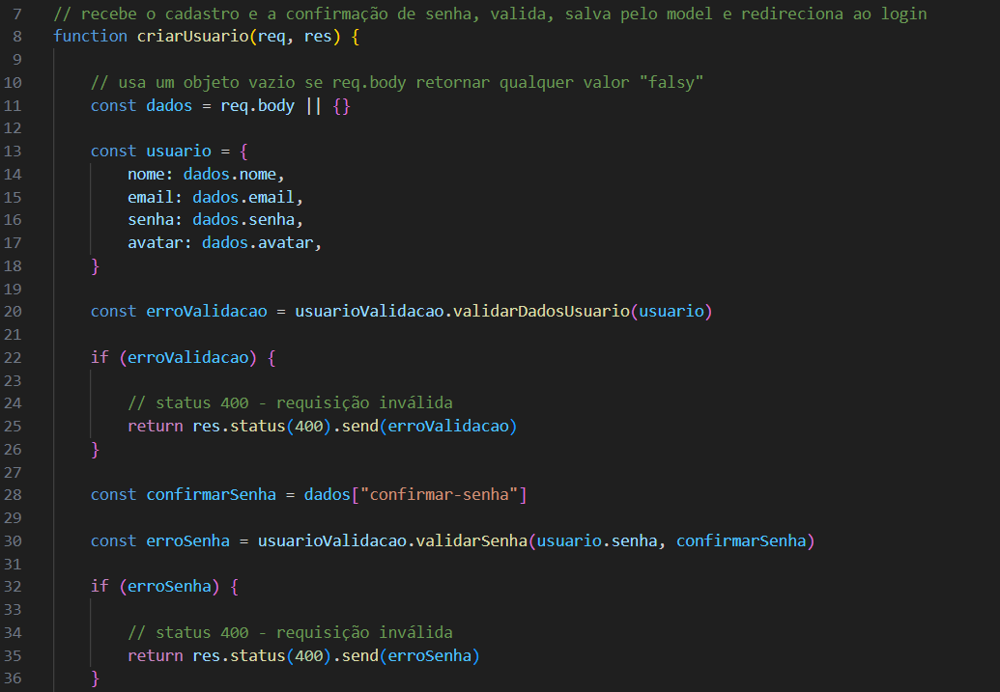

## Como nome, e-mail e avatar são verificados

Em **validacoes/usuarioValidacao.js**, **validarDadosUsuario(usuario)** recebe o objeto preparado pelo controller.

A função começa verificando os tipos dos campos. Nome e e-mail precisam ser textos.

Se o avatar não foi enviado, ele é tratado inicialmente como texto vazio. Um avatar enviado com outro tipo de dado é recusado.

Depois, a função aplica **trim()**:

```js
usuario.nome = usuario.nome.trim()
usuario.email = usuario.email.trim()
usuario.avatar = usuario.avatar.trim()
```

**trim()** remove espaços do começo e do final. A função altera diretamente as propriedades do objeto recebido.

### Nome de usuário

Em **validacoes/usuarioValidacao.js**, **validarDadosUsuario** verifica se o nome:

- Possui entre 3 e 80 caracteres.
- Não contém espaços.
- Não contém **@**.

A expressão utilizada para detectar espaços ou **@** é:

```js
/[\s@]/.test(usuario.nome)
```

**test** devolve verdadeiro quando encontra uma correspondência. Nesse caso, a função retorna uma mensagem de erro.

### E-mail

Na mesma função, o e-mail pode ter até 254 caracteres e precisa corresponder ao formato verificado pela expressão:

```js
const emailRegex = /^[^\s@]+@[^\s@]+\.[^\s@]+$/
```

Essa verificação exige partes de texto separadas por **@** e **.**, sem espaços.

Ela confere um formato básico. Não confirma que a caixa de e-mail existe ou que pertence à pessoa que está se cadastrando.

### Avatar

Ainda em **validarDadosUsuario**, o avatar pode ter até 10 caracteres pela contagem de **length** utilizada no código.

Se ficar vazio depois de **trim()**, recebe **:D**.

A contagem de **length** do JavaScript pode considerar alguns emojis como mais de 1 unidade. Por isso, a quantidade de símbolos visíveis pode ser menor que 10.

**Print da validação dos dados pessoais:**

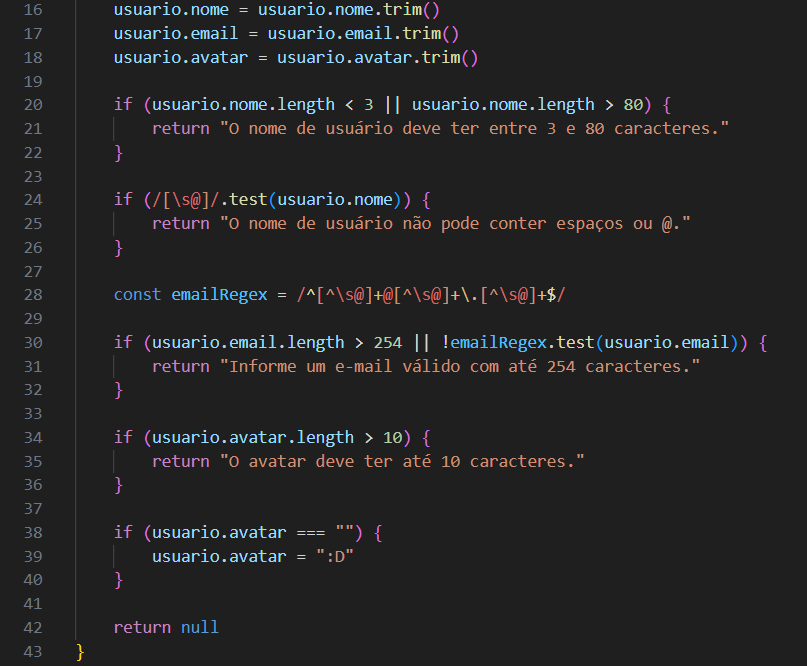

## O que a validação devolve

Em **validacoes/usuarioValidacao.js**, **validarDadosUsuario** retorna:

- Uma mensagem quando encontra um problema.
- **null** quando os dados atendem às regras.

Em **controller/userController.js**, **criarUsuario** recebe esse resultado:

```js
const erroValidacao = usuarioValidacao.validarDadosUsuario(usuario)

if (erroValidacao) {
    return res.status(400).send(erroValidacao)
}
```

Quando existe uma mensagem, o controller responde com status 400 e encerra a função.

Quando recebe **null**, continua a operação. O objeto **usuario** já contém os valores ajustados pela validação.

## Como a senha é verificada

Em **validacoes/usuarioValidacao.js**, **validarSenha(senha, confirmarSenha)** recebe a senha e sua confirmação.

As regras verificadas são:

- Os valores precisam ser textos.
- A senha precisa ter entre 8 e 64 caracteres.
- A representação da senha em UTF-8 não pode ultrapassar 72 bytes.
- A senha precisa conter pelo menos 1 número.
- A senha precisa conter pelo menos 1 dos símbolos aceitos.
- A confirmação precisa ser igual à senha.

Os símbolos aceitos são:

**! @ # $ % & \* ? . _ + -**

A função não exige uma combinação de letras maiúsculas e minúsculas. Ela aplica as condições presentes no código.

A verificação de bytes utiliza:

```js
if (Buffer.byteLength(senha, "utf8") > 72) {
    return "A senha ficou muito longa. Reduza o texto e tente novamente."
}
```

Caracteres podem ocupar quantidades diferentes de bytes. Essa condição evita que o bcrypt considere apenas parte de uma senha que ultrapasse seu limite de entrada.

A senha não passa por **trim()**, pois isso alteraria o valor informado pelo usuário.

Se ocorrer um problema, **validarSenha** retorna uma mensagem. Se todas as regras forem atendidas, retorna **null**.

Em **controller/userController.js**, **criarUsuario** responde com status 400 quando recebe uma mensagem dessa função.

**Print da validação da senha:**

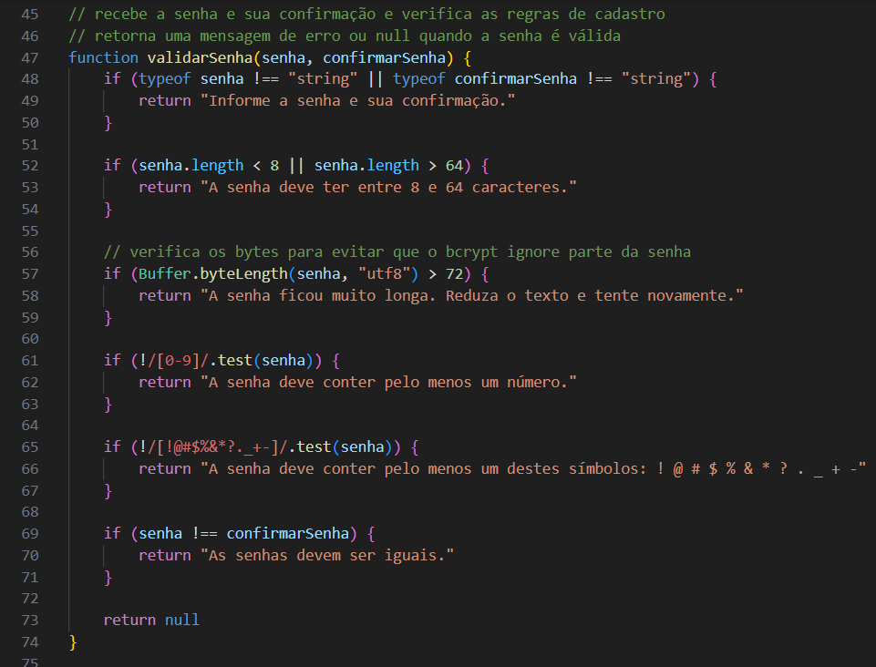

## Como o sistema procura cadastros duplicados

Em **controller/userController.js**, depois das validações, **criarUsuario** chama:

```js
userModel.buscarUsuarioDuplicado(usuario, 0, (erroBusca, usuarios) => {
```

Em **model/userModel.js**, **buscarUsuarioDuplicado(usuario, idIgnorado, callback)** recebe:

- O objeto com nome e e-mail.
- O id que deve ser ignorado.
- O callback que receberá o resultado.

A consulta é:

```sql
SELECT user_id
FROM tb_usuarios
WHERE (user_name = ? OR user_email = ?)
AND user_id <> ?
LIMIT 1
```

A condição procura uma conta com o mesmo nome ou e-mail.

**idIgnorado** permite reaproveitar a consulta nas edições. Na edição, a própria conta não deve ser considerada duplicada.

No cadastro, o controller envia **0**, pois ainda não existe um id de conta a ser ignorado.

**LIMIT 1** é suficiente, porque a função só precisa descobrir se existe alguma coincidência.

O resultado é uma lista:

- Lista vazia: nenhuma coincidência foi encontrada.
- Lista com registro: o nome ou e-mail já está cadastrado.

Em **controller/userController.js**, uma coincidência gera status 409. Uma falha na consulta gera status 500.

**Print da consulta de duplicidade:**

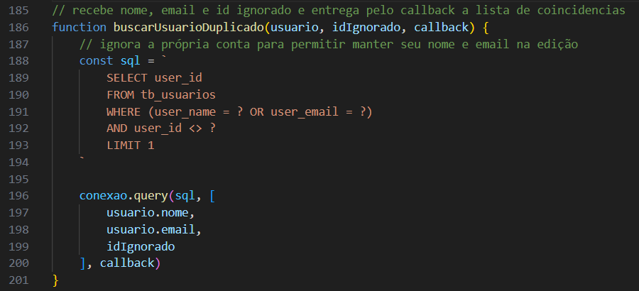

## Como a conta é salva

Em **controller/userController.js**, **criarUsuario** chama **userModel.criarUsuario** depois de concluir as verificações.

Em **model/userModel.js**, **criarUsuario(user, callback)** recebe os dados da conta e começa gerando o hash da senha:

```js
const senhaHash = await bcrypt.hash(user.senha, 10)
```

**bcrypt.hash** transforma a senha em um hash que será armazenado no banco. O valor **10** configura o custo do processamento.

O hash não é utilizado para recuperar a senha original. No login, a senha informada é conferida com **bcrypt.compare**.

Depois, a função prepara o INSERT:

```sql
INSERT INTO tb_usuarios
(user_name, user_email, user_pass, user_avatar)
VALUES (?, ?, ?, ?)
```

Os valores são enviados separadamente à consulta:

```js
conexao.query(sql, [
    user.nome,
    user.email,
    senhaHash,
    (user.avatar || ":D")
], callback)
```

A ordem da lista corresponde à ordem dos campos e dos **?**.

O SQL não recebe a confirmação de senha. Ele também não recebe um tipo de usuário enviado pelo formulário. O cadastro depende do valor padrão **usuario** definido para **user_tipo** no banco.

A função entrega o erro ou o resultado da gravação pelo callback.

**Print da gravação do usuário:**

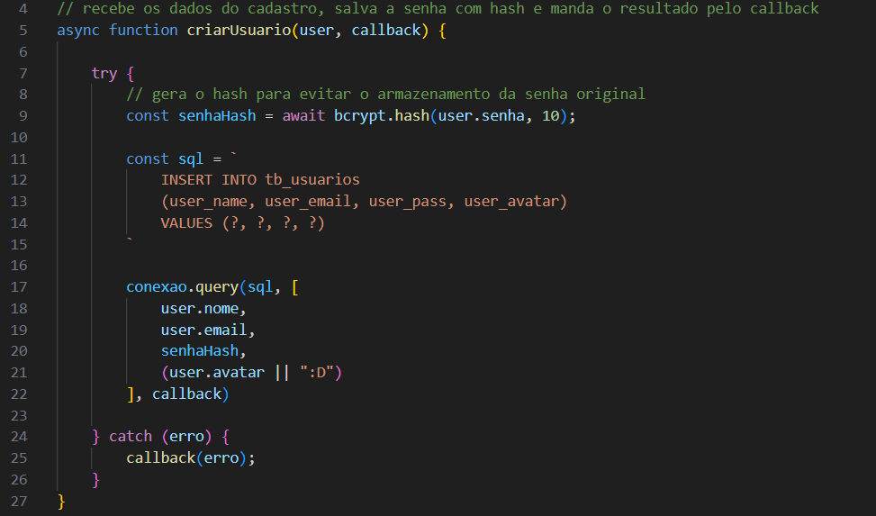

## Por que a duplicidade também é tratada no INSERT

Em **controller/userController.js**, o callback de **userModel.criarUsuario** verifica o erro **ER_DUP_ENTRY**.

Mesmo que a consulta anterior não encontre uma conta, outra requisição pode cadastrar os mesmos dados antes de o INSERT terminar.

As restrições de unicidade do banco impedem essa duplicação. Quando o banco retorna **ER_DUP_ENTRY**, o controller responde com status 409.

Outras falhas de gravação recebem status 500.

Esse tratamento depende dos índices únicos de nome e e-mail na tabela **tb_usuarios**.

## Como o cadastro é concluído

Em **controller/userController.js**, quando o INSERT funciona, **resultado.insertId** contém o id da conta criada.

A função prepara o log:

```js
const log = {
    userId: resultado.insertId,
    acao: "Cadastro realizado"
}
```

Depois, chama **registrarLog**, de **model/logModel.js**.

Se a gravação do log falhar, o erro é mostrado no terminal. A conta já foi criada e o controller continua para o redirecionamento:

```js
return res.redirect("/login.html")
```

O cadastro não cria a sessão de login automaticamente. O usuário é encaminhado para entrar com a conta criada.

**Print da conclusão do cadastro:**

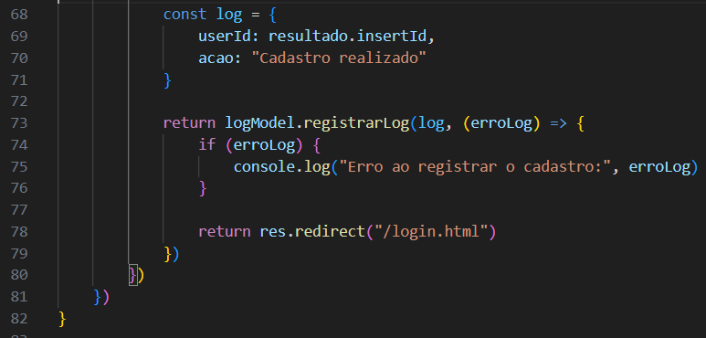

## Como o formulário de login envia os dados

Em **public/login.html**, o formulário envia **POST /usuarios/login**.

Os campos enviados são:

- **login:** nome de usuário ou e-mail.
- **senha:** senha da conta.

O envio utiliza o próprio formulário HTML. Não existe uma função de fetch responsável pelo login nessa página.

Em **routes/userRoutes.js**, a rota encaminha a requisição:

```js
router.post('/login', userController.loginUsuario)
```

**Print da página de login:**

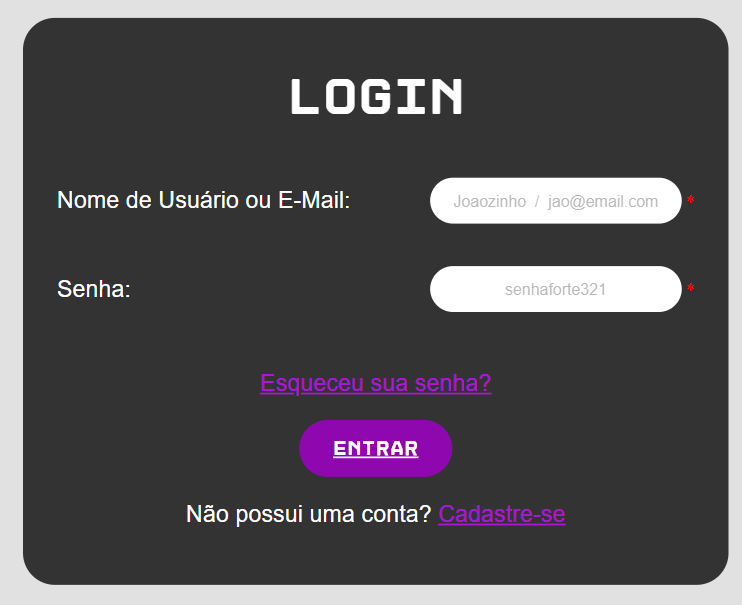

## Como a conta é localizada no login

Em **controller/userController.js**, **loginUsuario(req, res)** lê:

```js
const login = req.body.login
const senha = req.body.senha
```

Depois, chama **buscarPorLogin**, de **model/userModel.js**.

A consulta procura a conta pelo e-mail ou pelo nome:

```sql
SELECT *
FROM tb_usuarios
WHERE user_email = ?
OR user_name = ?
```

O mesmo valor de **login** é enviado para os 2 parâmetros.

Em **model/userModel.js**, o callback devolve o registro encontrado por **usuarios[0]**. Se a lista estiver vazia, esse valor será **undefined**.

Em **controller/userController.js**:

- Falha na consulta: status 500.
- Conta não encontrada: status 401.
- Conta encontrada: a função continua para a comparação da senha.

**Print da busca no login:**

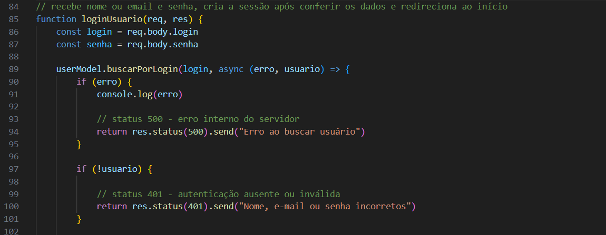

## Como a senha do login é comparada

Em **controller/userController.js**, **loginUsuario** executa:

```js
const senhaCorreta = await bcrypt.compare(senha, usuario.user_pass)
```

A função recebe a senha digitada e o hash armazenado.

O resultado informa se a senha corresponde ao hash. Não é necessário descriptografar o valor do banco.

Se **senhaCorreta** for falso, o controller responde com status 401.

A mensagem utilizada é a mesma para conta não encontrada e senha incorreta:

**Nome, e-mail ou senha incorretos**

Assim, a resposta não informa qual desses dados causou a falha.

Se ocorrer um erro durante a comparação, o **catch** registra a falha no terminal e responde com status 500.

## Como a sessão é criada após o login

Ainda em **controller/userController.js**, depois de confirmar a senha, **loginUsuario** preenche:

```js
req.session.usuario = {
    id: usuario.user_id,
    nome: usuario.user_name,
    tipo: usuario.user_tipo,
    avatar: usuario.user_avatar
}
```

Esse objeto permite identificar o usuário nas próximas requisições.

A senha e o hash não são colocados nesse objeto.

Depois, a função registra **Login realizado** por **model/logModel.js** e redireciona para **/**.

Em **public/scripts/navbar-auth.js**, a página consulta a sessão e passa a mostrar os controles do usuário conectado.

**Print da confirmação da senha e da sessão:**

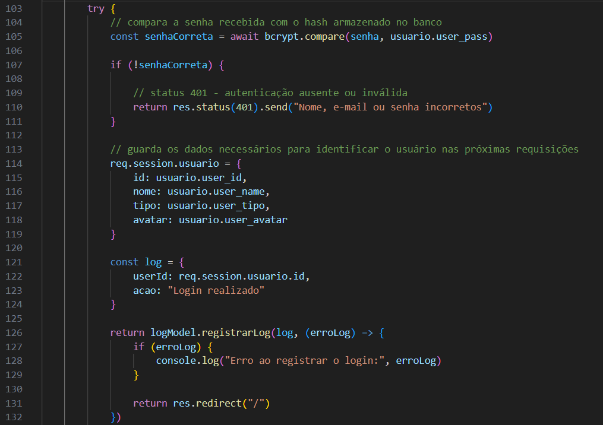

**Print do site após o login:**

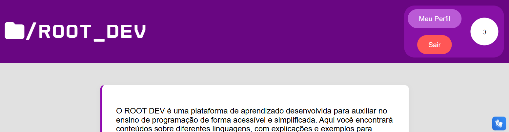

## Como as páginas consultam o estado do login

Em **routes/userRoutes.js**, **GET /usuarios/sessao** chama **verificarSessao**, de **controller/userController.js**.

Essa função:

- Retorna **logado: false** quando não existe usuário na sessão.
- Consulta a conta no banco quando existe sessão.
- Encerra a sessão se a conta não existir mais.
- Atualiza nome, tipo e avatar antes de devolver os dados atuais.

A resposta não inclui a senha nem o hash.

A consulta é utilizada pelo header e pela página de conteúdo para decidir quais controles mostrar.

O funcionamento detalhado está em **DOC_GLOBAL.md**.

## Como o logout é solicitado

Em **public/scripts/navbar-auth.js**, o controle Sair é montado como um formulário que envia **POST /usuarios/logout**.

Em **routes/userRoutes.js**, a rota chama:

```js
router.post('/logout', userController.logoutUsuario)
```

Em **controller/userController.js**, **logoutUsuario(req, res)** guarda temporariamente o usuário da sessão:

```js
const usuario = req.session.usuario
```

Essa referência permite registrar quem saiu depois que a sessão for encerrada.

A função chama **req.session.destroy** para remover a sessão no servidor.

Se ocorrer uma falha nessa operação, retorna status 500.

## Como a sessão e o cookie são removidos

Em **controller/userController.js**, depois que **req.session.destroy** funciona, **logoutUsuario** executa:

```js
res.clearCookie("connect.sid")
```

Isso solicita a remoção do cookie de sessão do navegador.

Se não havia usuário conectado, a função apenas redireciona para a página inicial.

Se havia, registra **Logout realizado** com o id guardado anteriormente e depois redireciona para **/**.

O logout não exclui a conta. Ele encerra o acesso daquela sessão.

**Print do encerramento da sessão:**

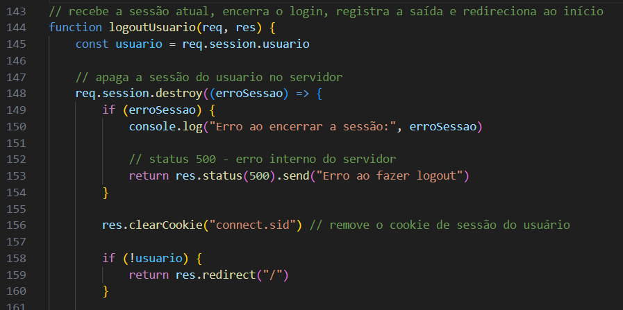

**Print do registro da saída:**

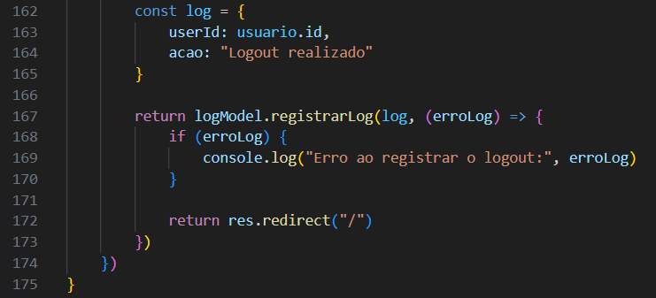

## Como as mensagens aparecem

Em **controller/userController.js**, cadastro e login utilizam **res.send** para responder aos erros.

Como os formulários de **public/cadastro.html** e **public/login.html** fazem o envio comum do HTML, essas respostas podem abrir como uma página de texto. Elas não são inseridas automaticamente em um elemento de mensagem dentro do formulário.

Nos casos de sucesso, **res.redirect** encaminha o navegador para a página indicada.

As verificações do HTML, como **required** e **minlength**, ajudam durante o preenchimento. As validações do servidor continuam necessárias, pois os dados podem ser enviados sem utilizar o formulário da página.

## Responsividade do cadastro e do login

Em **public/styles/cadastro-login.css**, as regras adaptam os formulários para telas menores.

- Até **688 pixels**, os elementos de **.campo** são organizados em coluna.
- Até **475 pixels**, o espaço da caixa do formulário é ajustado.
- Até **428 pixels**, a largura e os textos recebem outras adaptações.
- A partir de **430 pixels** e **900 pixels**, são aplicados limites de largura à caixa.

A responsividade do header e do footer está em **public/styles/global.css** e é explicada em **DOC_GLOBAL.md**.

**Print do cadastro em tela de celular:**

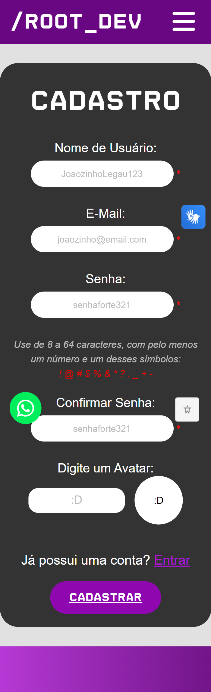

## Como manter as regras do cadastro

Em **validacoes/usuarioValidacao.js**, as regras são compartilhadas com outras funcionalidades. Alterar **validarDadosUsuario** também pode afetar a edição de perfil e a edição feita pelo admin.

Alterar **validarSenha** também afeta a recuperação de senha, que utiliza essa função.

Ao mudar uma regra, mantenha correspondência entre:

- A validação do servidor.
- Os limites e orientações dos campos HTML.
- O tamanho e as restrições dos campos no banco.
- Os textos da documentação.

Para adicionar um campo ao cadastro, será necessário considerar **public/cadastro.html**, **controller/userController.js**, **model/userModel.js**, a validação e a estrutura da tabela.

O tipo **admin** não é definido pelo formulário público de cadastro. A criação do 1º admin é explicada no **README.md**.

## Principais respostas dessas operações

Em **controller/userController.js** e **routes/userRoutes.js**, os principais resultados são:

- **Cadastro válido:** cria a conta, registra o log e redireciona para o login.
- **Dados ou senha fora das regras:** status 400.
- **Nome ou e-mail duplicado:** status 409.
- **Limite de cadastro atingido:** status 429.
- **Conta não encontrada ou senha incorreta no login:** status 401.
- **Login válido:** cria os dados da sessão, registra o log e redireciona para a página inicial.
- **Logout concluído:** remove a sessão e o cookie, registra a saída quando há usuário e redireciona para a página inicial.
- **Falha de consulta, gravação ou processamento:** status 500, conforme o tratamento da função.