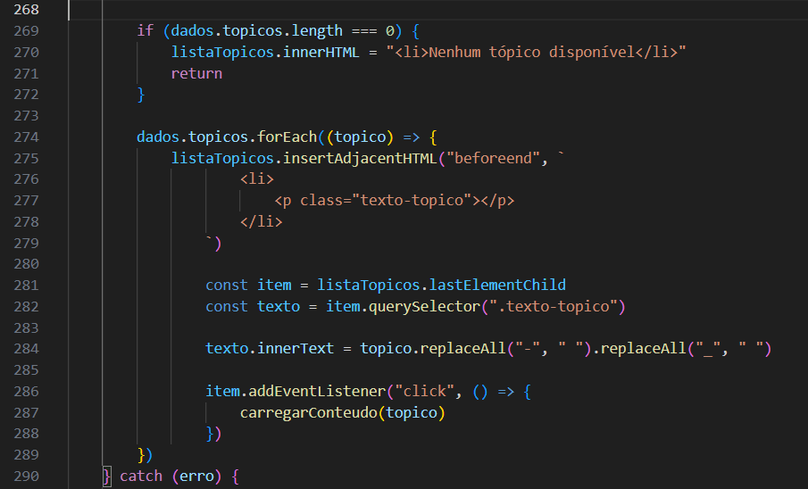

## Documentação da Página de Cadastro (`cadastro.html`)

## O arquivo `cadastro.html` atua como a página de registro de novos usuários na plataforma. Sua estrutura é focada em um formulário de coleta de dados e em opções de redirecionamento para facilitar a usabilidade.

### **Estrutura Visual (`<body>`)**

Contém os elementos de interação essenciais para a criação da conta do usuário, divididos entre o formulário principal, navegação e informações de contato.

**Formulário de Registro (`<form>`)**

* **Dados Pessoais e de Acesso:** O formulário principal solicita as informações essenciais para a criação da conta: nome, e-mail, telefone, senha e a confirmação da senha.
* **Foto de Perfil:** Como funcionalidade adicional, é oferecida a opção para que o usuário faça o upload de uma imagem, personalizando seu perfil na plataforma logo no primeiro acesso.

**Navegação Alternativa (`<a>` / Links)**

* **Acesso para Usuários Existentes:** Pensando na jornada do usuário, caso ele já possua uma conta cadastrada, há uma opção de redirecionamento rápido para a página de **LOGIN**, evitando que ele precise refazer qualquer etapa.

**Área de Contato / Rodapé (`<footer>`)**

* **Suporte da Empresa:** Logo abaixo da estrutura de cadastro, a página exibe o e-mail de contato da empresa, garantindo que o usuário tenha um canal de comunicação fácil caso enfrente problemas durante o registro.
