# Comentários das aulas

Este documento explica como os comentários são consultados, exibidos, publicados e excluídos na página de conteúdo.

Os caminhos começam na pasta principal do projeto, onde está **index.js**. As linhas indicadas para os prints consideram os arquivos comentados utilizados nesta documentação. Se o código mudar, use também o nome da função para localizar o trecho.

## Funcionamento dos comentários

Em **public/conteudo.html**, cada aula possui uma área de comentários.

- Visitantes podem visualizar os comentários.
- Usuários conectados podem publicar comentários.
- O autor pode excluir seus próprios comentários.
- O admin pode excluir comentários pela página do admin.
- Não existe uma função de edição de comentários.

Cada comentário é associado a uma categoria e a um tópico. Ao selecionar outra aula, a página consulta os comentários correspondentes.

A consulta e a exclusão pela página do admin são explicadas em **DOC_ADMIN.md**.

**Print da área de comentários:**

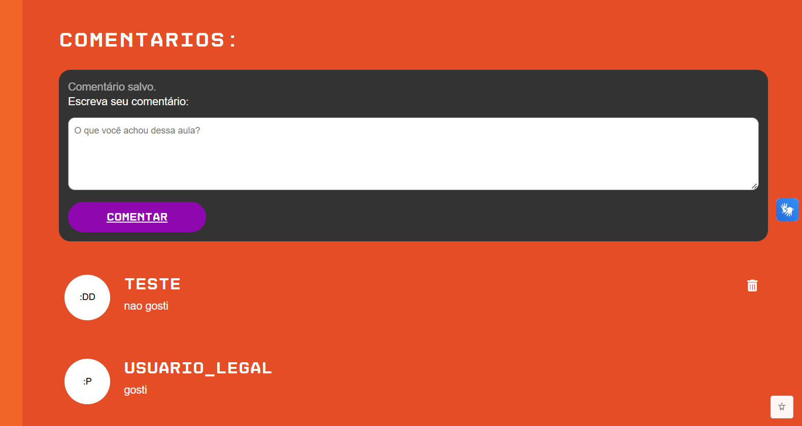

## Arquivos que participam do funcionamento

- **public/conteudo.html:** estrutura da área de comentários e do formulário.
- **public/scripts/conteudo.js:** exibição, verificação de login, publicação e solicitação de exclusão.
- **routes/conteudoRoutes.js:** encaminhamento da consulta da aula com seus comentários.
- **controller/conteudoController.js:** busca da aula e preparação dos comentários enviados ao navegador.
- **routes/comentarioRoutes.js:** rotas de publicação e exclusão pelo autor.
- **controller/comentarioController.js:** validação das operações, identificação do autor e respostas.
- **model/comentarioModel.js:** consultas, gravação e exclusão no banco.
- **model/logModel.js:** registro das publicações e exclusões.
- **public/styles/conteudo.css:** adaptações da área para diferentes tamanhos de tela.

## Como os comentários são consultados

Em **public/scripts/conteudo.js**, **carregarConteudo(topico)** solicita a aula pela rota **GET /conteudo/:categoria/:topico**.

Em **controller/conteudoController.js**, **buscarConteudo(req, res)** lê e valida o Markdown. Depois, chama:

```js
comentarioModel.buscarPorTopico(categoria, topico, (erroComentario, comentarios) => {
```

A função recebe a categoria e o tópico da aula solicitada.

Em **model/comentarioModel.js**, **buscarPorTopico(categoria, topico, callback)** consulta os comentários que possuem esses valores em **com_categoria** e **com_topico**.

A consulta também utiliza:

```sql
INNER JOIN tb_usuarios
    ON tb_comentarios.com_user_id = tb_usuarios.user_id
```

Esse trecho relaciona cada comentário com seu autor e permite receber o nome e o avatar junto com os dados do comentário.

A ordenação usa **com_data DESC**, colocando as datas mais recentes antes das antigas.

Os valores de categoria e tópico são enviados separadamente aos parâmetros do SQL. O callback devolve o erro ou a lista encontrada.

Essa consulta da página de aula não possui paginação. A paginação dos comentários existe na consulta da página do admin.

**Print da consulta dos comentários da aula:**

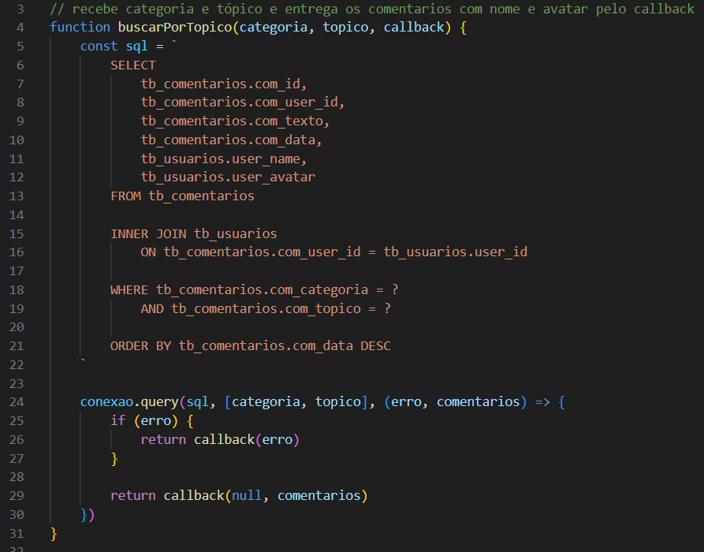

## Como a permissão de exclusão é informada

Em **controller/conteudoController.js**, depois da consulta, **buscarConteudo** percorre os comentários:

```js
comentarios.forEach((comentario) => {
    comentario.podeExcluir = false

    if (req.session.usuario) {
        comentario.podeExcluir = Number(comentario.com_user_id) === Number(req.session.usuario.id)
    }
})
```

Cada comentário começa com **podeExcluir** falso.

Se existir usuário na sessão, a função compara o id do autor com o id da conta conectada. Quando os valores são iguais, **podeExcluir** recebe verdadeiro.

A conversão com **Number** permite comparar os ids como números.

Essa informação controla a apresentação da lixeira. A autorização da exclusão também é conferida no servidor quando a operação é solicitada.

O controller responde com o texto da aula e a lista de comentários no mesmo JSON.

**Print da identificação dos comentários do autor:**

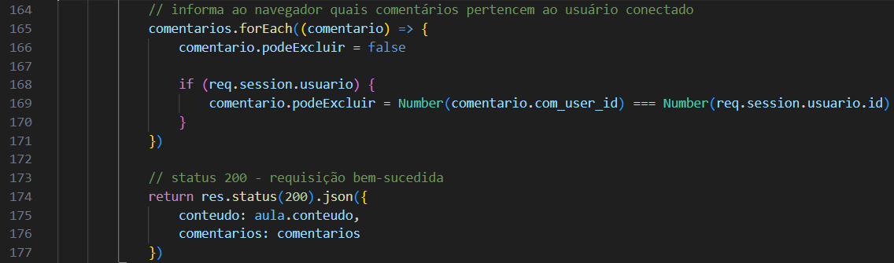

## Como os comentários são montados na página

Em **public/scripts/conteudo.js**, **exibirComentarios(comentarios)** recebe a lista enviada pelo servidor.

A função começa limpando a área:

```js
areaComentarios.textContent = ""
```

Se a lista estiver vazia, apresenta **Esta aula ainda não possui comentários.** e encerra a execução.

Se houver comentários, **forEach** percorre a lista. Para cada item, a função cria uma div e coloca dentro dela a estrutura fixa do comentário.

Essa estrutura contém:

- O elemento do avatar.
- O nome do usuário.
- O texto do comentário.
- O botão com ícone de exclusão.

Depois, os dados são preenchidos:

```js
bloco.querySelector(".avatar").innerText = comentario.user_avatar
bloco.querySelector(".user-name").innerText = comentario.user_name
bloco.querySelector(".commentary").innerText = comentario.com_texto
```

**querySelector** procura os elementos dentro da div daquele comentário.

**innerText** insere os valores como texto. O texto publicado não é interpretado como HTML.

Por fim, **areaComentarios.appendChild(bloco)** acrescenta o comentário à área da página.

**Print da estrutura e do preenchimento do comentário:**

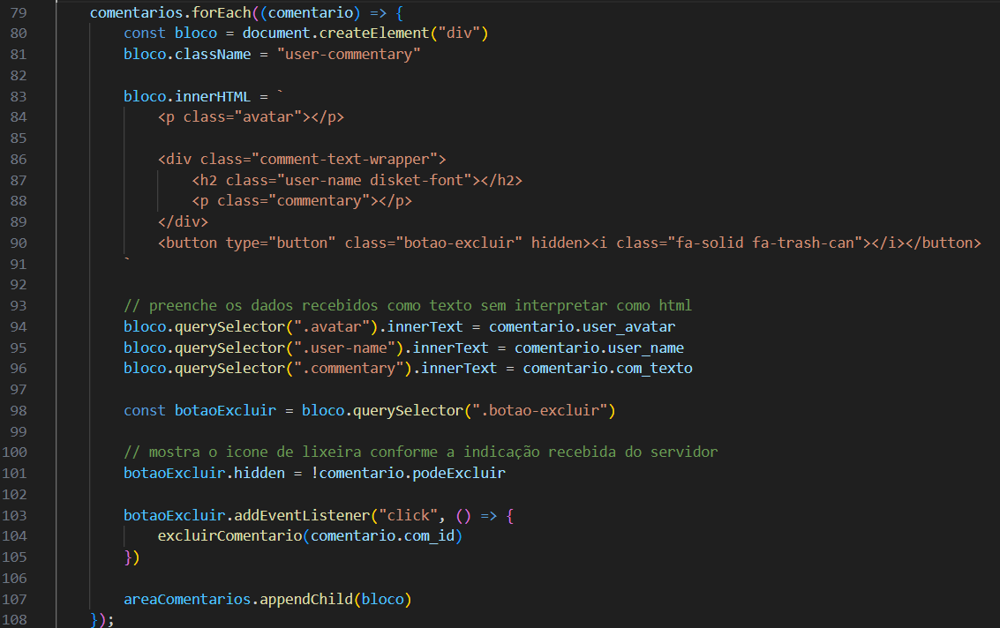

## Como a lixeira recebe sua ação

Ainda em **public/scripts/conteudo.js**, **exibirComentarios** encontra o botão e configura sua visibilidade:

```js
const botaoExcluir = bloco.querySelector(".botao-excluir")

botaoExcluir.hidden = !comentario.podeExcluir
```

Se **podeExcluir** for falso, o botão fica escondido.

A função também associa o clique:

```js
botaoExcluir.addEventListener("click", () => {
    excluirComentario(comentario.com_id)
})
```

O id enviado pertence ao comentário daquele bloco. A função **excluirComentario** utiliza esse id para montar a requisição.

## Como o formulário depende da aula e do login

Em **public/conteudo.html**, o formulário fica dentro de uma área que começa escondida.

Em **public/scripts/conteudo.js**, **carregarConteudo** mostra essa área somente depois que uma aula é carregada com sucesso.

No mesmo script, **verificarLoginComentario()** consulta **/usuarios/sessao** e decide o que mostrar:

- **dados.logado** verdadeiro: mostra o formulário e esconde o aviso de login.
- **dados.logado** falso: esconde o formulário e mostra o aviso.
- Falha na consulta: esconde o formulário e apresenta uma mensagem.

Essas condições trabalham juntas. Estar conectado não faz o formulário aparecer quando nenhuma aula foi carregada.

**Print da verificação de login dos comentários:**

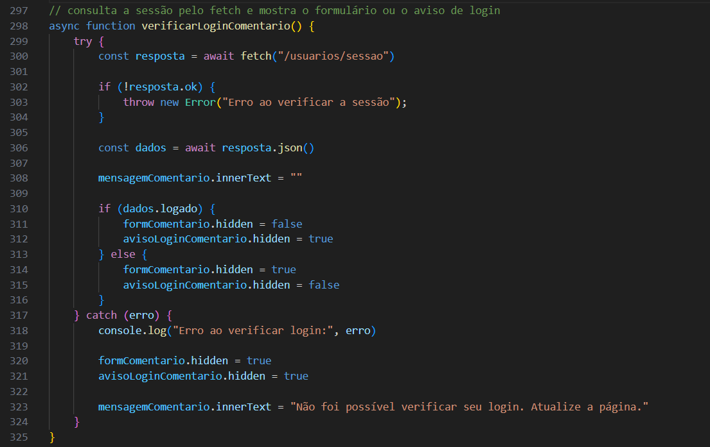

**Print da área sem login:**

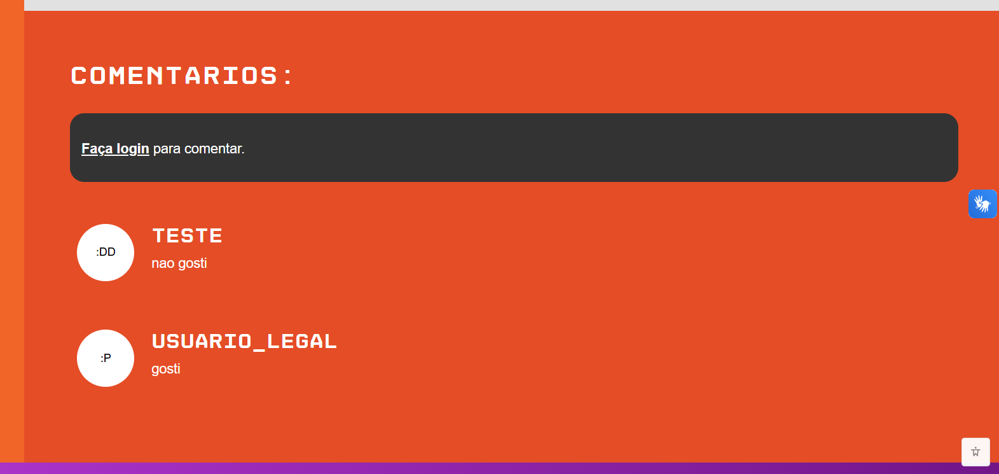

## Como o comentário é preparado para envio

Em **public/scripts/conteudo.js**, **enviarComentario(event)** recebe o envio do formulário.

**event.preventDefault()** impede o envio comum do HTML, pois os dados serão enviados com fetch.

A função verifica:

- Se existe uma operação em andamento, por meio de **ocupado**.
- Se uma aula foi selecionada, por meio de **topicoAtual**.
- Se o texto possui entre 1 e 1000 caracteres depois de **trim()**.

**trim()** remove espaços do início e do final. Um comentário formado apenas por espaços fica vazio e é recusado.

Depois, a função guarda o tópico em **topicoEnviado**. Essa variável mantém a identificação da aula utilizada naquela publicação.

Durante o envio, **ocupado** recebe verdadeiro, e o campo e o botão ficam desabilitados.

**Print das verificações antes do envio:**

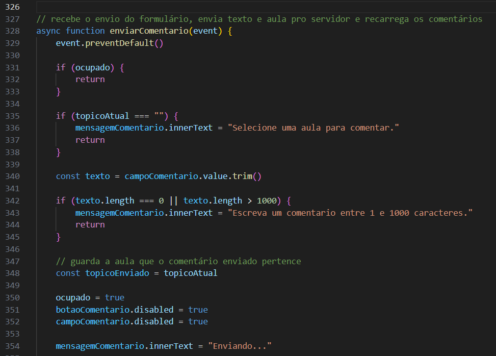

## Como o comentário é enviado

Ainda em **public/scripts/conteudo.js**, **enviarComentario** envia **POST /comentarios**.

O corpo contém:

```js
body: JSON.stringify({
    texto: texto,
    categoria: categoria,
    topico: topicoEnviado
})
```

O cabeçalho **Content-Type: application/json** informa o formato ao servidor.

O id do autor não é enviado pelo formulário. O servidor identifica a conta pela sessão.

A resposta é lida com **resposta.json()**. Quando o servidor retorna erro, a mensagem recebida é mostrada na página.

Se o status for 401, o script esconde o formulário e apresenta o aviso de login.

**Print da requisição de publicação:**

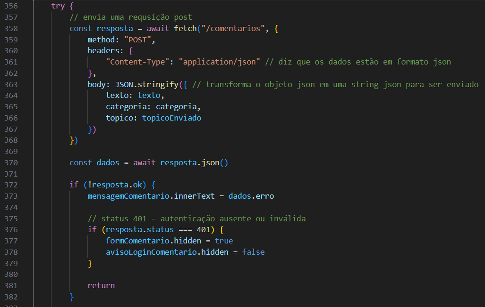

## Como a rota limita as publicações

Em **index.js**, **comentarioRoutes** é ligado ao início **/comentarios**.

Em **routes/comentarioRoutes.js**, a publicação utiliza:

```js
router.post("/", limitarComentarios, comentarioController.salvarComentario)
```

A requisição passa por **limitarComentarios** antes de chegar ao controller.

O limitador permite 5 tentativas em 1 minuto para cada usuário conectado.

Em **routes/comentarioRoutes.js**, **keyGenerator** define o identificador da contagem:

```js
keyGenerator: (req) => {
    return String(req.session.usuario.id)
}
```

A contagem utiliza o id da sessão convertido para texto.

A opção **skip** informa que visitantes sem sessão não entram nessa contagem:

```js
skip: (req) => {
    return !req.session.usuario
}
```

Isso não autoriza visitantes a publicar. Eles continuam sendo recusados pelo controller.

Ao atingir o limite, a biblioteca responde com status 429 e a mensagem configurada. A contagem considera tentativas, mesmo quando os dados são recusados depois.

A rota de exclusão não utiliza esse limitador no código atual.

**Print do limitador de comentários:**

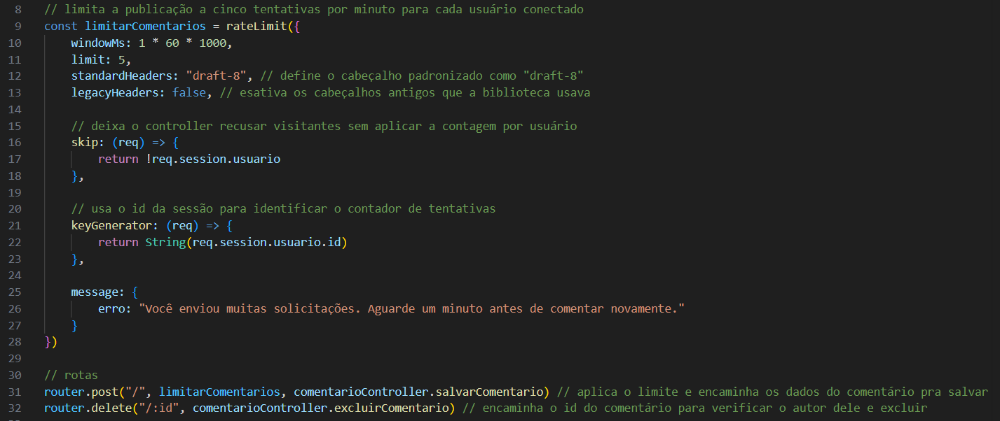

## Como o servidor verifica a publicação

Em **controller/comentarioController.js**, **salvarComentario(req, res)** começa verificando **req.session.usuario**.

Sem sessão, responde com status 401.

Depois, a função lê categoria, tópico e texto do corpo da requisição.

A categoria precisa ser **html**, **css** ou **javascript**.

O nome do tópico é conferido com:

```js
const nomeValido = /^[a-zA-Z0-9_-]+$/
```

A expressão aceita letras sem acento, números, **_** e **-**.

O texto passa por **trim()** e precisa ter entre 1 e 1000 caracteres. Os valores fora desses limites recebem status 400.

Nesse trecho, o código atual chama **dados.texto.trim()** diretamente. Portanto, ele pressupõe que o campo foi enviado como texto; não existe uma verificação anterior com **typeof** para esse campo.

**Print das verificações da publicação no servidor:**

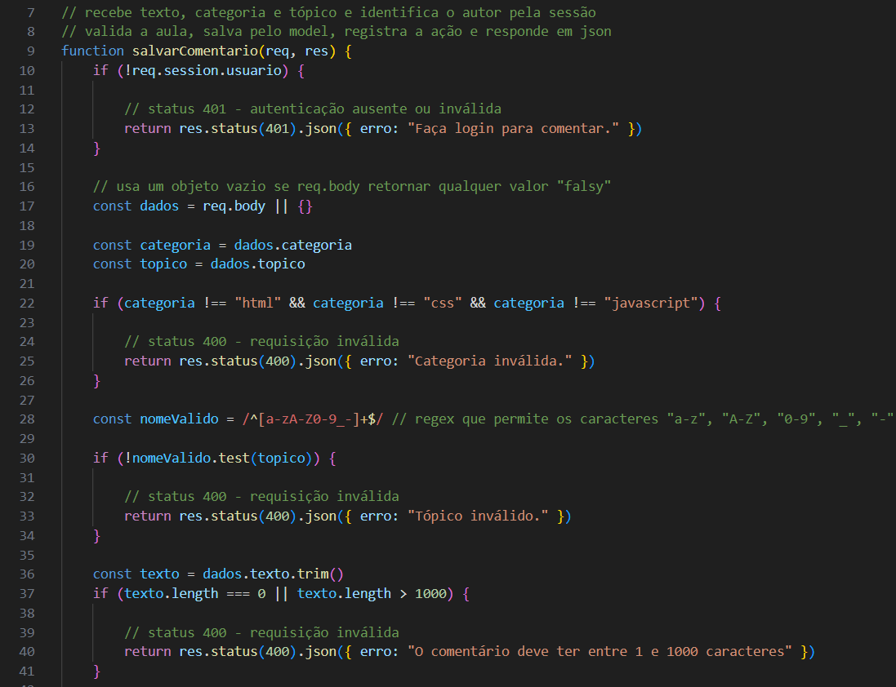

## Como a existência da aula é conferida

Em **controller/comentarioController.js**, **salvarComentario** monta o caminho do arquivo:

```js
const caminhoArquivo = path.join(__dirname, "../content", categoria, `${topico}.md`)
```

Depois, utiliza **fs.stat** para consultar as informações desse caminho.

- Se ocorrer **ENOENT**, responde com 404 porque a aula não foi encontrada.
- Se houver outra falha na consulta, responde com 500.
- Se o caminho não representar um arquivo, responde com 404.

A verificação de arquivo utiliza **arquivo.isFile()**.

Essa etapa evita gravar comentários para uma aula cujo arquivo não existe no momento da consulta.

O código dessa publicação verifica a existência do arquivo, mas não repete a leitura dos metadados feita por **buscarConteudo**, em **controller/conteudoController.js**.

**Print da verificação do arquivo da aula:**

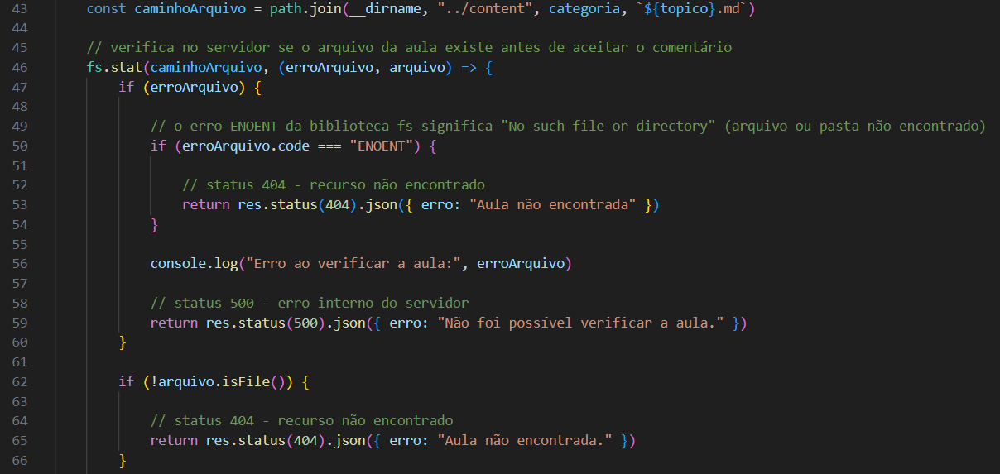

## Como o autor é definido

Ainda em **controller/comentarioController.js**, depois das verificações, **salvarComentario** prepara:

```js
const comentario = {
    userId: req.session.usuario.id,
    texto: texto,
    categoria: categoria,
    topico: topico
}
```

**userId** vem da sessão. O navegador envia o texto e a aula, mas não escolhe o autor registrado.

O objeto é enviado para **salvarComentario**, de **model/comentarioModel.js**.

## Como o comentário é salvo no banco

Em **model/comentarioModel.js**, **salvarComentario(comentario, callback)** executa:

```sql
INSERT INTO tb_comentarios
(com_user_id, com_texto, com_categoria, com_topico)
VALUES (?, ?, ?, ?)
```

Os valores são enviados nesta ordem:

- Id do autor.
- Texto do comentário.
- Categoria.
- Tópico.

O banco preenche **com_id** automaticamente e registra **com_data** pelo valor padrão da tabela.

O model devolve o erro ou o resultado pelo callback.

Em **controller/comentarioController.js**, **salvarComentario** verifica se **resultado.affectedRows** é igual a 1. Esse valor indica que o INSERT afetou o registro esperado.

Falhas de gravação ou um resultado diferente do esperado recebem status 500.

**Print do INSERT do comentário:**

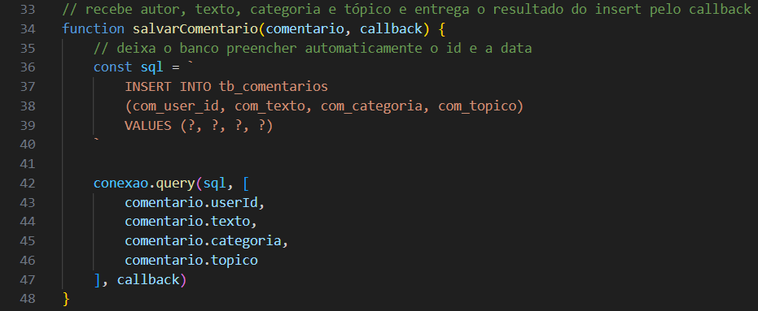

## Como a publicação é registrada nos logs

Em **controller/comentarioController.js**, depois de salvar o comentário, **salvarComentario** utiliza **resultado.insertId** para identificar o novo registro.

A ação enviada para **registrarLog**, de **model/logModel.js**, contém a indicação de publicação e o id do comentário.

O vínculo do log utiliza o id do usuário conectado.

Se a gravação do log falhar, o erro aparece no terminal. O comentário já foi salvo, e o controller continua para a resposta:

```js
return res.status(201).json({ mensagem: "Comentário salvo." })
```

O status 201 indica que o registro foi criado.

**Print do registro da publicação e da resposta:**

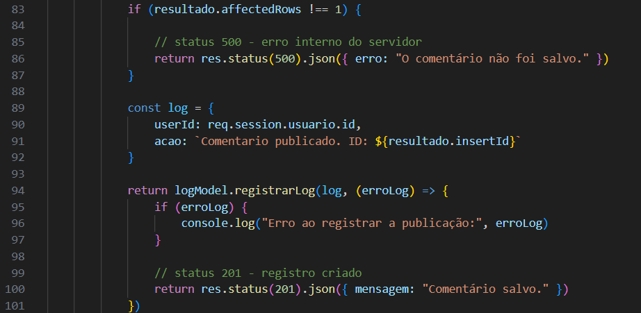

## Como a página atualiza os comentários após publicar

Em **public/scripts/conteudo.js**, quando **enviarComentario** recebe sucesso, limpa o campo e executa:

```js
ocupado = false
await carregarConteudo(topicoEnviado)
```

**ocupado** precisa ser liberado antes dessa chamada, porque **carregarConteudo** também verifica essa variável.

A aula é consultada novamente, trazendo a lista atualizada de comentários.

Depois, o script apresenta a mensagem recebida. No **finally**, libera o campo e ajusta o botão conforme a existência de uma aula selecionada.

Se houver falha de comunicação, a mensagem orienta conferir os comentários antes de repetir o envio. A falta de resposta no navegador não garante que o servidor deixou de salvar o registro.

**Print do comentário publicado:**

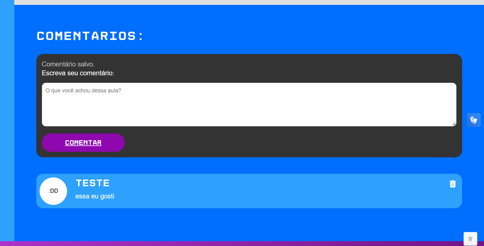

## Como a exclusão é solicitada

Em **public/scripts/conteudo.js**, **excluirComentario(id)** recebe o id associado ao botão de lixeira.

A função verifica **ocupado** e pede confirmação com **window.confirm**.

Se o usuário cancelar, a função encerra a chamada sem enviar a requisição.

Quando a exclusão é confirmada, guarda o tópico em **topicoSelecionado**, bloqueia o formulário e envia:

```js
const resposta = await fetch(`/comentarios/${id}`, {
    method: "DELETE"
})
```

Essa requisição informa o id no link. O autor continua sendo identificado pela sessão no servidor.

**Print da solicitação de exclusão:**

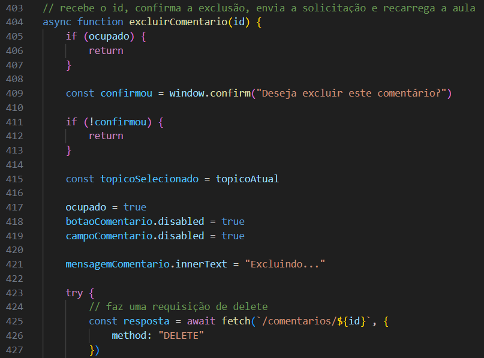

## Como o controller verifica a exclusão

Em **routes/comentarioRoutes.js**, **DELETE /:id** chama **excluirComentario**, de **controller/comentarioController.js**.

Essa função começa exigindo uma sessão. Sem login, responde com status 401.

Depois, converte o parâmetro:

```js
const id = Number(req.params.id)
```

O id precisa ser um inteiro seguro e maior que 0:

```js
if (!Number.isSafeInteger(id) || id <= 0) {
    return res.status(400).json({ erro: "ID do comentário inválido." })
}
```

O controller prepara um objeto com o id solicitado e o id do usuário da sessão.

Esses valores são enviados ao model para conferir também a autoria.

**Print das verificações da exclusão:**

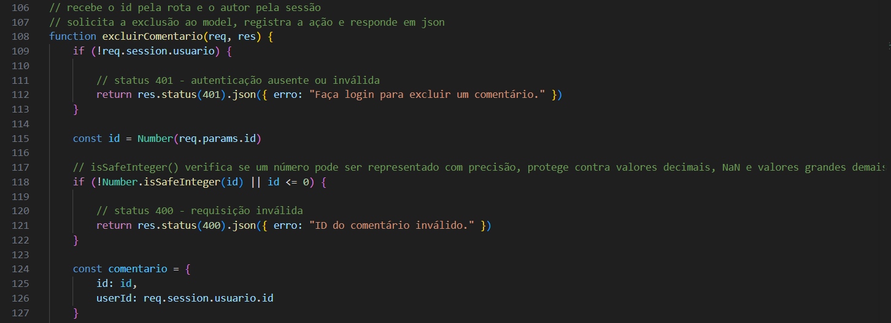

## Como o model impede a exclusão de outro autor

Em **model/comentarioModel.js**, **excluirComentario(comentario, callback)** utiliza:

```sql
DELETE FROM tb_comentarios
WHERE com_id = ?
AND com_user_id = ?
```

O registro precisa corresponder ao id do comentário e ao id do autor informado pelo servidor.

Por isso, mudar o id enviado pelo navegador não permite excluir um comentário pertencente a outra conta.

A lixeira escondida organiza a interface. A condição do SQL realiza a verificação de autoria nessa operação.

Em **controller/comentarioController.js**, se **resultado.affectedRows** for 0, a resposta será 404 com a mensagem de que o comentário não foi encontrado ou não pertence ao usuário.

**Print da exclusão com verificação de autoria:**

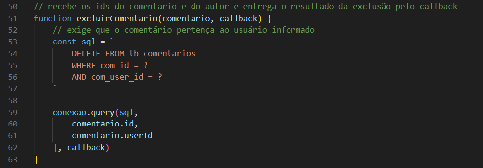

## Como a exclusão é registrada e apresentada

Em **controller/comentarioController.js**, depois da remoção, **excluirComentario** registra a ação com o id do usuário conectado e o id do comentário excluído.

A gravação é realizada por **registrarLog**, de **model/logModel.js**.

Depois, o controller devolve a mensagem de confirmação em JSON.

Em **public/scripts/conteudo.js**, **excluirComentario** libera **ocupado** e chama **carregarConteudo(topicoSelecionado)** para consultar a lista atualizada.

Se a sessão não estiver mais válida e a resposta for 401, o script esconde o formulário e mostra o aviso de login.

Em caso de falha de comunicação, apresenta uma mensagem para atualizar a página e conferir o resultado.

**Print do log da exclusão:**

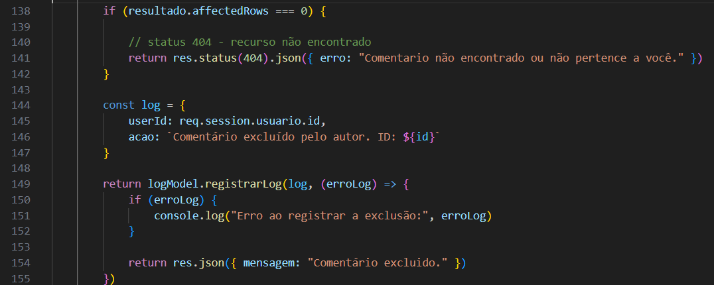

## Diferença entre exclusão pelo autor e pelo admin

Em **model/comentarioModel.js**, **excluirComentario** exige o id do comentário e o id do autor.

No mesmo model, **excluirComentarioAdmin** utiliza o id do comentário. A autorização dessa operação depende das rotas protegidas da página do admin.

As rotas do admin passam por **middleware/verificarAdmin.js**, que confere a sessão e o tipo de usuário.

Na página pública da aula, ser admin não faz a função **exibirComentarios** mostrar a lixeira em todos os comentários. O campo **podeExcluir** é calculado pela autoria.

A consulta e a exclusão pelo admin estão detalhadas em **DOC_ADMIN.md**.

## Relação entre comentários, usuários e aulas

Em **model/comentarioModel.js**, os comentários possuem 2 tipos de associação:

- **com_user_id:** relaciona o comentário a um registro de **tb_usuarios**.
- **com_categoria** e **com_topico:** identificam a aula armazenada em Markdown.

O banco consegue manter uma chave estrangeira para o usuário, mas não para o arquivo Markdown. Por isso, **controller/comentarioController.js** verifica a existência da aula antes da gravação.

Renomear ou mover um arquivo não atualiza os comentários automaticamente. Os valores de categoria e tópico precisam continuar correspondendo à aula desejada.

Com **ON DELETE CASCADE** configurado no relacionamento de **com_user_id**, excluir a conta também remove seus comentários. Essa regra depende da estrutura do banco utilizada na instalação.

## Responsividade dos comentários

Em **public/styles/conteudo.css**, as regras ajudam os textos a permanecer dentro da área disponível.

**min-width: 0** permite que a área de texto encolha. **overflow-wrap: anywhere** permite quebrar sequências longas que não possuem espaços.

Nos blocos **@media**, a área de comentários recebe ajustes de espaço e tamanho de texto.

Até 480 pixels, existem regras específicas para os elementos dentro de **comments-container**, incluindo o nome, o texto e a distância entre os elementos do comentário.

A organização geral da página está explicada em **DOC_CONTEUDOS.md**.

**Print dos comentários em tela de celular:**

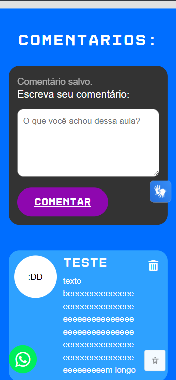

## Como manter a funcionalidade

Em **public/scripts/conteudo.js** e **controller/comentarioController.js**, o limite do texto precisa permanecer compatível com **com_texto** no banco.

Se esse limite mudar, atualize também o campo do formulário, as mensagens e a documentação.

Ao alterar a estrutura visual de um comentário em **exibirComentarios**, mantenha os seletores utilizados para preencher avatar, nome, texto e botão.

Ao alterar categorias ou nomes de tópicos, considere os registros existentes em **tb_comentarios**.

As operações de publicação e exclusão devem continuar registrando o resultado nos logs depois de confirmar a alteração no banco.

## Principais respostas das operações

Em **controller/comentarioController.js** e **routes/comentarioRoutes.js**, os principais resultados são:

- **Publicação concluída:** status 201.
- **Categoria, tópico, tamanho do texto ou id recusados pelas verificações:** status 400.
- **Sessão ausente:** status 401.
- **Aula não encontrada:** status 404.
- **Comentário inexistente ou de outro autor na exclusão:** status 404.
- **Limite de publicações atingido:** status 429.
- **Falha ao consultar o arquivo ou alterar o banco:** status 500.
- **Exclusão concluída:** resposta de sucesso com a mensagem em JSON.