# Conteúdos, tópicos e pesquisa

Este documento explica como a página de conteúdos funciona, como os arquivos do código se comunicam e como adicionar novas aulas.

Os caminhos começam na pasta principal do projeto, onde está **index.js**. As linhas indicadas nas instruções de prints consideram a versão comentada enviada. Se houver alterações, use também o nome da função para localizar o trecho.

## Objetivo da página

Em **public/conteudo.html**, a página reúne a pesquisa, o menu de tópicos, a aula e os comentários.

As aulas ficam em arquivos Markdown, dentro das pastas **content/html**, **content/css** e **content/javascript**. Os comentários ficam no banco de dados.

- Visitantes podem abrir aulas, pesquisar conteúdos e visualizar comentários.
- Usuários conectados podem publicar comentários.
- O autor pode excluir seu próprio comentário.
- O formulário de comentário aparece somente quando existe uma aula carregada e o usuário está conectado.

Em **public/scripts/conteudo.js**, selecionar um tópico pelo menu atualiza a aula sem recarregar toda a página. Os resultados da pesquisa são links que abrem a página novamente com a categoria e o tópico escolhidos.

**Print da página de conteúdo:**

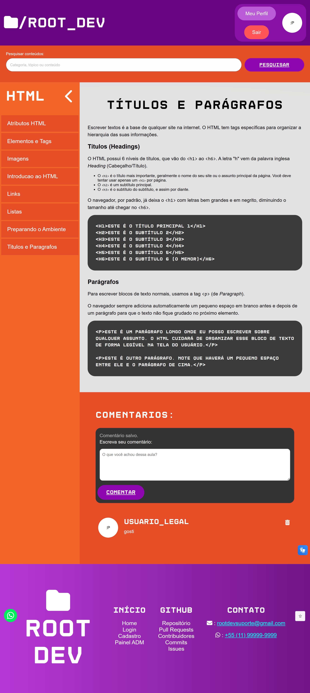

## Arquivos que participam do funcionamento

- **public/index.html:** contém os links das categorias na página inicial.
- **public/conteudo.html:** contém as áreas da pesquisa, dos tópicos, da aula e dos comentários.
- **public/scripts/conteudo.js:** recebe as ações do usuário, envia consultas com fetch e atualiza a página.
- **index.js:** encaminha as consultas para as rotas de conteúdo e inicia o cache da pesquisa.
- **routes/conteudoRoutes.js:** define qual função atende cada consulta.
- **controller/conteudoController.js:** lista os tópicos, lê as aulas, separa os metadados e realiza a pesquisa.
- **model/comentarioModel.js:** consulta os comentários e os dados de seus autores.
- **model/logModel.js:** registra a realização de pesquisas.
- **content/html, content/css e content/javascript:** guardam os arquivos Markdown das aulas.
- **public/styles/conteudo.css:** contém as adaptações da página para diferentes tamanhos de tela.

Os recursos compartilhados, como header, footer e scripts de navegação, são explicados em **DOC_GLOBAL.md**. A publicação e a exclusão de comentários são detalhadas em **DOC_COMENTARIOS.md**.

## Como a categoria é identificada

Em **public/index.html**, os botões das categorias usam estes links:

- **/conteudo.html?categoria=html**
- **/conteudo.html?categoria=css**
- **/conteudo.html?categoria=javascript**

Em **public/scripts/conteudo.js**, o código lê a informação presente no link:

```js
const parametros = new URLSearchParams(window.location.search)

let categoria = parametros.get("categoria")
```

**window.location.search** contém a parte do link iniciada por **?**. **URLSearchParams** permite consultar cada informação pelo nome. Por isso, **get("categoria")** recupera a categoria escolhida.

No mesmo arquivo, uma condição aceita somente **html**, **css** ou **javascript**. Quando a categoria não é aceita ou não foi informada, o script usa **html**.

A variável **categoria** é utilizada por estas funções de **public/scripts/conteudo.js**:

- **atualizarTitulo():** altera o título do menu e da aba do navegador.
- **aplicarTema():** coloca a categoria no atributo **data-categoria** do body.
- **carregarTopicos():** consulta os tópicos da categoria atual.

Essas funções usam a variável declarada no início do script, sem precisar recebê-la como argumento.

**Print da leitura da categoria:**

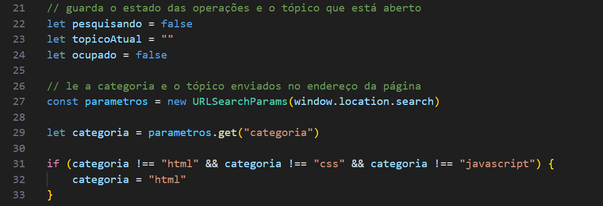

## Como uma aula pode ser indicada no link

Em **public/scripts/conteudo.js**, o trecho final também procura o parâmetro **topico**.

Um exemplo de link é:

**/conteudo.html?categoria=html&topico=Introducao-ao-HTML**

A categoria identifica a pasta. O tópico identifica o arquivo sem a extensão **.md**.

Se o tópico existir no link, o script chama **carregarConteudo(topicoInicial)**. Caso contrário, mostra **Nenhuma aula selecionada.**

**Print da abertura pelo link:**


## Como o JavaScript encontra as áreas da página

Em **public/conteudo.html**, os elementos que serão alterados possuem ids.

Em **public/scripts/conteudo.js**, as referências são obtidas com **document.getElementById**:

```js
const areaConteudo = document.getElementById("lesson-content")
const areaComentarios = document.getElementById("comments-container")
const listaTopicos = document.getElementById("topics-list")
```

- **areaConteudo:** elemento que recebe a aula.
- **areaComentarios:** elemento que recebe os comentários.
- **listaTopicos:** elemento que recebe os itens do menu.

Essas variáveis guardam os elementos da página. Assim, outras funções podem alterar seus textos, conteúdos e visibilidade.

Os ids do HTML precisam corresponder aos utilizados no script. Se um elemento não for encontrado, o resultado será **null**.

Em **public/conteudo.html**, o script de conteúdo é carregado ao final da página, depois dos elementos que ele utiliza.

## Como as rotas encaminham as consultas

Em **index.js**, esta configuração encaminha os links iniciados por **/conteudo**:

```js
app.use('/conteudo', conteudoRoutes)
```

Em **routes/conteudoRoutes.js**, as rotas são:

```js
router.get("/pesquisa", conteudoController.pesquisarConteudos)
router.get("/:categoria", conteudoController.listarTopicos)
router.get("/:categoria/:topico", conteudoController.buscarConteudo)
```

Cada rota possui uma finalidade:

- **GET /conteudo/pesquisa:** recebe o termo pesquisado e devolve os resultados.
- **GET /conteudo/:categoria:** recebe uma categoria e devolve seus tópicos.
- **GET /conteudo/:categoria/:topico:** recebe a categoria e o tópico e devolve a aula com seus comentários.

O símbolo **:** indica uma parte variável da rota. Por exemplo, em **/conteudo/html/Imagens**, o Express disponibiliza **html** em **req.params.categoria** e **Imagens** em **req.params.topico**.

A pesquisa usa **req.query.pesquisa**, pois o termo fica depois de **?**.

A rota **/pesquisa** precisa aparecer antes de **/:categoria**. Caso contrário, a palavra pesquisa pode ser interpretada como uma categoria.

Em **controller/conteudoController.js**, as funções recebem **req**, que contém os dados da requisição, e **res**, usado para enviar a resposta.

**Print das rotas de conteúdo:**

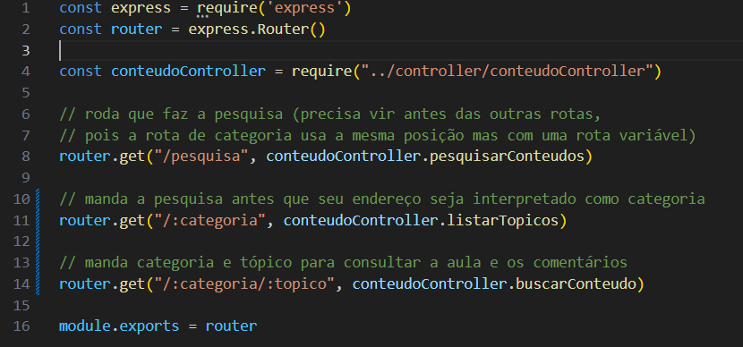

## Como os tópicos são consultados

Em **public/scripts/conteudo.js**, **carregarTopicos()** consulta os tópicos da categoria atual:

```js
const resposta = await fetch(`/conteudo/${categoria}`)
const dados = await resposta.json()
```

**fetch** envia a consulta ao servidor. O **await** aguarda a resposta antes de continuar.

**resposta.json()** lê o corpo da resposta e transforma o JSON recebido em um objeto. A função também confere **resposta.ok** para verificar se o servidor respondeu com sucesso.

Em **controller/conteudoController.js**, **listarTopicos(req, res)** realiza estas operações:

- Recebe a categoria pela rota.
- Confere se a categoria é aceita.
- Monta o caminho da pasta com **path.join**.
- Lê os itens da pasta com **fs.readdir**.
- Considera somente arquivos terminados em **.md**.
- Remove a extensão com **path.basename**.
- Ordena os nomes com **sort()**.
- Envia a lista ao navegador.

A opção **withFileTypes: true** permite verificar se cada item é um arquivo usando **arquivo.isFile()**.

**fs.readdir** recebe um callback. Essa função é executada quando a leitura termina e recebe o possível erro e os itens encontrados.

Uma resposta simplificada tem este formato:

```json
{
    "topicos": ["Imagens", "Introducao-ao-HTML", "Links"]
}
```

**Print da listagem de tópicos no servidor:**

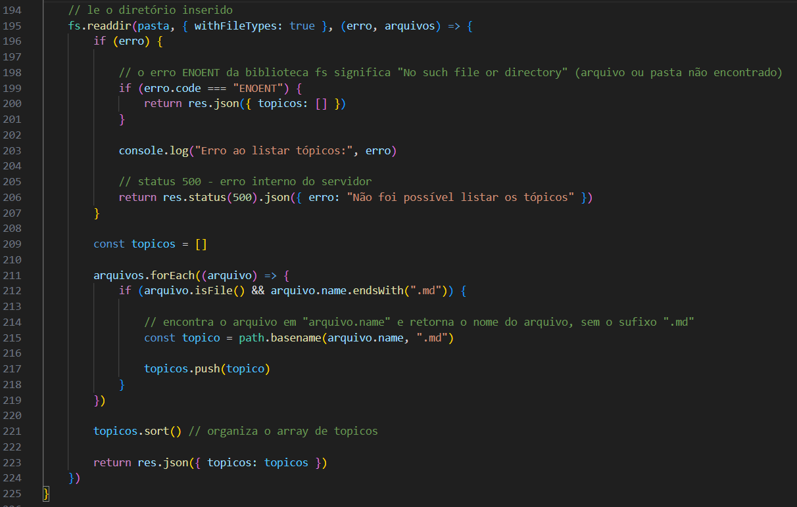

## Como os tópicos aparecem no menu

De volta a **public/scripts/conteudo.js**, **carregarTopicos()** usa **forEach** para percorrer a lista recebida.

Para cada tópico, o script insere a estrutura de um item e preenche seu texto. Os caracteres **-** e **_** são trocados por espaços somente na apresentação.

O nome original é mantido na chamada que abre a aula:

```js
item.addEventListener("click", () => {
    carregarConteudo(topico)
})
```

**addEventListener** associa o clique à função indicada. Quando o usuário clica, o tópico daquele item é enviado para **carregarConteudo**.

A listagem considera os nomes dos arquivos, mas não valida o cabeçalho de cada aula. Por isso, um arquivo com cabeçalho incorreto pode aparecer no menu e apresentar erro ao ser aberto.

**Print da montagem do menu:**


## Como o carregamento da aula é controlado

Em **public/scripts/conteudo.js**, **carregarConteudo(topico)** recebe o tópico escolhido e utiliza algumas variáveis para controlar a operação:

- **topicoAtual:** guarda o tópico carregado com sucesso.
- **ocupado:** indica se existe um carregamento, uma publicação ou uma exclusão de comentário em andamento.
- **pesquisando:** controla separadamente a consulta da pesquisa.

No início de **carregarConteudo**, esta condição impede outro carregamento durante uma operação:

```js
if (ocupado) {
    return
}
```

O **return** encerra a chamada atual.

Quando pode continuar, a função marca **ocupado** como verdadeiro, limpa **topicoAtual**, esconde a área do formulário de comentário e bloqueia seus controles.

Isso evita que um comentário seja enviado enquanto a nova aula ainda está carregando.

Na mesma função, **mudouDeTopico** compara o tópico solicitado com o anterior. Depois do carregamento, esse resultado define se o texto digitado no comentário deve ser limpo.

A consulta utiliza a categoria e o tópico:

```js
const endereco = `/conteudo/${encodeURIComponent(categoria)}/${encodeURIComponent(topico)}`

const resposta = await fetch(endereco)
const dados = await resposta.json()
```

A variável **endereco** guarda o link da consulta. **encodeURIComponent** prepara os valores para serem inseridos no link.

Se a resposta funcionar, a função chama **exibirConteudo(dados.conteudo)** e **exibirComentarios(dados.comentarios)**. Depois, registra o tópico carregado e libera a área do formulário.

O tratamento utiliza:

- **try:** consulta o servidor e processa a resposta.
- **catch:** apresenta uma mensagem quando ocorre uma falha.
- **finally:** libera o estado de ocupado e ajusta os controles.

O botão de comentar permanece desabilitado se **topicoAtual** continuar vazio.

## Como o servidor lê a aula

Em **controller/conteudoController.js**, **buscarConteudo(req, res)** recebe a categoria e o tópico pela rota.

A categoria precisa ser **html**, **css** ou **javascript**. O tópico é conferido com esta expressão:

```js
const nomeValido = /^[a-zA-Z0-9_-]+$/
```

Ela aceita letras sem acento, números, **_** e **-**. Nomes com espaços ou **/** são recusados.

Depois da validação, a função monta o caminho:

```js
const caminhoArquivo = path.join(__dirname, "../content", categoria, `${topico}.md`)
```

- **__dirname:** pasta onde está o controller.
- **../content:** pasta das aulas em relação ao controller.
- **categoria:** subpasta escolhida.
- **topico:** nome que recebe a extensão **.md**.

**path.join** reúne essas partes no formato de caminho do sistema operacional.

Ainda em **buscarConteudo**, **fs.readFile** lê o arquivo. O parâmetro **utf8** faz o conteúdo ser recebido como texto.

No callback, **erroArquivo** informa uma possível falha e **conteudo** contém o texto lido.

- **ENOENT:** arquivo não encontrado, com resposta 404.
- Outras falhas de leitura: resposta 500.
- Leitura concluída: o texto é enviado para **extrairMetadados**.

**Print da leitura da aula:**

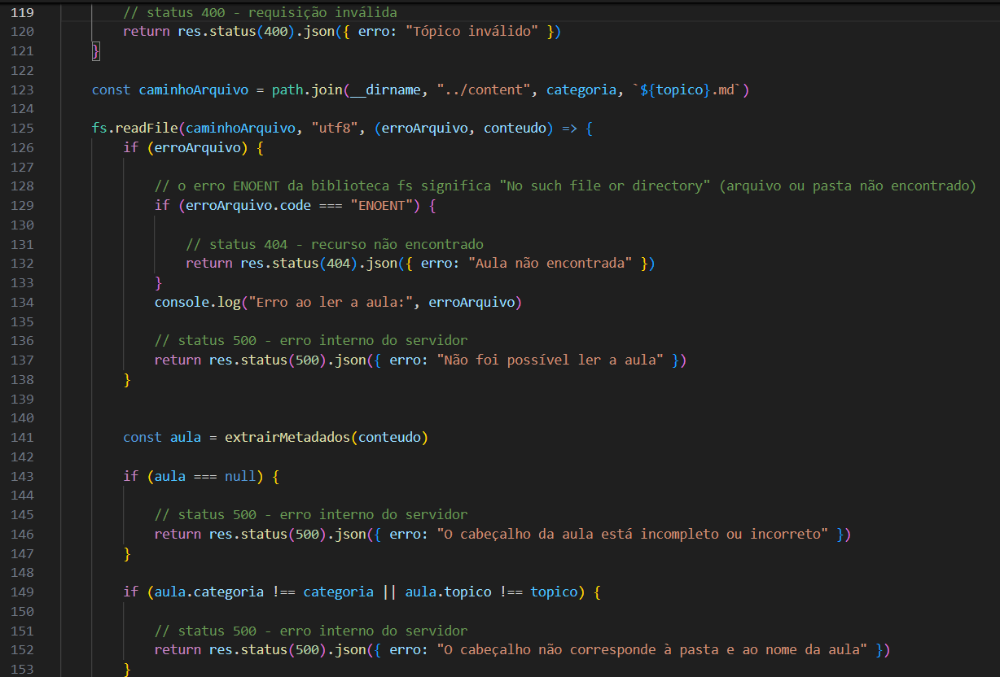

## Como os metadados são separados

Em **controller/conteudoController.js**, **extrairMetadados(texto)** recebe o texto completo do Markdown.

O cabeçalho fica entre 2 linhas com **---** e informa a categoria e o tópico.

A função trabalha desta forma:

- **split("\n")** divide o texto em uma lista de linhas.
- A 1ª linha precisa conter **---**.
- **categoria** e **topico** começam vazios.
- **fimCabecalho** começa com **-1**, indicando que o final ainda não foi encontrado.
- O laço **for** começa na 2ª linha.
- **startsWith** identifica os campos do cabeçalho.
- **replace** remove o nome do campo.
- **trim** remove espaços das pontas.
- Ao encontrar outro **---**, a função guarda sua posição e encerra o laço com **break**.

Se faltar categoria, tópico ou o separador final, a função retorna **null**.

Quando o cabeçalho é válido, o conteúdo é separado:

```js
const conteudo = linhas.slice(fimCabecalho + 1).join("\n")
```

**slice** seleciona as linhas depois do cabeçalho. **join** reúne essas linhas novamente em um texto.

A função retorna um objeto com **categoria**, **topico** e **conteudo**. Ela não envia a resposta ao navegador diretamente.

No mesmo arquivo, **buscarConteudo** compara os metadados com a categoria e o tópico solicitados. Se não corresponderem à pasta e ao arquivo, retorna 500.

**Print da separação dos metadados:**

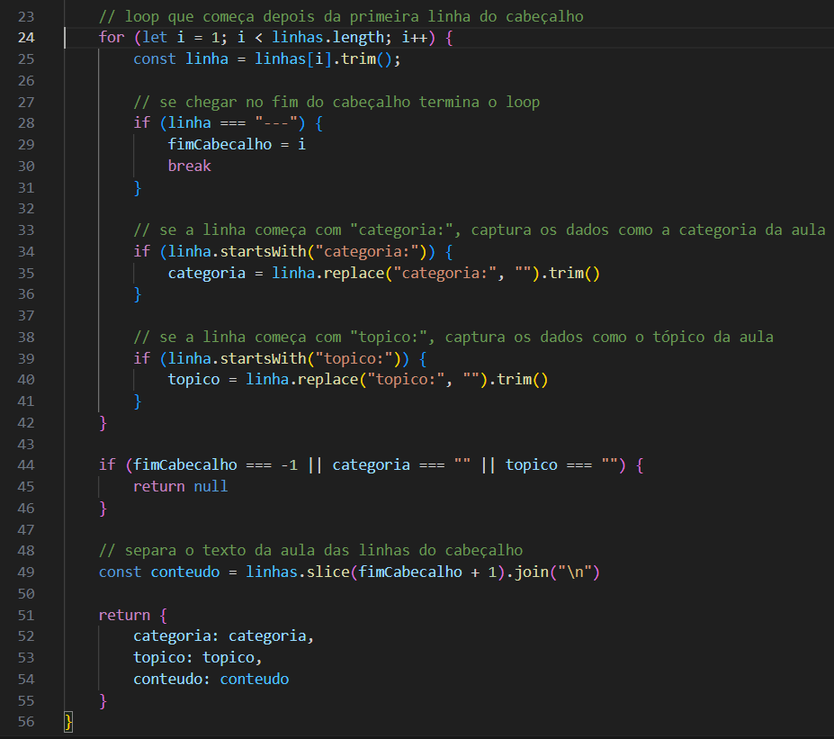

## Como os comentários acompanham a aula

Em **controller/conteudoController.js**, **buscarConteudo** chama **comentarioModel.buscarPorTopico(categoria, topico, callback)** depois de validar a aula.

Em **model/comentarioModel.js**, **buscarPorTopico** consulta **tb_comentarios** usando a categoria e o tópico.

A consulta usa **INNER JOIN** com **tb_usuarios** para acrescentar o nome e o avatar dos autores. Os comentários são ordenados pela data, do mais recente para o mais antigo.

O callback recebe o erro ou a lista encontrada.

De volta a **controller/conteudoController.js**, o controller acrescenta **podeExcluir** em cada comentário. O valor é verdadeiro quando existe uma sessão de usuário e o id da sessão corresponde ao autor.

Esse campo controla a exibição da lixeira. A exclusão também confere a autoria no servidor.

Por fim, **buscarConteudo** envia:

```js
return res.status(200).json({
    conteudo: aula.conteudo,
    comentarios: comentarios
})
```

**status(200)** indica sucesso. **json** envia os dados ao navegador.

Se a consulta dos comentários falhar, a requisição retorna erro. O código atual envia aula e comentários juntos, por isso não devolve normalmente a aula nessa situação.

## Como o Markdown aparece na página

Em **public/scripts/conteudo.js**, **exibirConteudo(markdown)** recebe o texto da aula:

```js
const html = marked.parse(markdown)
const htmlSeguro = DOMPurify.sanitize(html)

areaConteudo.innerHTML = htmlSeguro
```

**marked.parse** transforma o Markdown em HTML.

**DOMPurify.sanitize** remove elementos e atributos não permitidos antes da inserção.

**innerHTML** coloca o resultado na área da aula, permitindo que títulos, listas e exemplos sejam apresentados como elementos da página.

Em **public/conteudo.html**, Marked e DOMPurify são carregados antes de **public/scripts/conteudo.js**.

Na função **exibirConteudo**, depois da inserção, **querySelector("h1")** procura o título principal e acrescenta as classes utilizadas pela página.

No mesmo script, **exibirComentarios(comentarios)** monta uma estrutura fixa para cada comentário e preenche nome, avatar e texto com **innerText**. Assim, esses valores são exibidos como texto.

**Print da conversão do Markdown:**

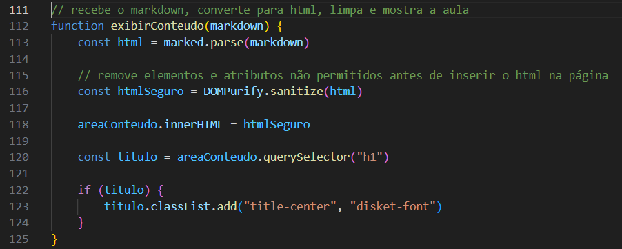

**Print da aula renderizada:**

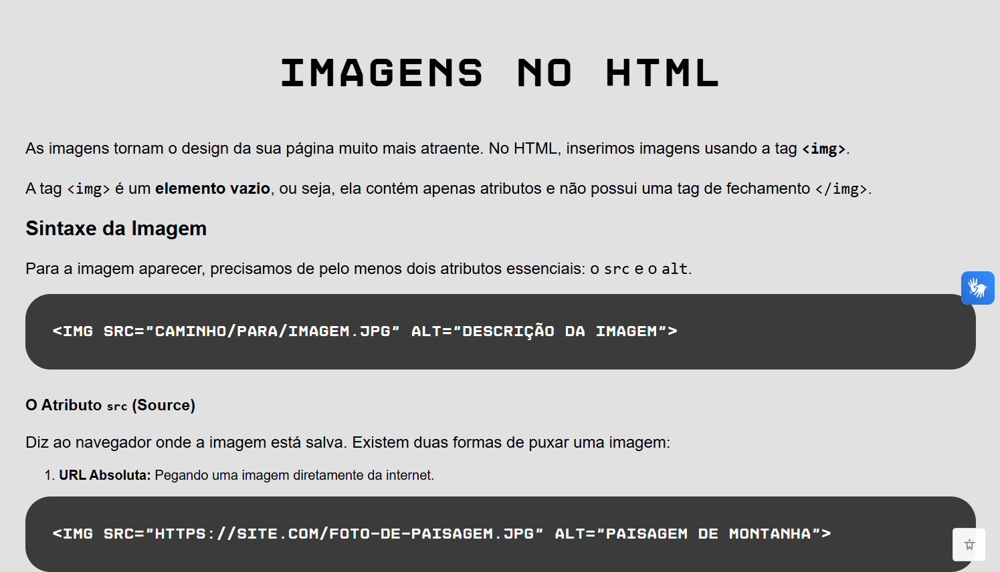

## Como a pesquisa funciona no navegador

Em **public/scripts/conteudo.js**, **pesquisarConteudos(event)** recebe o envio do formulário.

**event.preventDefault()** impede o envio comum do HTML, permitindo que a consulta seja feita com fetch.

A função lê o campo, remove espaços das pontas com **trim** e recusa uma pesquisa vazia. Durante a consulta, marca **pesquisando** como verdadeiro e desabilita o botão.

O link enviado tem este formato:

**/conteudo/pesquisa?pesquisa=html**

Depois da resposta, **exibirResultadosPesquisa(resultados)** recebe a lista, monta os links e informa a quantidade de resultados.

Se a lista estiver vazia, apresenta a mensagem correspondente. Ao clicar em um resultado, o navegador abre **conteudo.html** com a categoria e o tópico no link.

## Como o servidor encontra os resultados

Em **controller/conteudoController.js**, **pesquisarConteudos(req, res)** recebe **req.query.pesquisa**.

A função verifica se o valor é um texto, remove espaços das pontas, transforma o termo em letras minúsculas e limita seu tamanho a 100 caracteres.

Se o termo estiver vazio, retorna uma lista vazia.

A pesquisa percorre o cache e compara o termo com categoria, tópico e conteúdo:

```js
if (categoria.includes(termo) || topico.includes(termo) || conteudo.includes(termo)) {
    resultados.push({
        categoria: aula.categoria,
        topico: aula.topico
    })
}
```

**includes** verifica se um texto contém o termo. **||** permite encontrar a correspondência em qualquer um dos 3 campos.

**push** acrescenta a aula encontrada à lista.

A comparação usa **toLowerCase()**, por isso não diferencia letras maiúsculas e minúsculas. O código não remove acentos.

A pesquisa considera todas as categorias, independentemente da categoria aberta na página.

**Print da comparação da pesquisa:**

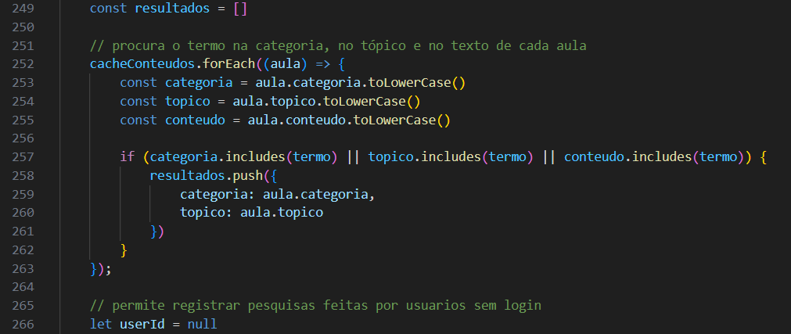

**Print dos resultados no site:**

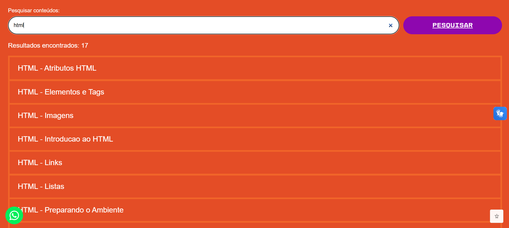

## Como a pesquisa é registrada nos logs

Em **controller/conteudoController.js**, **pesquisarConteudos** chama **registrarLog**, de **model/logModel.js**, depois de uma pesquisa válida e não vazia.

A ação registrada é **Pesquisa de conteúdos realizada**.

Se existir login, o registro recebe o id da sessão. Para visitantes, o vínculo com o usuário recebe **null**.

Essa função registra a realização da pesquisa, mas não coloca o termo pesquisado na descrição do log.

Se a gravação falhar, o erro aparece no terminal e os resultados ainda são enviados.

## Como o cache é preparado

Em **controller/conteudoController.js**, **cacheConteudos** guarda as aulas na memória do servidor.

Em **index.js**, **carregarCacheConteudos()** é chamada antes de **app.listen**.

A função **carregarCacheConteudos**, definida em **controller/conteudoController.js**, realiza estas etapas:

- Limpa a lista com **cacheConteudos.length = 0**.
- Percorre HTML, CSS e JavaScript.
- Lê os itens das pastas com **fs.readdirSync**.
- Ignora subpastas e arquivos sem extensão **.md**.
- Confere os nomes dos tópicos.
- Lê os arquivos com **fs.readFileSync**.
- Chama **extrairMetadados**.
- Confere se os metadados correspondem à pasta e ao arquivo.
- Acrescenta as aulas válidas com **cacheConteudos.push(aula)**.

As funções terminadas em **Sync** concluem a leitura antes de o código continuar. Nesse caso, são usadas na preparação inicial.

Arquivos com nome ou cabeçalho inválido são ignorados no cache e geram uma mensagem no terminal. Uma pasta ausente ou outra falha de leitura sem tratamento pode interromper a inicialização.

**Print do carregamento do cache:**

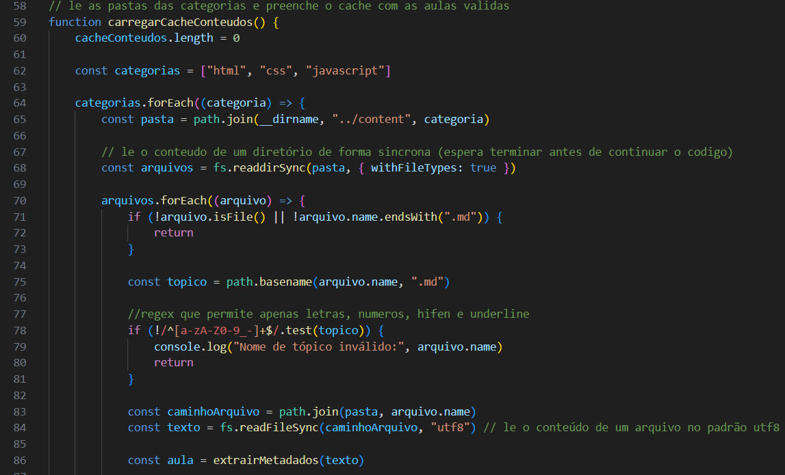

## Diferença entre listar, abrir e pesquisar

Em **controller/conteudoController.js**, cada operação utiliza uma origem:

- **listarTopicos:** consulta os nomes dos arquivos na pasta.
- **buscarConteudo:** lê o Markdown solicitado e consulta os comentários no banco.
- **pesquisarConteudos:** consulta as aulas guardadas em memória.

Por isso, uma aula nova pode aparecer no menu antes de aparecer na pesquisa.

O cache não é atualizado automaticamente. Depois de adicionar, alterar ou remover aulas, reinicie o servidor.

## Como o formulário de comentário é mostrado

Em **public/conteudo.html**, a área externa do formulário começa escondida.

Em **public/scripts/conteudo.js**, **carregarConteudo** mostra essa área depois de receber uma aula com sucesso.

No mesmo script, **verificarLoginComentario()** consulta **/usuarios/sessao**:

- Com login, mostra o formulário.
- Sem login, mostra o aviso para entrar na conta.
- Em caso de falha, mantém o formulário escondido e apresenta uma mensagem.

A propriedade **hidden** controla a visibilidade. O valor verdadeiro esconde o elemento.

Em **public/scripts/conteudo.js**, **enviarComentario(event)** recebe o envio do formulário e manda texto, categoria e tópico por **POST /comentarios**. O servidor identifica o autor pela sessão.

**excluirComentario(id)** recebe o id escolhido e envia **DELETE /comentarios/:id** após a confirmação.

Quando essas operações funcionam, a aula é carregada novamente para atualizar os comentários. Os detalhes estão em **DOC_COMENTARIOS.md**.

**Print da página sem tópico:**

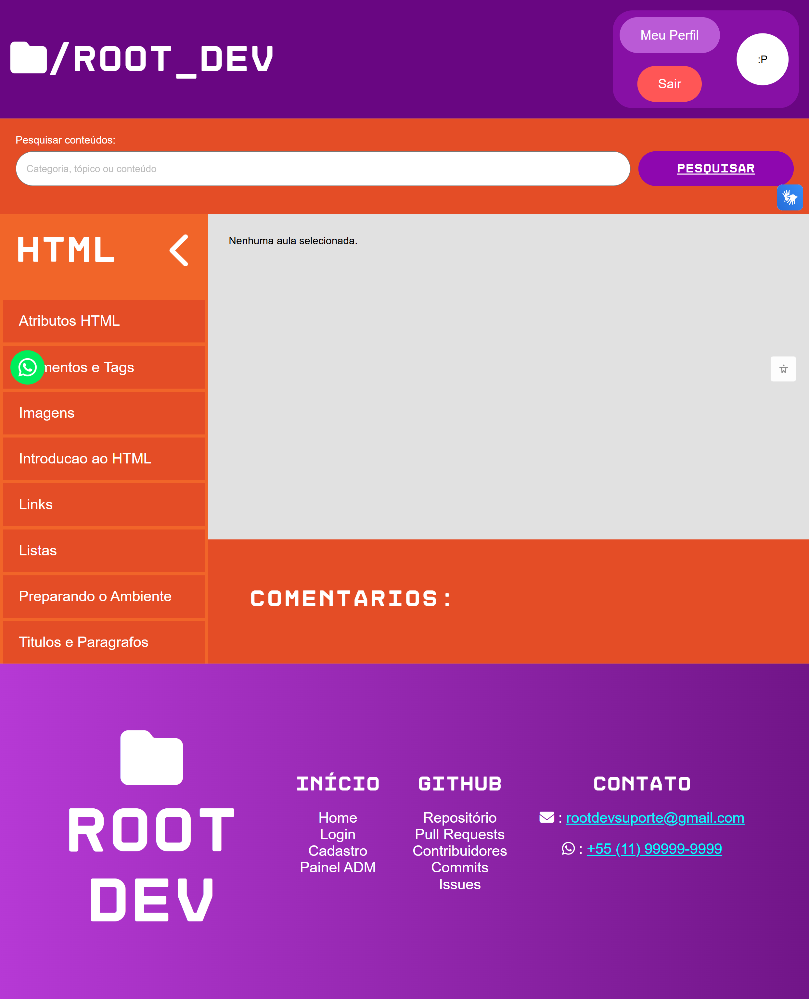

**Print dos comentários sem login:**

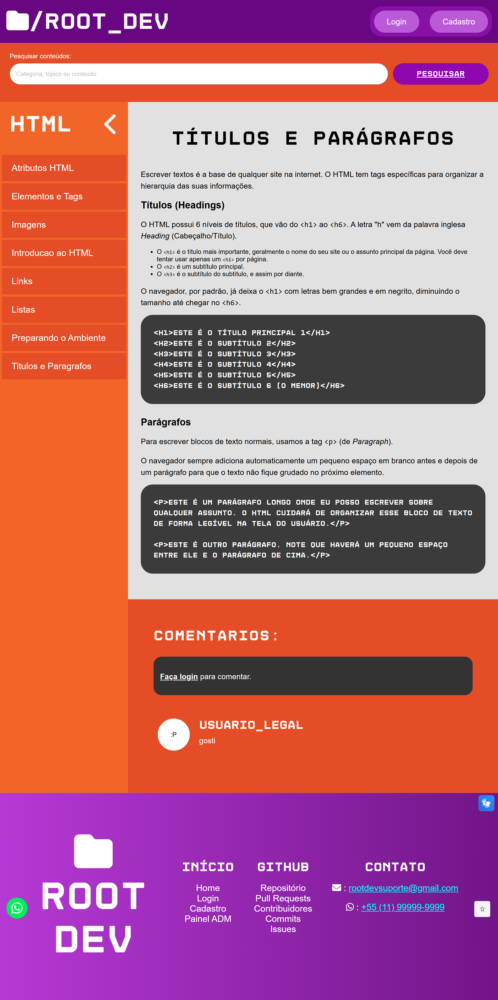

## Como adicionar uma aula

As aulas são mantidas nos arquivos do projeto. A página do admin não possui um formulário para criar ou editar conteúdos didáticos.

Use qualquer editor de texto que permita salvar um arquivo com extensão **.md**.

### Escolher o arquivo

Como exemplo, crie **content/html/Formularios-HTML.md**.

- **html** define a categoria.
- **Formularios-HTML** define o tópico.
- **.md** identifica o formato do arquivo.

No nome do tópico, use letras sem acento, números, **-** ou **_**. Mantenha a mesma escrita, incluindo maiúsculas e minúsculas, no nome do arquivo e no cabeçalho.

O título exibido dentro da aula pode ter espaços e acentos.

### Escrever o conteúdo

Em **content/html/Formularios-HTML.md**, escreva:

````markdown
---
categoria: html
topico: Formularios-HTML
---

# Formulários em HTML

Formulários permitem que o usuário preencha informações em uma página.

## Exemplo

```html
<form>
    <label for="nome">Nome:</label>
    <input id="nome" name="nome" type="text">
    <button type="submit">Enviar</button>
</form>
```

Nesse exemplo, o campo recebe um nome e o botão envia o formulário.
````

O 1º **---** deve estar no começo do arquivo. Os campos **categoria** e **topico** ficam entre os 2 separadores.

Escreva os valores sem **"** nem **'**. Em **controller/conteudoController.js**, **extrairMetadados** lê essas linhas diretamente e não interpreta um formato completo de configuração.

Depois do cabeçalho:

- **#:** cria o título principal.
- **##:** cria um subtítulo.
- Linhas de texto separadas por linhas vazias formam os parágrafos.
- **\`\`\`** antes e depois de um trecho delimitam um bloco de código.

O formulário dentro do bloco será apresentado como exemplo de código, não como um formulário interativo do site.

**Print do arquivo da nova aula:**

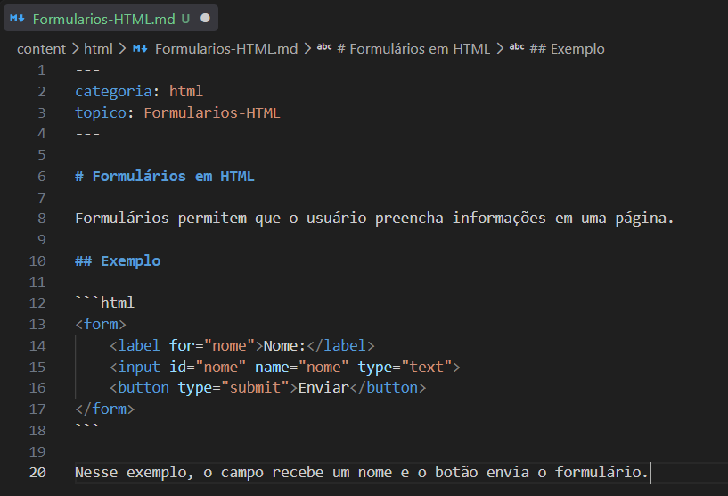

### Abrir a nova aula

Com o projeto e o banco configurados:

- Salve o arquivo.
- No CMD, PowerShell ou terminal que executa o projeto, pare o servidor com **Ctrl + C**.
- Na pasta de **index.js**, execute **node index.js**.
- Abra **http://localhost:8000/conteudo.html?categoria=html**.
- Selecione o novo tópico.
- Pesquise por **Formularios-HTML** para encontrar a aula no cache.

Também é possível abrir diretamente:

**http://localhost:8000/conteudo.html?categoria=html&topico=Formularios-HTML**

Não é necessário inserir a aula no banco. Seus comentários serão associados à categoria e ao tópico.

**Print da nova aula no site:**

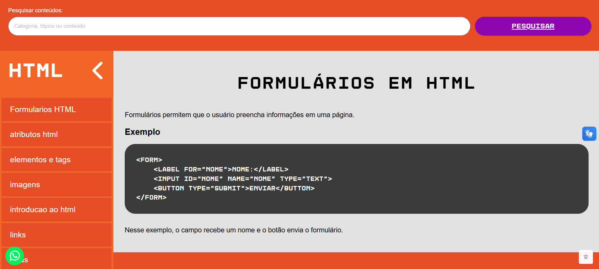

**Print da pesquisa pela nova aula:**

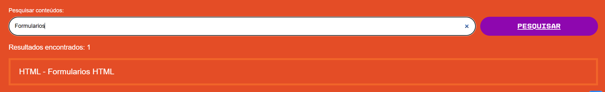

### Alterar, renomear ou remover aulas

Nos arquivos das pastas **content/html**, **content/css** e **content/javascript**:

- Para alterar uma explicação, edite o texto abaixo do cabeçalho.
- Para renomear o arquivo, ajuste também **topico** no cabeçalho.
- Para mover a aula, ajuste **categoria** no cabeçalho.
- Para remover a aula, exclua o arquivo.
- Depois dessas alterações, reinicie o servidor para atualizar a pesquisa.

Os links precisam acompanhar mudanças no nome ou na categoria.

Em **model/comentarioModel.js**, a associação dos comentários usa **com_categoria** e **com_topico**. Os comentários não são transferidos automaticamente quando uma aula é renomeada ou movida.

Excluir o Markdown também não apaga os comentários do banco. Esses registros precisam ser considerados na manutenção.

Adicionar uma aula em uma categoria existente exige o novo arquivo. Adicionar uma 4ª categoria exige mudanças nas categorias aceitas pelo servidor, na interface e na validação dos comentários.

## Responsividade da página

Em **public/styles/conteudo.css**, os blocos **@media** adaptam a página:

- Até **1024 pixels**, ajustam os espaços dos comentários e a margem do menu fechado.
- Até **768 pixels**, organizam a área principal em coluna, posicionam o menu sobre a aula e reservam espaço para seu controle.
- Até **480 pixels**, o menu pode ocupar toda a largura e os controles da pesquisa ficam em coluna.

Essas regras se somam. Uma tela de 480 pixels também atende aos limites de 768 e 1024 pixels.

Em **public/scripts/conteudo.js**, este trecho inicia o menu fechado em telas menores:

```js
if (window.innerWidth <= 768) {
    menuLateral.classList.add("fechado")
}
```

Essa verificação acontece na abertura da página. O menu da aula não possui um evento próprio de redimensionamento nesse script.

No mesmo arquivo, **alternarMenu()** acrescenta ou remove a classe **fechado**. **atualizarSeta()** muda o ícone conforme o estado do menu.

Em **public/styles/conteudo.css**, outras propriedades ajudam a manter o conteúdo dentro da página:

- **white-space: pre-wrap:** preserva espaços e quebras de linha dos exemplos e permite novas quebras.
- **overflow-x: auto:** permite rolagem horizontal quando necessário.
- **min-width: 0:** permite que a área de texto dos comentários encolha.
- **overflow-wrap: anywhere:** permite quebrar textos longos.

A responsividade do header e do footer está em **DOC_GLOBAL.md**.

**Print das regras de responsividade:**

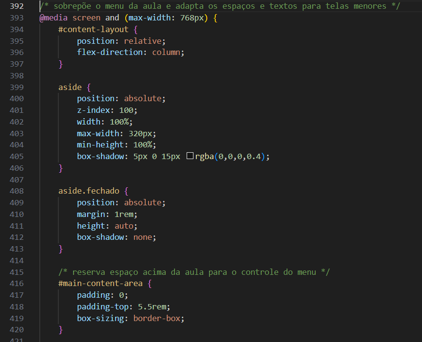

**Print da página em tela larga:**

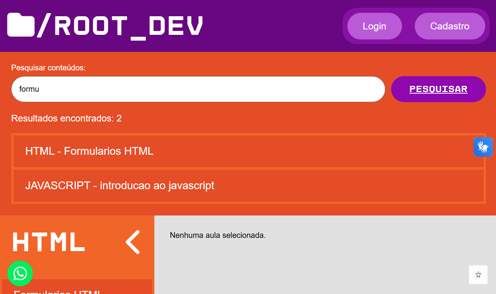

**Print da página em tela de celular:**

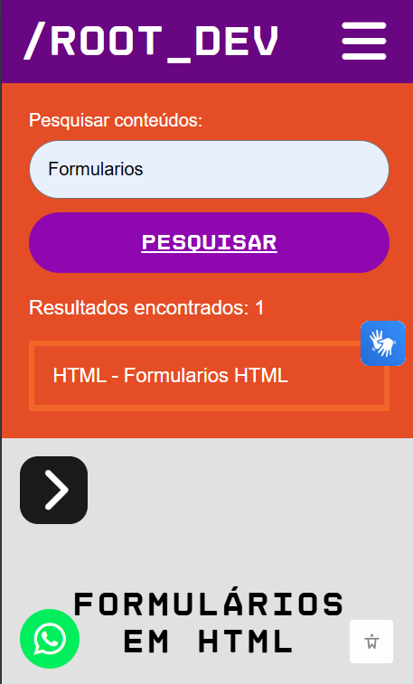

## Mensagens e situações que podem ocorrer

Em **public/scripts/conteudo.js** e **controller/conteudoController.js**, algumas situações possuem tratamento específico:

- **Página sem tópico:** apresenta a mensagem inicial e mantém o formulário de comentário escondido.
- **Categoria inválida na consulta ao servidor:** retorna 400.
- **Tópico com caracteres não permitidos:** retorna 400.
- **Arquivo da aula ausente:** retorna 404.
- **Cabeçalho incompleto ou diferente da pasta e do arquivo:** a abertura da aula retorna 500.
- **Falha ao consultar os comentários:** a requisição da aula retorna 500.
- **Pesquisa sem resultados:** retorna uma lista vazia e apresenta a mensagem correspondente.
- **Aula no menu, mas ausente na pesquisa:** pode ser necessário corrigir o cabeçalho ou reiniciar o servidor.

Em **public/conteudo.html**, se Marked ou DOMPurify não forem carregados, a conversão pode falhar mesmo que o servidor tenha enviado o Markdown corretamente.