# Estruturas globais e recursos compartilhados

Este documento explica a organização do ROOT DEV e as partes utilizadas por várias páginas, como a inicialização do servidor, a sessão, o header, o footer e os scripts compartilhados.

Os caminhos começam na pasta principal do projeto, onde está **index.js**. As linhas indicadas para os prints consideram os arquivos comentados utilizados nesta documentação. Se o código mudar, use também o nome da função para localizar o trecho.

## Organização do projeto

Cada pasta possui uma responsabilidade:

- **public:** guarda as páginas, os scripts, as imagens e os estilos disponibilizados ao navegador.
- **private/admin:** guarda o HTML e o JavaScript da página do admin, enviados por rotas protegidas.
- **routes:** define as rotas e as funções que atendem cada requisição.
- **controller:** recebe as requisições, verifica os dados e organiza as operações.
- **model:** executa as consultas e alterações no banco.
- **config:** configura o banco de dados e o envio de e-mail.
- **middleware:** contém verificações executadas antes das funções principais das rotas.
- **validacoes:** reúne regras reutilizadas para conferir os dados dos usuários.
- **service:** contém o serviço que monta e envia o e-mail de recuperação.
- **content:** guarda as aulas Markdown, separadas por categoria.
- **Doc:** reúne os documentos que explicam o projeto.

O código utiliza funções e módulos. As funções são distribuídas conforme sua responsabilidade, sem a necessidade de criar classes JavaScript.

## Como os arquivos compartilham funções

Em **controller/userController.js**, o início do arquivo carrega os módulos necessários:

```js
const userModel = require('../model/userModel')
const logModel = require('../model/logModel')
const usuarioValidacao = require("../validacoes/usuarioValidacao")
```

**require** carrega o que outro arquivo disponibiliza por **module.exports**.

Em **model/userModel.js**, por exemplo, **module.exports** disponibiliza as funções de consulta e alteração dos usuários. Assim, o controller pode chamar **userModel.buscarPorId** ou **userModel.criarUsuario**.

A função continua definida no model. O controller apenas utiliza essa função quando precisa acessar o banco.

Essa organização permite reaproveitar o mesmo código em diferentes operações. A busca de usuário por id, por exemplo, participa da consulta de sessão, do perfil e da edição feita pelo admin.

## Como o servidor é preparado

Em **index.js**, a instrução inicial carrega as variáveis de configuração:

```js
require("dotenv").config()
```

O dotenv disponibiliza os valores do arquivo **.env** em **process.env**. Essa chamada aparece antes dos módulos que dependem dessas informações, como a configuração de e-mail.

Depois, **index.js** carrega Express, express-session, os arquivos de rotas e o controller de conteúdo.

A aplicação e a porta são definidas assim:

```js
const app = express()
const port = 8000
```

**express()** cria a aplicação que recebe as requisições. A variável **port** determina a porta utilizada para acessar o site.

## Como os dados enviados são lidos

Em **index.js**, estas instruções preparam a leitura dos corpos das requisições:

```js
app.use(express.urlencoded({ extended: true }))
app.use(express.json())
```

**express.urlencoded** lê os dados enviados por formulários HTML. No cadastro, por exemplo, os campos são enviados pelo formulário para o servidor.

**express.json** lê os dados enviados em JSON pelos scripts, como acontece na edição de perfil e na publicação de comentários.

Depois dessa leitura, os controllers acessam os valores por **req.body**.

Essas configurações aparecem antes das rotas, pois os dados precisam estar disponíveis quando as funções dos controllers forem executadas.

## Como os arquivos públicos são disponibilizados

Em **index.js**, a pasta pública é configurada com:

```js
app.use(express.static(path.join(__dirname, 'public')))
```

**path.join** monta o caminho da pasta. **__dirname** representa a pasta onde está **index.js**.

**express.static** permite acessar os arquivos de **public** pelo navegador. O nome da pasta não faz parte do link:

- **public/cadastro.html** é acessado por **/cadastro.html**.
- **public/scripts/perfil.js** é acessado por **/scripts/perfil.js**.
- **public/styles/global.css** é acessado por **/styles/global.css**.

Os arquivos de **private/admin** não são disponibilizados por essa configuração. Eles são enviados pelas rotas protegidas do admin.

**Print da preparação do servidor:**

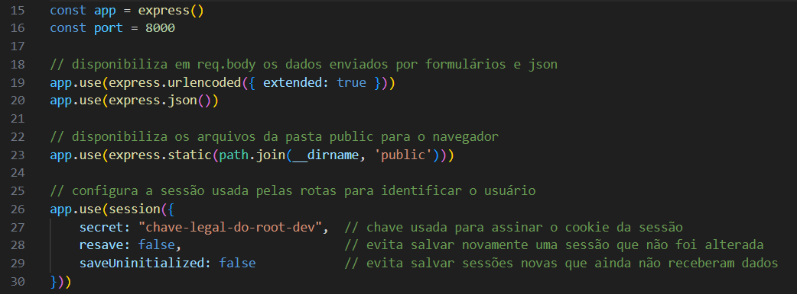

## Como as rotas são separadas

Em **index.js**, cada grupo de rotas recebe um início de link:

```js
app.use('/usuarios', userRoutes)
app.use('/adm', admRoutes)
app.use('/conteudo', conteudoRoutes)
app.use('/comentarios', comentarioRoutes)
app.use("/recuperacao", recuperacaoRoutes)
```

Esses grupos possuem as seguintes funções:

- **/usuarios:** cadastro, login, sessão, logout e perfil.
- **/adm:** acesso e operações da página do admin.
- **/conteudo:** pesquisa, tópicos e leitura das aulas.
- **/comentarios:** publicação e exclusão de comentários pelo autor.
- **/recuperacao:** solicitação do código, verificação e definição da nova senha.

Em **routes/userRoutes.js**, por exemplo, a rota **/cadastro** fica dentro do grupo **/usuarios**. Por isso, seu link completo é **/usuarios/cadastro**.

Em **index.js**, a rota **/** envia a página inicial. Antes de iniciar o atendimento das requisições, o arquivo também chama **carregarCacheConteudos()** para preparar a pesquisa das aulas.

Por fim, **app.listen** inicia o servidor na porta configurada.

**Print do encaminhamento das rotas e da inicialização:**

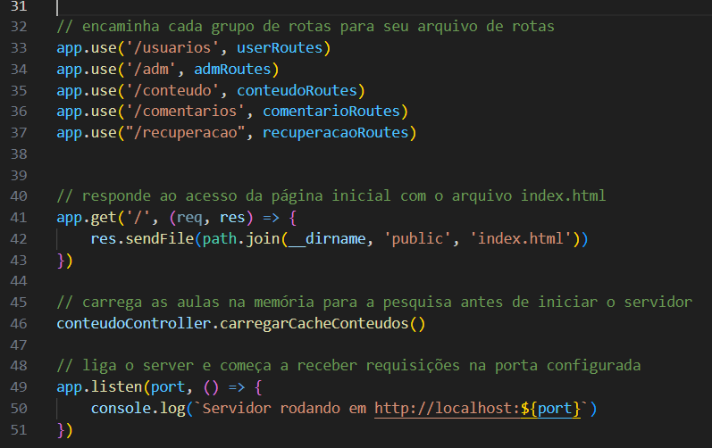

## Como uma operação percorre os arquivos

A edição de perfil mostra como as partes do projeto trabalham juntas.

Em **public/scripts/perfil.js**, **salvarPerfil(evento)** lê os campos e envia uma requisição para **/usuarios/perfil**.

Em **routes/userRoutes.js**, a rota encaminha essa requisição para **atualizarPerfil**, de **controller/userController.js**.

O controller verifica a sessão, os campos, a senha atual e a duplicidade dos dados. Depois, chama **atualizarPerfil**, de **model/userModel.js**, para atualizar o banco.

O model devolve o resultado pelo callback. O controller usa esse resultado para responder ao navegador, e o script atualiza a mensagem da página.

Nesse fluxo:

- O HTML contém os campos.
- O script lê os campos e envia a requisição.
- A rota encaminha a requisição.
- O controller decide se a operação pode continuar.
- O model executa o SQL.
- O controller envia a resposta.
- O script mostra o resultado.

Os detalhes dessa funcionalidade estão em **DOC_PERFIL.md**.

## Informações recebidas pelas funções do servidor

Em **controller/userController.js**, **controller/admController.js** e nos demais controllers, os dados podem vir de locais diferentes:

- **req.body:** corpo da requisição, como nome, e-mail e senha.
- **req.params:** partes variáveis da rota, como o id em **/usuarios/:id**.
- **req.query:** valores depois de **?**, como pesquisa e página.
- **req.session:** informações da sessão mantida pelo servidor.
- **res:** objeto utilizado para responder ao navegador.

Em **middleware/verificarAdmin.js**, também existe **next**. Essa função continua o fluxo da rota depois que a verificação de acesso é concluída.

Se o middleware responder com erro e encerrar a execução, a função seguinte não deve ser executada.

## Como a sessão identifica o usuário

Em **index.js**, a configuração de **express-session** permite manter informações entre as requisições.

As opções utilizadas são:

- **secret:** chave utilizada para assinar o identificador da sessão.
- **resave: false:** evita salvar novamente uma sessão que não foi alterada.
- **saveUninitialized: false:** evita salvar uma sessão nova que ainda não recebeu dados.

O navegador recebe o cookie **connect.sid**, que identifica a sessão. Os dados de **req.session.usuario** ficam no servidor.

Em **controller/userController.js**, **loginUsuario** preenche esse objeto após confirmar a senha:

```js
req.session.usuario = {
    id: usuario.user_id,
    nome: usuario.user_name,
    tipo: usuario.user_tipo,
    avatar: usuario.user_avatar
}
```

Essas informações permitem identificar quem está fazendo as próximas requisições.

A configuração atual não define um armazenamento externo para as sessões. Elas ficam na memória do servidor e deixam de estar disponíveis quando ele é reiniciado.

## Como os dados da sessão são atualizados

Em **controller/userController.js**, **verificarSessao(req, res)** consulta os dados atuais da conta no banco.

Se não existir sessão, retorna **logado: false**.

Se existir, consulta a conta pelo id. Quando a conta é encontrada, atualiza nome, tipo e avatar na sessão e devolve **logado: true**, junto com os dados do usuário.

Isso permite mostrar alterações de nome ou avatar sem exigir outro login.

A função também usa:

```js
res.set("Cache-Control", "no-store")
```

Esse cabeçalho pede ao navegador que não armazene a resposta para reutilizá-la depois. A consulta deve refletir o estado atual.

Se a conta não existir mais, a função encerra a sessão e informa que não há usuário conectado.

**Print da atualização da sessão:**

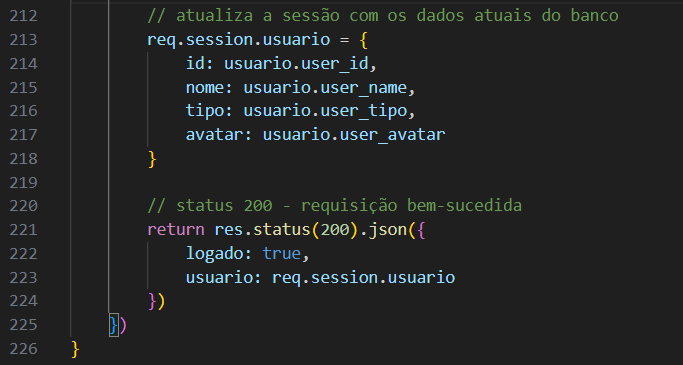

## Como o header funciona

Em **public/index.html**, o header contém a marca, os botões Login e Cadastro e a estrutura do menu para telas menores.

Os principais ids utilizados pelos scripts são:

- **auth-buttons:** área dos controles de autenticação.
- **nav-drawer-menu:** conteúdo do menu compacto.
- **menu-icon:** ícone utilizado para abrir e fechar esse menu.

Essa estrutura aparece nas outras páginas. O projeto não utiliza uma função que gere automaticamente o header de todos os HTMLs.

Por isso, ao alterar um link ou controle compartilhado, é necessário atualizar as páginas que possuem essa estrutura.

**Print da estrutura do header:**

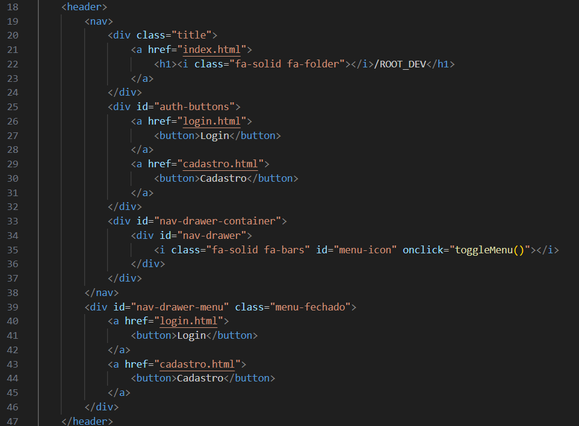

## Como o header muda depois do login

Em **public/scripts/navbar-auth.js**, **verificarLogin()** consulta a sessão:

```js
const resposta = await fetch('/usuarios/sessao')
```

Depois, confere **resposta.ok** e lê o JSON retornado.

Se **dados.logado** for falso, a função mantém os controles iniciais.

Se for verdadeiro, substitui os controles pelos links e formulários do usuário conectado:

- **Meu Perfil:** abre **/perfil.html**.
- **Sair:** envia **POST /usuarios/logout**.
- Avatar: mostra o texto salvo na conta.

A estrutura é inserida com **innerHTML**, mas o avatar é preenchido separadamente com **innerText**:

```js
authButtons.querySelector(".avatar").innerText = dados.usuario.avatar || ":D"
navDrawerMenu.querySelector(".avatar").innerText = dados.usuario.avatar || ":D"
```

O valor **:D** é usado quando não existe um avatar aproveitável.

A função atualiza a interface. Ela não realiza o login e não cria a sessão.

**Print da consulta de sessão pelo header:**

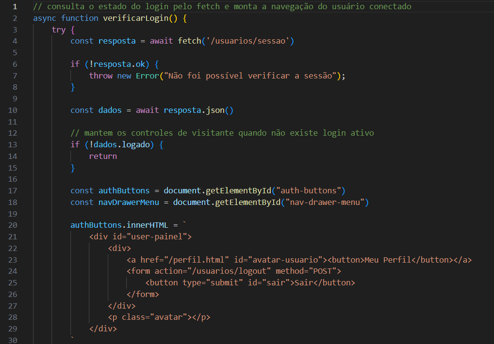

**Print do preenchimento dos avatares:**

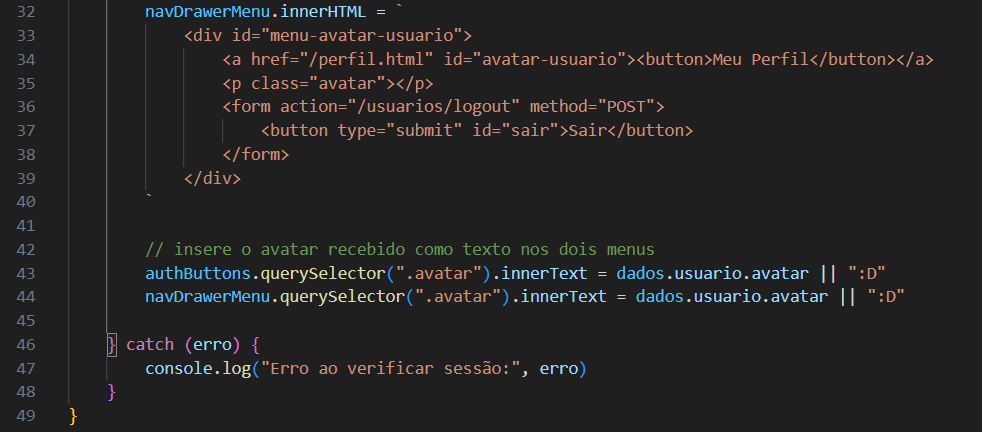

## Como o menu do header abre e fecha

Em **public/scripts/nav-drawer.js**, **toggleMenu()** altera as classes do menu:

```js
menu.classList.toggle("menu-aberto")
menu.classList.toggle("menu-fechado")
```

**classList.toggle** acrescenta a classe quando ela não existe e a remove quando já está presente.

A função também alterna as classes **fa-bars** e **fa-xmark** do ícone.

No mesmo arquivo, o evento **resize** verifica a largura da janela. Quando ela passa de 720 pixels, o código fecha o menu e restaura o ícone de abertura.

Esse menu pertence ao header. Ele é separado do menu de tópicos da página de conteúdo.

**Print do controle do menu:**

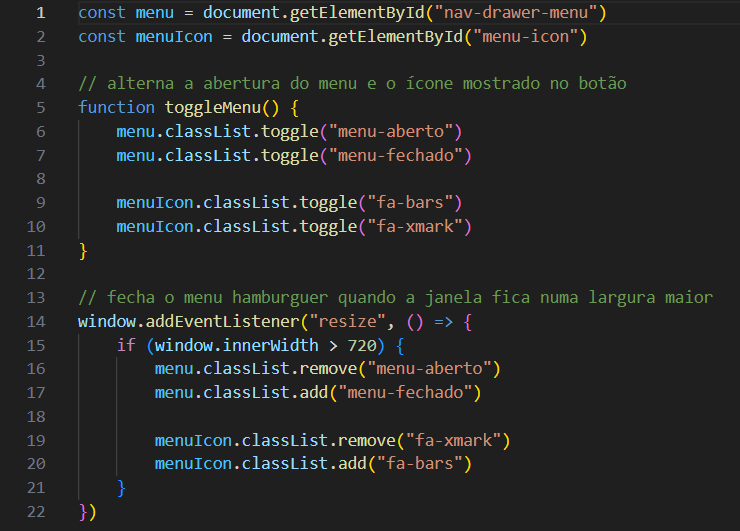

## Como o footer funciona

Em **public/index.html**, o footer reúne os links de navegação e o contato do projeto.

Essa estrutura também é repetida em outras páginas. Ao alterar o contato ou algum link, as cópias precisam ser atualizadas.

Em **public/scripts/email-to-clipboard.js**, **emailToClipboard()** copia o e-mail de contato usando **navigator.clipboard.writeText**.

Depois, a função mostra um aviso com **alert**.

Essa operação apenas copia o texto. Ela não abre uma solicitação de recuperação e não envia mensagens.

O código atual mostra o aviso logo depois de solicitar a cópia, sem aguardar a confirmação de que a área de transferência foi atualizada.

Em **private/admin/admin.html**, o contato chama **emailToClipboard**, mas o script correspondente não está incluído nessa página. A presença do contato no footer, portanto, não garante que a função esteja disponível ali.

**Print da função de copiar o contato:**

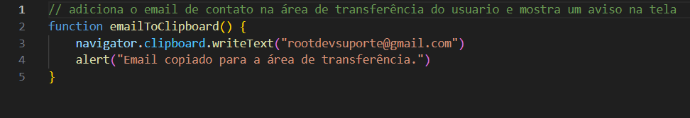

**Print do footer:**


## Como a prévia do avatar é reaproveitada

Em **public/scripts/previa-avatar.js**, **atualizarPreviaAvatar()** lê o campo **avatar** e preenche **avatar-previa**:

```js
previaAvatar.innerText = campoAvatar.value || ":D"
```

A função é executada ao carregar o script e sempre que o evento **input** ocorre no campo.

No cadastro, os elementos já existem quando o script é carregado.

Em **private/admin/admin.js**, a função equivalente é **atualizarPreviewAvatarAdm()**. O formulário de edição é criado dinamicamente, por isso o evento é associado depois que os campos são inseridos.

Em **public/scripts/perfil.js**, **atualizarPreviaPerfil()** realiza a atualização na página de perfil.

Cada função trabalha com os elementos de sua página. Não é necessário carregar o script de prévia do cadastro em todas elas.

**Print da prévia do cadastro:**

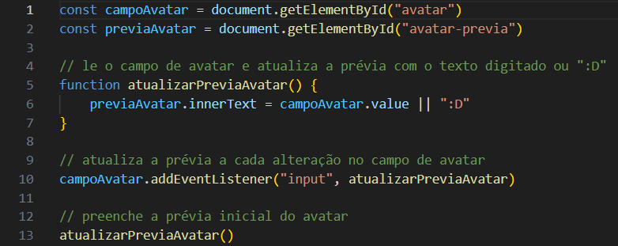

## Por que a ordem dos scripts importa

Em **public/scripts/previa-avatar.js** e nos demais scripts de interface, **document.getElementById** procura elementos do HTML.

Se o script executar antes de esses elementos existirem, a busca pode retornar **null**. Tentar usar **addEventListener** nesse resultado provoca erro.

Em **public/perfil.html**, o script de perfil utiliza **defer**. Isso permite carregar o script e aguardar a leitura do HTML antes de executá-lo.

Em outras páginas, os scripts ficam ao final do HTML, depois dos elementos utilizados.

Em **public/conteudo.html**, Marked e DOMPurify também precisam ser carregados antes do script que usa essas bibliotecas.

## Bibliotecas compartilhadas pelo navegador

Em **public/index.html** e nas demais páginas, existem referências a recursos externos:

- **Font Awesome:** disponibiliza os ícones usados na interface.
- **VLibras:** carrega o recurso de acessibilidade em Libras.
- **a11y:** carrega controles adicionais de acessibilidade.

Em **public/conteudo.html**, também são utilizadas:

- **Marked:** converte Markdown para HTML.
- **DOMPurify:** trata o HTML convertido antes da inserção na página.

Essas bibliotecas são carregadas pelo navegador. Elas são diferentes das dependências instaladas pelo npm para o servidor.

A inclusão desses recursos depende de seu carregamento. Ela também não substitui a organização adequada dos campos, botões e textos do HTML.

## Estruturas comuns nas funções

### Objeto vazio quando o corpo está ausente

Em **controller/userController.js**, várias funções começam com:

```js
const dados = req.body || {}
```

Quando **req.body** possui um valor considerado falso pela expressão, **dados** recebe um objeto vazio.

Isso permite acessar propriedades como **dados.nome** sem tentar ler uma propriedade de um corpo ausente.

O objeto vazio não representa dados válidos. As validações ainda precisam verificar se os campos obrigatórios foram enviados e se possuem o tipo esperado.

### Callback das consultas

Em **model/userModel.js**, as funções de consulta recebem callbacks.

Quando a consulta termina, o callback entrega o possível erro e o resultado. Uma chamada como **callback(null, usuarios[0])** informa que não houve erro e devolve o registro encontrado.

O controller continua a operação dentro desse callback, pois o resultado não fica disponível imediatamente após iniciar a consulta.

### Envio e recebimento de JSON

Em **public/scripts/perfil.js**, **salvarPerfil** usa **JSON.stringify** para transformar o objeto enviado em texto JSON.

O cabeçalho **Content-Type: application/json** informa o formato ao servidor.

Na resposta, **resposta.json()** realiza o caminho inverso: lê o JSON recebido e disponibiliza um objeto para o script.

### Verificação de resposta

Em **public/scripts/recuperacao.js**, as funções verificam **resposta.ok** depois do fetch.

O fetch pode receber uma resposta 400 ou 500 sem lançar um erro automaticamente. Por isso, o script precisa conferir o status antes de tratar a operação como concluída.

### Tratamento de falhas

Em **public/scripts/perfil.js**, as operações utilizam **try**, **catch** e **finally**:

- **try:** executa a tentativa.
- **catch:** trata falhas que interrompem a execução.
- **finally:** libera campos e botões quando necessário, mesmo após uma falha.

### Verificação de números inteiros

Em **controller/admController.js**, **Number.isSafeInteger** é usado em ids, páginas e deslocamentos.

A função verifica se o valor é um número inteiro representado com segurança pelo JavaScript. Ela rejeita valores como números fracionados, **NaN**, infinito e inteiros fora da faixa segura.

O código também precisa conferir se o número é positivo. Essa verificação não substitui a validação de acesso nem os parâmetros das consultas SQL.

## Como as funções respondem ao navegador

Em **controller/userController.js**, o cadastro e o login utilizam **res.redirect** quando funcionam. O navegador é encaminhado para outra página.

Nas operações de perfil, a resposta utiliza **res.json**, pois o script precisa receber uma mensagem ou os dados sem trocar imediatamente de página.

Em **controller/admController.js**, **res.sendFile** envia o HTML e o JavaScript protegidos da página do admin.

Os principais status utilizados no projeto são:

- **200:** operação concluída.
- **201:** comentário criado.
- **202:** solicitação de recuperação aceita para processamento.
- **302:** redirecionamento.
- **400:** dados inválidos.
- **401:** autenticação ou autorização de recuperação ausente ou inválida.
- **403:** operação não permitida.
- **404:** recurso não encontrado.
- **409:** conflito nos dados ou no estado da operação.
- **415:** formato enviado não aceito.
- **429:** limite de tentativas atingido.
- **500:** erro interno do servidor.

O status indica o tipo de resultado. A mensagem enviada explica o problema específico.

## Responsividade do header e do footer

Em **public/styles/global.css**, os blocos **@media** adaptam os elementos compartilhados:

- Até **720 pixels**, os controles comuns do header são escondidos e o menu compacto passa a ser utilizado.
- Até **776 pixels**, o ícone dentro de **.title** é escondido.
- Até **470 pixels** e **428 pixels**, textos e controles recebem ajustes de tamanho.
- Até **1100 pixels**, o footer passa a se organizar em coluna.
- Até **768 pixels**, as áreas internas do footer também são organizadas em coluna.

As regras podem se somar quando a largura atende a vários limites.

**Print da responsividade do header:**

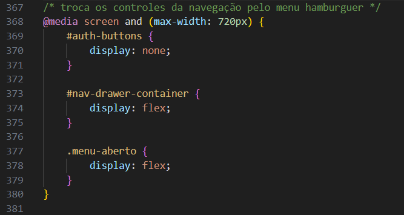

**Print da responsividade do footer:**

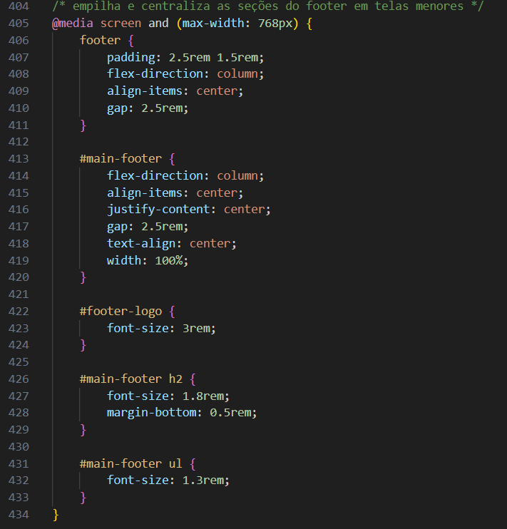

**Print do menu em tela de celular:**


## Responsividade dos formulários compartilhados

Em **public/styles/cadastro-login.css**, as regras são utilizadas pelas páginas que carregam esse arquivo, incluindo cadastro, login, perfil, recuperação e edição do admin.

- Até **688 pixels**, **.campo** passa a organizar seus elementos em coluna.
- Até **475 pixels**, a caixa do formulário recebe ajustes de espaço.
- Até **428 pixels**, a largura e os textos recebem outros ajustes.
- A partir de **430 pixels**, a caixa utiliza uma largura proporcional com limite.
- A partir de **900 pixels**, a largura máxima passa a ser 600 pixels.

A aplicação de cada regra depende das classes e dos ids presentes no HTML.

**Print da organização dos campos em telas menores:**

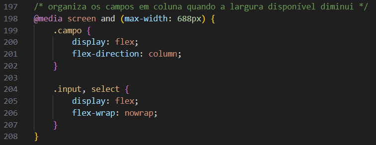

## Responsividade da página inicial

Em **public/styles/index.css**, até **768 pixels**, a introdução recebe ajustes de espaço e tamanho de texto.

Até **545 pixels**, o título de JavaScript utiliza uma medida proporcional à largura da tela para caber melhor.

A responsividade específica das aulas está em **DOC_CONTEUDOS.md**, e a das consultas está em **DOC_ADMIN.md**.

## Como adicionar uma página com os recursos compartilhados

Use **public/index.html** como referência para o header e o footer. Mantenha os ids utilizados pelos scripts.

Inclua **public/styles/global.css** e os scripts correspondentes aos recursos usados pela página.

Os scripts precisam executar depois que seus elementos estiverem disponíveis. Para isso, mantenha-os ao final do HTML ou utilize **defer**, como em **public/perfil.html**.

Se a página precisar consultar o servidor, adicione a rota ao grupo adequado e defina a função do controller. Quando houver consulta ou alteração no banco, utilize uma função de model.

Em **index.js**, outro **app.use** só é necessário quando for criado um novo grupo de rotas.

As ações que precisam aparecer nos relatórios devem registrar o resultado conforme **DOC_LOGS.md**.

A proteção de uma operação deve existir no servidor. Esconder um botão ou formulário apenas controla sua apresentação na página.