# Logs e relatórios

Este documento explica como o sistema registra ações automaticamente e como o admin consulta esses registros com pesquisa e paginação.

Os caminhos começam na pasta principal do projeto, onde está **index.js**. As linhas indicadas para os prints consideram os arquivos comentados utilizados nesta documentação. Se o código mudar, use também o nome da função para localizar o trecho.

## Objetivo dos logs

Os logs guardam informações sobre ações realizadas no sistema, como cadastro, login, publicação de comentários e alteração de perfil.

Cada registro informa a ação, o momento em que ocorreu e, quando possível, o usuário responsável.

Na página do admin, esses registros são apresentados na consulta de relatórios.

A consulta permite pesquisar e navegar pelos registros. Não existem funções de edição ou exclusão de logs pela interface.

O relatório atual é uma listagem na página. O código não possui exportação desses dados para PDF ou planilha.

**Print da consulta de relatórios:**

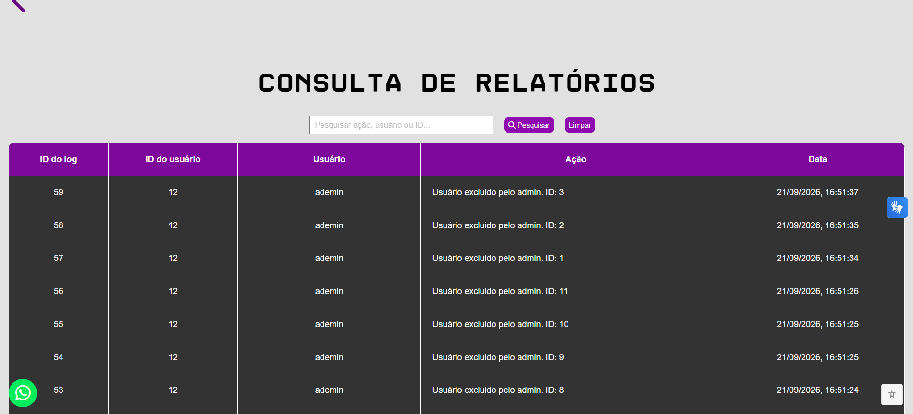

## Arquivos que participam do funcionamento

- **model/logModel.js:** grava e consulta os registros no banco.
- **controller/userController.js:** registra ações de cadastro, login, logout e perfil.
- **controller/admController.js:** registra operações do admin e atende a consulta dos relatórios.
- **controller/comentarioController.js:** registra publicações e exclusões pelo autor.
- **controller/conteudoController.js:** registra pesquisas de conteúdo.
- **controller/recuperacaoController.js:** registra etapas da recuperação de senha.
- **routes/admRoutes.js:** define a rota protegida de consulta dos logs.
- **middleware/verificarAdmin.js:** verifica o acesso do admin.
- **private/admin/admin.html:** contém a opção para abrir os relatórios.
- **private/admin/admin.js:** envia a consulta e apresenta os resultados.
- **public/admin/admin.css:** permite a adaptação da consulta a telas menores.

## Como os registros ficam no banco

Em **model/logModel.js**, as funções utilizam a tabela **tb_logs_acesso**.

Os campos utilizados são:

- **log_id:** identificador do registro, preenchido automaticamente pelo banco.
- **tb_usuarios_user_id:** vínculo com o usuário responsável, quando existe.
- **log_acao:** descrição da ação, com limite de 100 caracteres.
- **log_data:** data e hora preenchidas automaticamente pelo banco.

O campo **tb_usuarios_user_id** aceita **null**. Isso permite registrar ações sem uma conta vinculada.

O relacionamento com **tb_usuarios** utiliza **ON DELETE SET NULL**. Quando uma conta é excluída, os logs permanecem, mas o vínculo com ela é removido.

Essa configuração precisa estar presente no banco recriado a partir do MER.

## Como uma ação é enviada para gravação

Nos controllers, a ação é preparada em um objeto com **userId** e **acao**.

Em **controller/userController.js**, por exemplo, **atualizarPerfil** utiliza:

```js
const log = {
    userId: id,
    acao: "Perfil atualizado pelo próprio usuário"
}
```

**userId** identifica a conta associada à ação. **acao** descreve o que aconteceu.

Depois, o controller chama **registrarLog**, de **model/logModel.js**, e entrega um callback para tratar uma possível falha.

O log é criado pelo servidor. O navegador não possui uma rota pública para enviar livremente descrições de ações ao banco.

## Como registrarLog grava a ação

Em **model/logModel.js**, **registrarLog(log, callback)** recebe o objeto da ação e a função que será chamada após a consulta.

O SQL utilizado é:

```sql
INSERT INTO tb_logs_acesso
    (tb_usuarios_user_id, log_acao)
VALUES (?, ?)
```

Os valores são enviados separadamente:

```js
conexao.query(sql, [
    log.userId || null,
    log.acao
], callback)
```

**log.userId || null** utiliza **null** quando não existe um id aproveitável pela expressão.

A função não envia **log_id** nem **log_data**, pois esses campos são preenchidos pelo banco.

O callback recebe o erro ou o resultado da gravação. O model não envia uma resposta HTTP diretamente.

**Print da gravação de logs:**

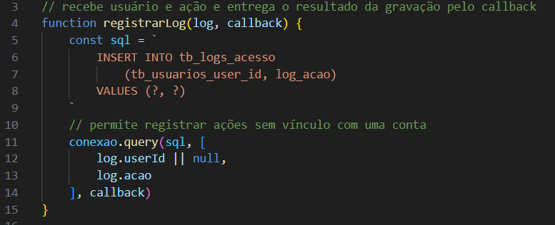

## Quais ações dos usuários são registradas

Em **controller/userController.js**, os registros são feitos nas seguintes funções:

- **criarUsuario:** registra a criação da conta usando o id retornado pelo INSERT.
- **loginUsuario:** registra o login depois da confirmação da senha.
- **logoutUsuario:** registra a saída depois de encerrar a sessão, quando havia usuário conectado.
- **atualizarPerfil:** registra a alteração dos dados após a atualização no banco.
- **excluirPerfil:** registra a exclusão da própria conta depois de removê-la.

Na exclusão do próprio perfil, a conta já não existe quando o log é gravado. Por isso, **excluirPerfil** utiliza **userId: null** e coloca o id removido na descrição da ação.

**Print do registro de exclusão do próprio perfil:**

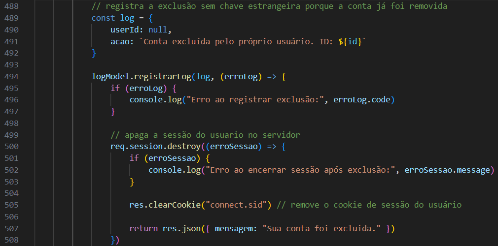

## Quais ações do admin são registradas

Em **controller/admController.js**, as funções registram:

- **loginAdm:** entrada pelo acesso do admin.
- **atualizarUsuario:** alteração de uma conta.
- **excluirUsuario:** exclusão de uma conta.
- **excluirComentarioAdmin:** exclusão de um comentário.

Nas operações sobre outra conta ou comentário, o vínculo do log identifica o admin que realizou a ação.

O id do registro alterado ou excluído aparece na descrição.

Isso diferencia quem realizou a operação de qual registro foi afetado.

Em **controller/admController.js**, por exemplo, excluir um usuário não vincula o novo log à conta removida. O vínculo utiliza **req.session.usuario.id**, que identifica o admin.

## Quais ações de comentários e conteúdos são registradas

Em **controller/comentarioController.js**:

- **salvarComentario:** registra a publicação com o id do comentário criado.
- **excluirComentario:** registra a exclusão pelo autor com o id do comentário removido.

Em **controller/conteudoController.js**, **pesquisarConteudos** registra **Pesquisa de conteúdos realizada** depois de uma pesquisa válida e não vazia.

Se a pesquisa for feita sem login, o log recebe **null** no vínculo com o usuário.

Essa função não inclui o termo pesquisado na descrição.

A abertura de uma aula e a listagem de tópicos não geram logs nesse fluxo. Os registros são criados somente nos pontos em que o código chama **registrarLog**.

## Quais etapas da recuperação são registradas

Em **controller/recuperacaoController.js**, os registros acompanham estas etapas:

- **solicitarRecuperacao:** registra se o código foi encaminhado ao serviço de e-mail ou se ocorreu falha no envio.
- **verificarCodigo:** registra a validação do código.
- **redefinirSenha:** registra a conclusão da alteração da senha.

O registro de encaminhamento ao serviço de e-mail não confirma que a mensagem chegou à caixa de entrada.

Essas ações não gravam a senha nem o código de recuperação na descrição.

Se uma solicitação não encontrar uma conta ou falhar antes de chegar à chamada de **registrarLog**, esse registro não será criado.

Os detalhes estão em **DOC_RECUPERACAO_SENHA.md**.

## O que acontece quando o log falha

Nos controllers que utilizam **registrarLog**, o callback verifica se houve erro.

Em **controller/userController.js**, por exemplo, **atualizarPerfil** mostra o erro no terminal e continua enviando a resposta da operação.

A alteração do perfil já foi concluída antes da tentativa de gravar o log.

O mesmo princípio aparece em outras operações: a falha do log não desfaz automaticamente o cadastro, a edição ou a exclusão que já ocorreu.

A operação principal e a gravação do log não estão reunidas em uma transação nesses trechos. Portanto, pode existir uma operação concluída sem seu log correspondente caso essa gravação falhe.

## Como os relatórios são solicitados

Em **private/admin/admin.js**, **mostrarLogs(pesquisa = "", pagina = 1)** recebe o filtro e a página desejada.

Sem argumentos, utiliza pesquisa vazia e página 1.

A função chama **abrirConsulta()**, apresenta a mensagem de carregamento e prepara:

```js
const endereco = `/adm/logs?pesquisa=${encodeURIComponent(pesquisa)}&pagina=${pagina}`
const resposta = await fetch(endereco)
```

**encodeURIComponent** prepara o termo para ser inserido no link.

Se **resposta.ok** for falso, a função lê a resposta como texto e cria uma mensagem com o status HTTP.

Quando funciona, lê o JSON e atualiza **paginaLogsAtual** e **pesquisaLogsAtual**.

**Print da solicitação dos relatórios:**

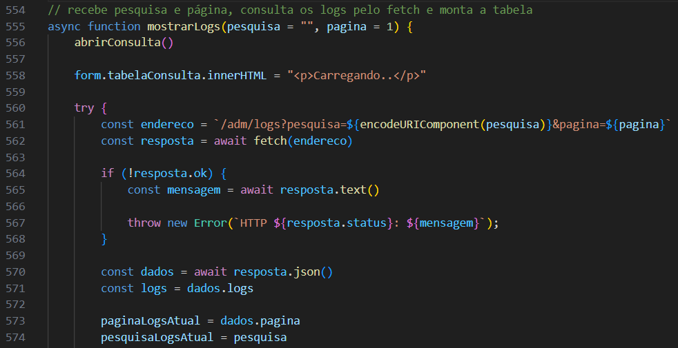

## Como a consulta é protegida

Em **routes/admRoutes.js**, a consulta utiliza:

```js
router.get("/logs", verificarAdmin, admController.buscarLogs)
```

Em **index.js**, esse arquivo de rotas pertence ao grupo **/adm**. Por isso, o link completo é **GET /adm/logs**.

Em **middleware/verificarAdmin.js**, a requisição precisa possuir uma sessão cujo tipo seja **admin**.

- Sem sessão: status 401.
- Com outro tipo de usuário: status 403.
- Com acesso permitido: a execução continua para **buscarLogs**.

A proteção acontece antes da consulta ao banco.

## Como o controller prepara a paginação

Em **controller/admController.js**, **buscarLogs(req, res)** recebe pesquisa e página por **req.query**.

Se a página não foi informada, utiliza 1.

O cálculo é:

```js
const limite = 50
const deslocamento = (pagina - 1) * limite
```

**limite** define a quantidade exibida. **deslocamento** define quantos registros serão pulados.

O controller verifica:

- Se a página é um inteiro seguro.
- Se a página é maior ou igual a 1.
- Se o deslocamento é um inteiro seguro.
- Se a pesquisa é um texto.

Valores inválidos recebem status 400.

Depois, a função solicita **limite + 1** registros para descobrir se existe uma próxima página.

**Print da validação da consulta de logs:**

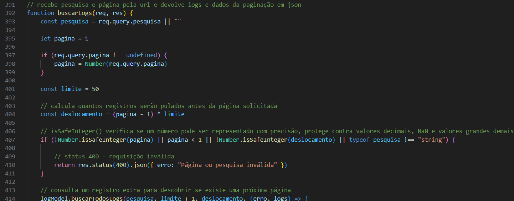

## Como os logs são consultados no banco

Em **model/logModel.js**, **buscarTodosLogs(pesquisa, limite, deslocamento, callback)** recebe o filtro e os valores da paginação.

A consulta seleciona os campos do log e o nome do usuário.

O relacionamento utiliza:

```sql
LEFT JOIN tb_usuarios
    ON tb_logs_acesso.tb_usuarios_user_id = tb_usuarios.user_id
```

**LEFT JOIN** mantém os logs mesmo quando não existe um usuário correspondente.

Isso permite apresentar registros de visitantes e registros cujo vínculo foi removido após a exclusão da conta.

O nome exibido vem da consulta atual de **tb_usuarios**. Ele não é uma cópia do nome que o usuário possuía quando a ação aconteceu.

Se o nome da conta mudar, os logs ainda vinculados a ela passam a mostrar o nome atual.

**Print da consulta com usuários opcionais:**

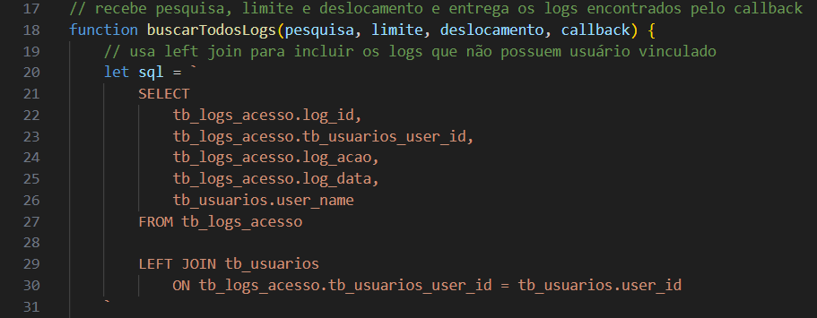

## Como a pesquisa dos logs funciona

Em **model/logModel.js**, **buscarTodosLogs** acrescenta os filtros somente quando existe um termo de pesquisa.

Os campos pesquisados são:

- Descrição da ação.
- Nome atual do usuário vinculado.
- Id do log.
- Id do usuário vinculado.

A pesquisa utiliza **LIKE** com o termo entre **%**:

```js
const termo = `%${pesquisa}%`
```

Isso permite encontrar o termo dentro do conteúdo dos campos.

Os ids são convertidos para texto com **CAST(... AS CHAR)** antes da comparação.

O termo é enviado separadamente para cada parâmetro da consulta. Ele não é colocado diretamente dentro da instrução SQL.

A data não faz parte dos filtros dessa função.

## Como os resultados são ordenados e limitados

Ainda em **model/logModel.js**, **buscarTodosLogs** acrescenta:

```sql
ORDER BY tb_logs_acesso.log_data DESC,
    tb_logs_acesso.log_id DESC
LIMIT ? OFFSET ?
```

A data decrescente coloca os registros mais recentes antes dos antigos.

O id decrescente organiza os registros que possuem a mesma data e hora.

**LIMIT** restringe a quantidade recebida. **OFFSET** pula os registros das páginas anteriores.

A função entrega o erro ou a lista encontrada pelo callback.

**Print dos filtros e da paginação no SQL:**

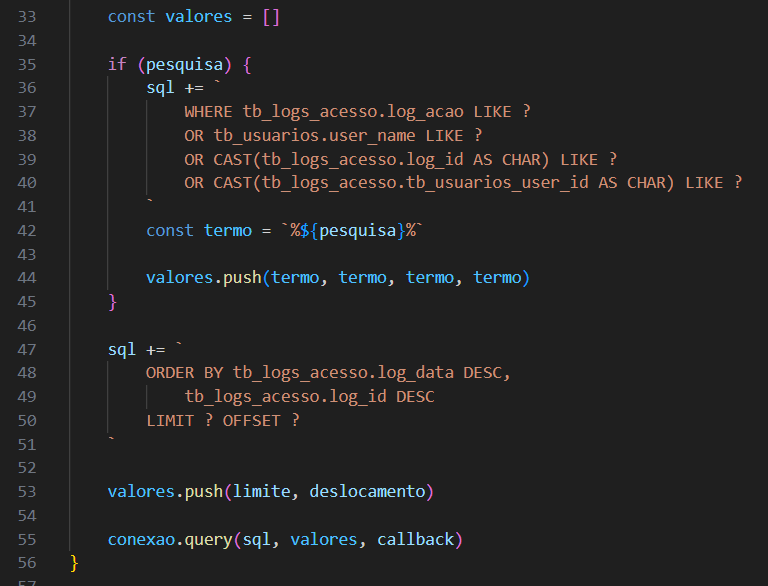

## Como o controller informa a próxima página

Em **controller/admController.js**, **buscarLogs** pode receber até 51 registros para exibir no máximo 50.

A função verifica:

```js
const temProxima = logs.length > limite

if (temProxima) {
    logs.pop()
}
```

Quando existe o registro extra, **temProxima** recebe verdadeiro.

**pop()** remove esse registro antes do envio ao navegador.

A resposta contém:

```js
return res.json({
    logs: logs,
    pagina: pagina,
    temProxima: temProxima
})
```

O navegador recebe a página atual e a indicação de que pode avançar. Não existe uma contagem do total de páginas nesse processo.

**Print da resposta paginada:**

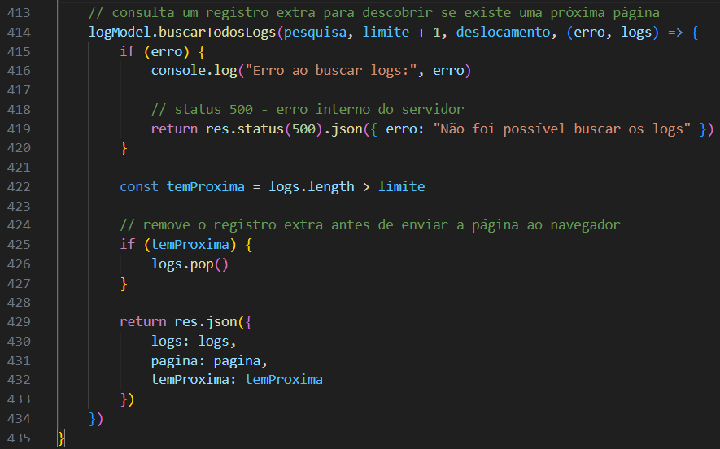

## Como os registros aparecem na página

Em **private/admin/admin.js**, **mostrarLogs** monta a pesquisa, a tabela e os botões de paginação.

As colunas exibidas são:

- Id do log.
- Id do usuário.
- Nome do usuário.
- Ação.
- Data.

A função percorre a lista com **forEach** e insere uma linha para cada registro.

**lastElementChild** encontra a linha criada, e **querySelectorAll("td")** encontra suas células.

Os valores são preenchidos com **innerText**, para que sejam apresentados como texto.

A data é formatada com:

```js
new Date(log.log_data).toLocaleString("pt-BR")
```

Essa apresentação utiliza o formato brasileiro e o fuso horário considerado pelo navegador.

Se a lista estiver vazia, a consulta mostra **Nenhum registro encontrado**.

**Print do preenchimento dos registros:**

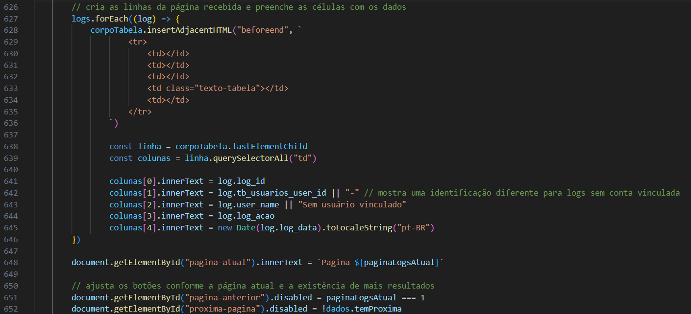

## Como os registros sem usuário são apresentados

Em **private/admin/admin.js**, **mostrarLogs** utiliza:

```js
colunas[1].innerText = log.tb_usuarios_user_id || "-"
colunas[2].innerText = log.user_name || "Sem usuário vinculado"
```

Quando o vínculo está vazio, a consulta mostra **-** no id e **Sem usuário vinculado** no nome.

Essa apresentação pode ocorrer em situações diferentes:

- Uma pesquisa feita por visitante.
- Um log antigo de uma conta excluída.
- O registro da exclusão do próprio perfil.

A descrição da ação ajuda a interpretar o registro. O valor **null**, sozinho, não informa por que não existe mais um vínculo.

**Print de um log sem usuário vinculado:**

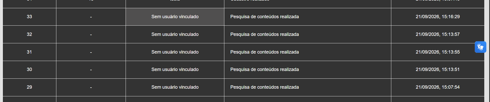

## Como a pesquisa e a navegação são controladas

Em **private/admin/admin.js**, as funções utilizam **paginaLogsAtual** e **pesquisaLogsAtual**.

**mudarPaginaLogs(direcao)** recebe **-1** para voltar ou **1** para avançar. A função calcula a nova página e impede valores menores que 1.

Depois, chama **mostrarLogs** mantendo o filtro.

**pesquisarLogs(event)** impede o envio comum do formulário, lê o termo e consulta a página 1.

**limparPesquisaLogs()** consulta a página 1 com pesquisa vazia.

Na montagem da consulta:

- Anterior fica desabilitado na página 1.
- Próxima fica desabilitado quando **temProxima** é falso.

A lista não é atualizada automaticamente quando outra ação gera um log. É necessário realizar outra consulta, como pesquisar, mudar de página ou abrir novamente os relatórios.

**Print das funções de navegação dos logs:**

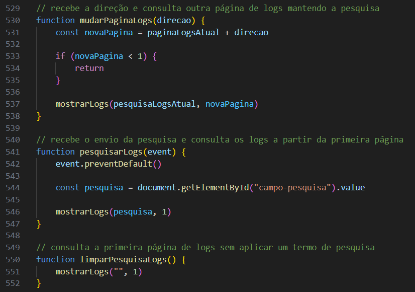

## Por que os logs não possuem edição ou exclusão

Em **routes/admRoutes.js**, o grupo de logs possui somente a rota de consulta.

Em **model/logModel.js**, são exportadas somente:

- **registrarLog**
- **buscarTodosLogs**

Assim, a aplicação permite criar registros a partir das ações do servidor e consultá-los pela página do admin.

Essa decisão preserva o histórico dentro das funcionalidades oferecidas pelo site.

Ela não impede que uma pessoa com acesso direto ao banco altere os registros. A ausência de edição na interface não torna os dados imutáveis no MySQL.

## Como integrar uma nova funcionalidade aos logs

Use **controller/userController.js**, na função **atualizarPerfil**, como referência.

Nesse fluxo, a gravação do log acontece depois que o model confirma a atualização no banco.

Ao acrescentar outra funcionalidade:

- Importe **model/logModel.js** no controller responsável.
- Identifique quem realizou a ação.
- Prepare uma descrição objetiva.
- Registre depois de confirmar o resultado correspondente.
- Trate o erro da gravação.
- Envie a resposta da operação apenas no ponto previsto pelo fluxo.

O trecho já utilizado em **controller/userController.js** é:

```js
const log = {
    userId: id,
    acao: "Perfil atualizado pelo próprio usuário"
}

logModel.registrarLog(log, (erroLog) => {
    if (erroLog) {
        console.log("Erro ao registrar edição do perfil:", erroLog.code)
    }

    return res.json({ mensagem: "Perfil atualizado com sucesso." })
})
```

Esse trecho está dentro de uma função que já possui **id**, **req** e **res** disponíveis. Para outra operação, a descrição, o responsável e o momento de gravação precisam ser ajustados.

Não é necessário criar outra função de model para cada tipo de ação. **registrarLog** já recebe a descrição como dado.

**Print do exemplo de integração:**

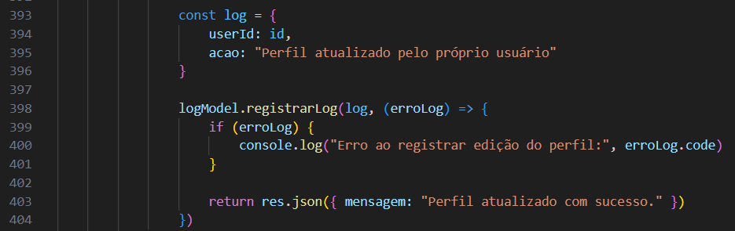

## Como escolher o usuário e a descrição

No controller da nova funcionalidade, o vínculo deve representar quem realizou a ação.

- Ação de uma conta conectada: utilize o id da sessão.
- Cadastro concluído: utilize o id retornado pelo INSERT.
- Operação feita pelo admin: utilize o id do admin.
- Ação sem conta vinculada: utilize **null**.
- Exclusão do próprio perfil já concluída: utilize **null** e identifique a conta na descrição.

O campo **log_acao** aceita até 100 caracteres. **registrarLog**, em **model/logModel.js**, não verifica esse tamanho antes do INSERT.

Por isso, mantenha as descrições curtas, inclusive quando acrescentar ids.

As descrições devem identificar a ação sem incluir senhas, hashes, códigos de recuperação ou credenciais de e-mail.

Uma mensagem de sucesso deve ser registrada após a confirmação do sucesso. Para registrar uma falha, use uma descrição que indique a falha.

## Responsividade da consulta

Em **private/admin/admin.js**, a tabela de logs utiliza **tabela-rolagem** e **tabela-admin**, como as outras consultas.

Em **public/admin/admin.css**:

- A área da consulta pode encolher com **min-width: 0**.
- **overflow-x: auto** permite rolagem horizontal dentro da tabela.
- A tabela mantém largura mínima para preservar as colunas.
- Textos longos podem quebrar dentro das células.
- Os controles da pesquisa são reorganizados em telas menores.

As regras compartilhadas estão explicadas em **DOC_ADMIN.md**.

**Print dos relatórios em tela de celular:**

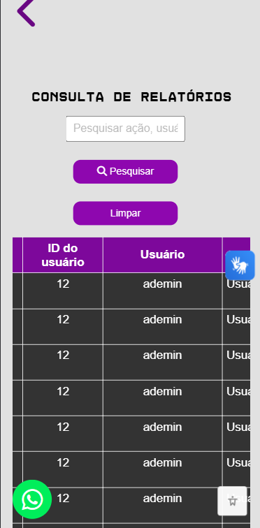

## Principais situações da consulta

Em **middleware/verificarAdmin.js**, **controller/admController.js** e **private/admin/admin.js**, os resultados possíveis incluem:

- **Sem sessão:** status 401.
- **Usuário sem tipo admin:** status 403.
- **Página ou pesquisa inválida:** status 400.
- **Falha na consulta ao banco:** status 500.
- **Consulta sem resultados:** lista vazia e mensagem na página.
- **Consulta concluída:** registros, página atual e indicação de próxima página.

Se a gravação de uma ação falhar, a mensagem aparece no terminal do servidor. Ela não cria automaticamente outro log sobre essa falha.