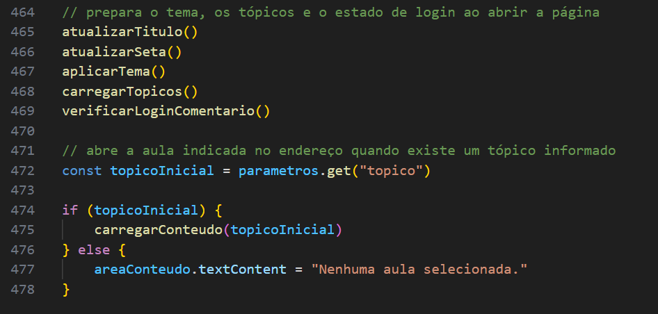

### **1. Configurações da Página (`<head>`)**

Esta seção é responsável por carregar todos os recursos de estilo e iconografia essenciais para a interface.

* **Folhas de Estilo:** Importa o arquivo `global.css` (para a padronização visual de todo o site) e o `index.css` (para o estilo específico da página inicial).
* **Biblioteca de Ícones:** A última linha de importação traz a biblioteca **Font Awesome**, ativando os ícones que decoram a interface.

---
