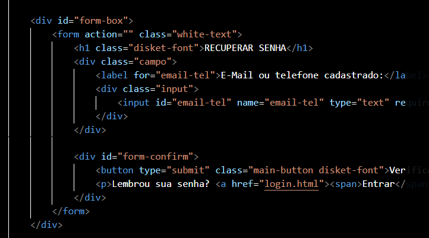

## Documentação e Fluxo da Página de Recuperação de Senha (`recuperar-senha.html`)

## O arquivo de recuperação de senha atua como a interface segura para redefinição de acesso à plataforma. Sua estrutura é desenhada para garantir a segurança da conta, guiando o usuário desde a solicitação do código de segurança até a criação da nova credencial.

### **1. Estrutura Visual (`<body>`)**

Contém os elementos dinâmicos de interface com os quais o usuário interage durante as etapas de validação e redefinição da conta.

**Formulários de Recuperação e Redefinição (`<form>`)**

* **Identificação de E-mail:** O campo inicial onde o usuário deve inserir o e-mail que está vinculado à sua conta para receber o código.
* **Validação de Segurança (TOKEN):** Um campo que é exibido para a inserção do código de verificação recebido na caixa de entrada do e-mail.
* **Nova Credencial:** Campos de segurança onde o usuário deverá inserir a **Nova Senha** e, em seguida, **Confirmar a Nova Senha**.
* **Ações Principais:** Botões de submissão que guiam cada etapa (ex: "Enviar Código", "Validar Código" e "Redefinir Senha").

---

### **2. Fluxo de Interação do Usuário (User Flow)**

O fluxo descreve a jornada passo a passo do usuário ao tentar recuperar o acesso à sua conta, englobando as ações dele e as respostas de segurança do sistema:

* **Passo 1: Acesso e Inicialização**
O usuário acessa a página de recuperação (geralmente vindo de um link "Esqueci minha senha" na página de `login.html`). A interface exibe apenas o campo de e-mail.
* **Passo 2: Solicitação do Código**
O usuário preenche o campo com o seu E-mail cadastrado e clica no botão para enviar. O sistema identifica o e-mail e dispara um código de segurança (TOKEN) para a caixa de mensagens do usuário.
* **Passo 3: Validação de Identidade (Token)**
A interface atualiza solicitando o código. O usuário acessa seu e-mail pessoal, copia o TOKEN recebido e o insere no campo correspondente na página, clicando em validar.

### **A FUNÇÃO ABAIXO AINDA NÃO FOI DESENVOLVIDA E TALVEZ TODA A FUNÇÃO SEJA RETIRADA DO PROJETO** 
* **Passo 4: Inserção da Nova Senha**
Após o sistema validar que o TOKEN está correto, o usuário é direcionado (ou a tela é atualizada) para a etapa final. Ele preenche a "Nova Senha" e repete a digitação no campo "Confirmar Senha", enviando os dados.
* **Passo 5: Conclusão (Resposta do Sistema)**
O sistema processa as informações e decide qual caminho seguir:
* **Cenário de Sucesso:** Se o token for válido e as senhas digitadas coincidirem, a senha é alterada no banco de dados. O sistema exibe uma mensagem de sucesso e **redireciona** o usuário de volta para a tela de **Login** (`login.html`), para que ele acesse a conta com a nova senha.
* **Cenário de Falha:**
* Se o token estiver incorreto/expirado, o sistema alerta: "Código inválido".
* Se as senhas digitadas no Passo 4 não forem iguais, o sistema alerta: "As senhas não conferem", exigindo que o usuário corrija os campos.

* **Passo 6: Rotas Alternativas (Escape)**
Um botão ou link de "Voltar ao Login" fica disponível durante todo o processo, caso o usuário se lembre da senha repentinamente e queira cancelar a recuperação.
