# Perfil do usuário

Este documento explica como a página de perfil carrega os dados da conta, permite alterações e realiza a exclusão do próprio usuário.

Os caminhos começam na pasta principal do projeto, onde está **index.js**. As linhas indicadas para os prints consideram os arquivos comentados utilizados nesta documentação. Se o código mudar, use também o nome da função para localizar o trecho.

## Objetivo da página

Em **public/perfil.html**, o usuário conectado pode:

- Consultar seu nome, e-mail e avatar.
- Alterar esses dados após informar a senha atual.
- Acessar o link de recuperação para definir outra senha.
- Excluir sua conta após informar a senha atual e confirmar a operação.

A página não permite escolher outra conta para editar. O servidor identifica o usuário pela sessão.

A alteração da senha é realizada pelo sistema de recuperação, explicado em **DOC_RECUPERACAO_SENHA.md**.

**Print da página de perfil:**

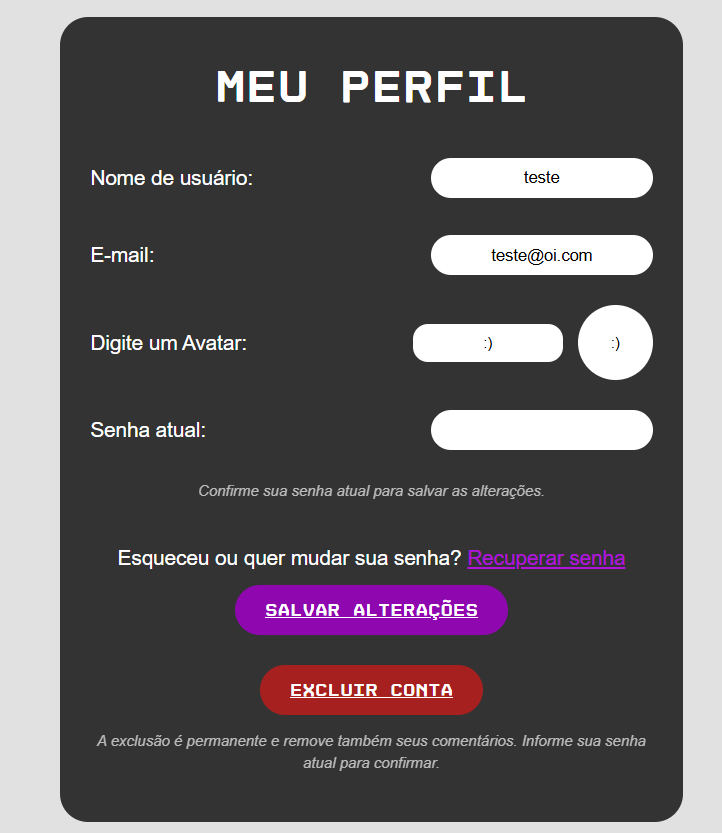

## Arquivos que participam do funcionamento

- **public/perfil.html:** estrutura do formulário e das mensagens.
- **public/scripts/perfil.js:** carregamento dos dados, prévia do avatar, envio das alterações e solicitação de exclusão.
- **public/scripts/navbar-auth.js:** atualização do avatar e dos controles do header.
- **routes/userRoutes.js:** rotas de consulta, alteração e exclusão do perfil.
- **controller/userController.js:** validações, identificação da conta e respostas.
- **model/userModel.js:** consultas, atualização e exclusão no banco.
- **validacoes/usuarioValidacao.js:** regras de nome, e-mail e avatar.
- **model/logModel.js:** registro das alterações e da exclusão.
- **public/styles/cadastro-login.css:** responsividade do formulário.

A configuração geral de sessão e dos elementos compartilhados está em **DOC_GLOBAL.md**.

## Como a página começa

Em **public/perfil.html**, o formulário possui o id **form-perfil** e começa com **hidden**.

Os botões Salvar alterações e Excluir conta também começam desabilitados.

Enquanto os dados não chegam, o elemento **mensagem-perfil** apresenta **Carregando perfil...**

Isso evita que o usuário envie um formulário vazio antes de a consulta terminar.

No mesmo HTML, **public/scripts/perfil.js** é carregado com **defer**. O script pode encontrar os elementos porque sua execução aguarda a leitura do HTML.

**Print dos controles iniciais do perfil:**

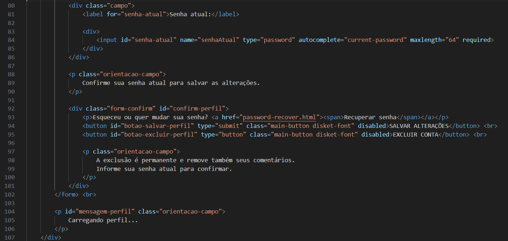

## Como os elementos são encontrados

Em **public/scripts/perfil.js**, as variáveis iniciais utilizam **document.getElementById** para encontrar os elementos:

- **formPerfil:** formulário completo.
- **campoNomePerfil:** campo do nome.
- **campoEmailPerfil:** campo do e-mail.
- **campoAvatarPerfil:** campo do avatar.
- **previaAvatarPerfil:** elemento que mostra a prévia.
- **mensagemPerfil:** área de mensagens.
- **campoSenhaAtual:** campo de confirmação da senha.
- **botaoSalvarPerfil:** botão de salvamento.
- **botaoExcluirPerfil:** botão de exclusão.

Os ids do HTML precisam corresponder aos utilizados nessas buscas.

No final de **public/scripts/perfil.js**, o código associa os eventos e inicia a consulta:

```js
botaoExcluirPerfil.addEventListener("click", excluirPerfil)

campoAvatarPerfil.addEventListener("input", atualizarPreviaPerfil)

carregarPerfil()

formPerfil.addEventListener("submit", salvarPerfil)
```

O clique em Excluir conta chama **excluirPerfil**. A digitação do avatar chama **atualizarPreviaPerfil**. O envio do formulário chama **salvarPerfil**.

**carregarPerfil()** é executada assim que o script chega a esse trecho.

**Print da ligação dos eventos:**

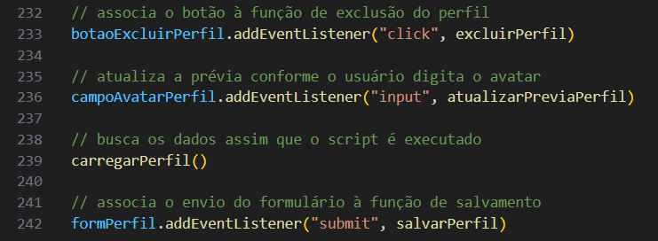

## Como as rotas do perfil são organizadas

Em **routes/userRoutes.js**, existem 3 operações para o perfil:

```js
router.get('/perfil', userController.buscarPerfil)
router.post('/perfil', limitarEdicaoPerfil, userController.atualizarPerfil)
router.delete('/perfil', limitarEdicaoPerfil, userController.excluirPerfil)
```

Como **index.js** liga esse arquivo ao início **/usuarios**, os links completos são:

- **GET /usuarios/perfil:** consulta os dados.
- **POST /usuarios/perfil:** salva nome, e-mail e avatar.
- **DELETE /usuarios/perfil:** solicita a exclusão da conta.

O método diferencia as operações, mesmo quando o link é igual.

## Como o limite de tentativas funciona

Em **routes/userRoutes.js**, **limitarEdicaoPerfil** permite 10 tentativas por IP em 15 minutos.

O mesmo limitador é aplicado à edição e à exclusão. Portanto, essas operações compartilham a contagem.

Ao atingir o limite, a biblioteca responde com status 429 e uma mensagem para aguardar.

A consulta por **GET /usuarios/perfil** não utiliza esse limitador.

Os bloqueios dos botões no navegador evitam envios repetidos durante uma operação. O limitador do servidor atua também nas requisições que não passam pelos controles da página.

**Print do limite de tentativas e das rotas:**

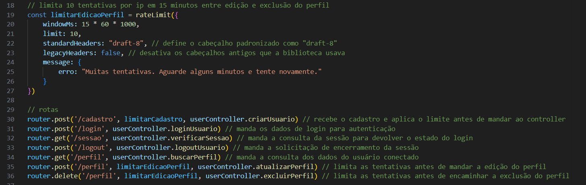

## Como os dados são solicitados

Em **public/scripts/perfil.js**, **carregarPerfil()** consulta o servidor:

```js
const resposta = await fetch("usuarios/perfil")
```

Na página **/perfil.html**, esse link relativo corresponde a **/usuarios/perfil**.

Se o servidor responder com status 401, o script executa:

```js
window.location.replace("/login.html")
```

O navegador passa para a página de login, pois a consulta exige uma sessão válida.

Nas outras respostas, a função lê o JSON. Se **resposta.ok** for falso, apresenta o erro na área de mensagens.

Quando a consulta funciona, o script preenche os campos, atualiza a prévia do avatar, mostra o formulário e habilita os botões.

**Print da consulta do perfil:**

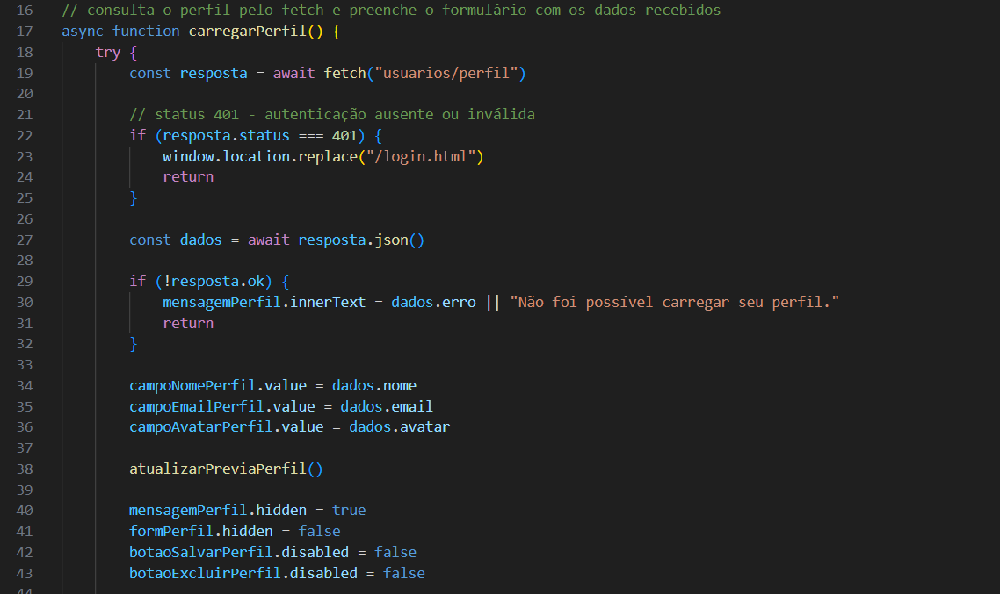

## Como o servidor identifica a conta

Em **controller/userController.js**, **buscarPerfil(req, res)** começa verificando **req.session.usuario**.

Se não houver usuário na sessão, responde com status 401.

Quando a sessão existe, a função obtém:

```js
const id = req.session.usuario.id
```

O id não é recebido de um campo do formulário. Isso evita que a página escolha outra conta apenas enviando um id diferente.

A função também configura **Cache-Control: no-store**, pedindo ao navegador que não guarde a resposta para reutilizá-la depois.

Em seguida, chama **buscarPorId**, de **model/userModel.js**.

## Como o model consulta o perfil

Em **model/userModel.js**, **buscarPorId(id, callback)** executa:

```sql
SELECT user_id, user_name, user_email, user_tipo, user_avatar
FROM tb_usuarios
WHERE user_id = ?
```

O id é enviado separadamente ao SQL.

O callback recebe o erro ou o registro encontrado. Quando não existe resultado, **usuarios[0]** será **undefined**.

Essa consulta não seleciona **user_pass**. O carregamento do perfil não precisa receber o hash da senha.

De volta a **controller/userController.js**, **buscarPerfil** responde com:

```js
return res.json({
    nome: usuario.user_name,
    email: usuario.user_email,
    avatar: usuario.user_avatar || ":D"
})
```

O script recebe apenas os dados necessários para preencher a página.

Se a conta não existir mais, o controller encerra a sessão, limpa o cookie e responde com status 401.

**Print da consulta sem o campo de senha:**

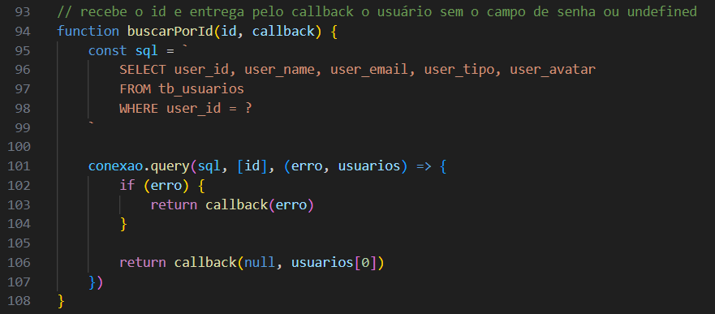

## Como a prévia do avatar é atualizada

Em **public/scripts/perfil.js**, **atualizarPreviaPerfil()** utiliza:

```js
previaAvatarPerfil.innerText = campoAvatarPerfil.value || ":D"
```

O texto digitado aparece na prévia. Se o campo estiver vazio, aparece **:D**.

A função é chamada:

- Depois de carregar os dados do perfil.
- Durante a digitação no campo de avatar.
- Depois de salvar as alterações.

**innerText** faz o valor ser apresentado como texto.

Essa função modifica a prévia da página. O avatar só é gravado quando o usuário salva o formulário e o servidor aceita a alteração.

## Como as alterações são preparadas

Em **public/scripts/perfil.js**, **salvarPerfil(evento)** recebe o envio do formulário.

A função usa **evento.preventDefault()** para impedir o envio comum do HTML. O salvamento será realizado com fetch.

Se o botão já estiver desabilitado, a função encerra a chamada.

Os dados são reunidos neste objeto:

```js
const usuario = {
    nome: campoNomePerfil.value.trim(),
    email: campoEmailPerfil.value.trim(),
    avatar: campoAvatarPerfil.value.trim() || ":D",
    senhaAtual: campoSenhaAtual.value
}
```

Nome, e-mail e avatar passam por **trim()** para remover espaços das pontas.

A senha atual não passa por essa alteração, pois precisa ser comparada conforme foi informada.

Durante o envio:

- O botão Salvar alterações fica desabilitado.
- Seu texto muda para indicar o salvamento.
- Os campos ficam com **readOnly**.
- A área de mensagens informa que a operação está em andamento.

**readOnly** impede a edição dos campos enquanto a resposta é aguardada.

**Print da preparação das alterações:**

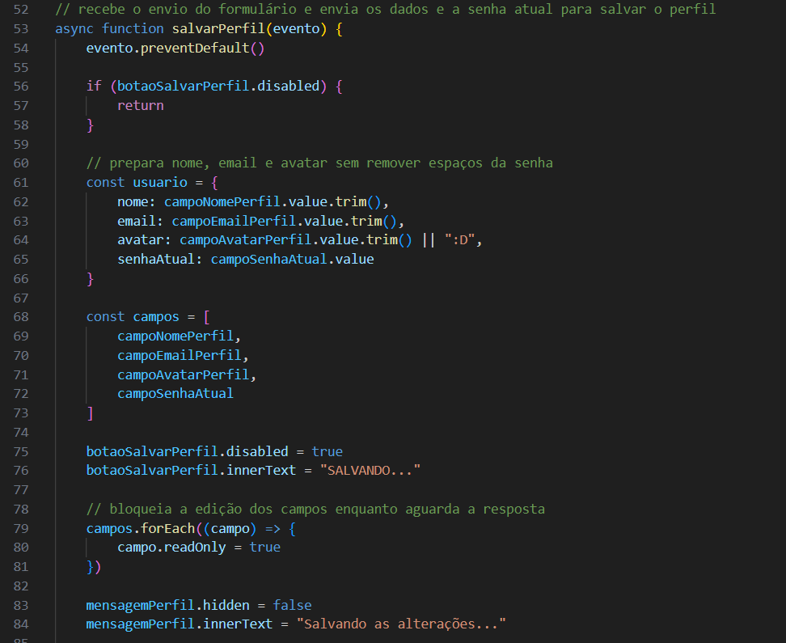

## Como as alterações são enviadas

Ainda em **public/scripts/perfil.js**, **salvarPerfil** faz a requisição:

```js
const resposta = await fetch("/usuarios/perfil", {
    method: "post",
    headers: {
        "Content-Type": "application/json"
    },
    body: JSON.stringify(usuario)
})
```

**JSON.stringify** transforma o objeto em texto JSON.

O cabeçalho **Content-Type** informa esse formato ao servidor.

A resposta será usada para mostrar a mensagem de sucesso ou de erro na própria página.

## Como o servidor verifica a edição

Em **controller/userController.js**, **atualizarPerfil(req, res)** confere:

- Se existe um usuário na sessão.
- Se o corpo foi enviado em JSON.
- Se nome, e-mail e avatar atendem às regras.
- Se a senha atual possui um formato que pode ser verificado.

Sem sessão, retorna 401. Se o formato do corpo não for aceito, retorna 415.

A identificação da conta utiliza novamente o id da sessão.

O controller cria um objeto somente com:

```js
const usuario = {
    nome: dados.nome,
    email: dados.email,
    avatar: dados.avatar
}
```

Esse objeto é enviado para **validarDadosUsuario**, de **validacoes/usuarioValidacao.js**.

As regras são as mesmas utilizadas no cadastro e estão explicadas em **DOC_CADASTRO_LOGIN.md**.

O perfil não recebe um tipo de conta para atualizar. Por essa operação, o usuário não altera **user_tipo**.

**Print das verificações iniciais da edição:**

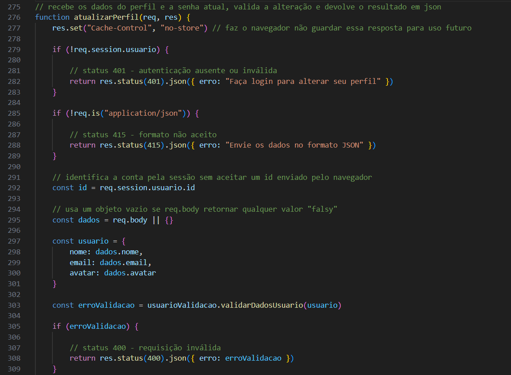

## Como a senha atual é conferida

Em **controller/userController.js**, **atualizarPerfil** exige que **senhaAtual**:

- Seja um texto.
- Não esteja vazia.
- Não ultrapasse 72 bytes em UTF-8.

Essa etapa não aplica as regras de criação de uma nova senha. Ela prepara a conferência de uma senha já cadastrada.

O controller chama **buscarSenhaPorId**, de **model/userModel.js**, que consulta **user_pass** da conta indicada.

O hash permanece no servidor. Ele não é enviado ao navegador.

Em **controller/userController.js**, a comparação utiliza:

```js
senhaCorreta = await bcrypt.compare(senhaAtual, conta.user_pass)
```

Se a comparação for falsa, a função responde com status 403.

Se a consulta ou a comparação falhar, responde com status 500. Se a conta não existir mais, responde com status 401.

**Print da comparação da senha atual:**

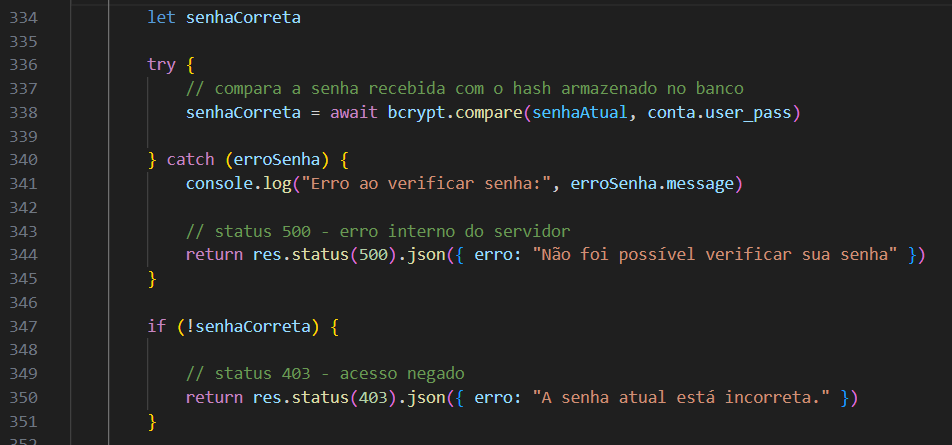

## Como a duplicidade é verificada na edição

Em **controller/userController.js**, depois de confirmar a senha, **atualizarPerfil** chama **buscarUsuarioDuplicado**, de **model/userModel.js**.

A chamada envia os dados alterados e o id da própria conta.

O model procura nome ou e-mail iguais em outros registros, ignorando esse id.

Isso permite manter o nome ou o e-mail atual sem que a conta seja considerada duplicada de si mesma.

Se outra conta já utilizar esses dados, o controller retorna 409.

O controller também trata **ER_DUP_ENTRY** caso a duplicidade seja identificada pelo banco durante a gravação.

## Como o perfil é atualizado no banco

Em **model/userModel.js**, **atualizarPerfil(id, usuario, callback)** executa:

```sql
UPDATE tb_usuarios
SET user_name = ?,
    user_email = ?,
    user_avatar = ?
WHERE user_id = ?
```

Os valores enviados são nome, e-mail, avatar e id.

O SQL não modifica a senha nem o tipo de usuário.

O resultado é devolvido pelo callback. Em **controller/userController.js**, **atualizarPerfil** verifica **resultado.affectedRows**.

Quando o resultado é 0, o código responde com status 404. As falhas de gravação são tratadas como 500, exceto a duplicidade, que recebe 409.

**Print da atualização no banco:**

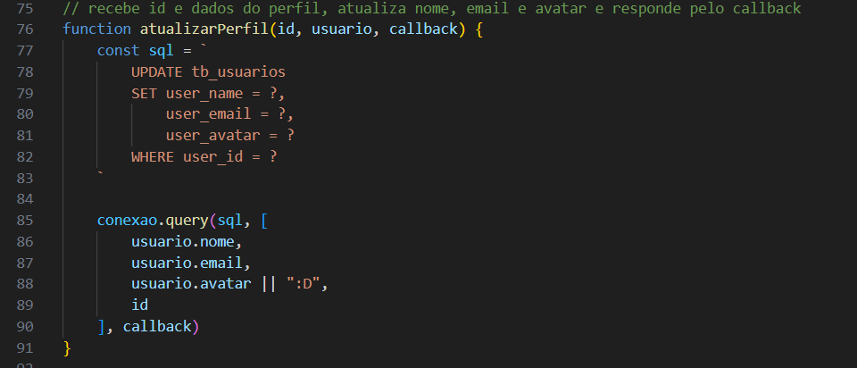

## Como a sessão e o log são atualizados

Em **controller/userController.js**, depois de salvar o perfil, **atualizarPerfil** atualiza:

```js
req.session.usuario.nome = usuario.nome
req.session.usuario.avatar = usuario.avatar
```

Em seguida, prepara o log:

```js
const log = {
    userId: id,
    acao: "Perfil atualizado pelo próprio usuário"
}
```

A gravação é realizada por **registrarLog**, de **model/logModel.js**.

Se o log falhar, o problema é registrado no terminal. A alteração do perfil já foi realizada.

Por fim, o controller responde com a mensagem **Perfil atualizado com sucesso.**

**Print da atualização da sessão e do log:**

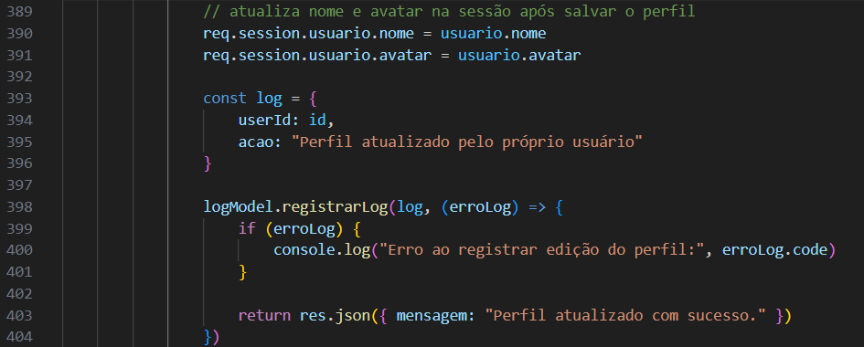

## Como a página mostra o resultado da edição

Em **public/scripts/perfil.js**, depois de receber uma resposta de sucesso, **salvarPerfil**:

- Mantém os valores ajustados nos campos.
- Limpa a senha atual.
- Atualiza a prévia do avatar.
- Mostra a mensagem recebida.
- Chama **verificarLogin()**.

A função **verificarLogin**, definida em **public/scripts/navbar-auth.js**, consulta a sessão novamente e atualiza o header.

Por isso, o novo avatar pode aparecer na navegação sem outro login.

No **finally** de **salvarPerfil**, os campos deixam de ser somente leitura e o botão volta ao estado normal.

Se houver uma falha de comunicação, a página informa que não foi possível confirmar o salvamento. A ausência de resposta não garante que o banco deixou de ser atualizado.

**Print do resultado do salvamento no script:**

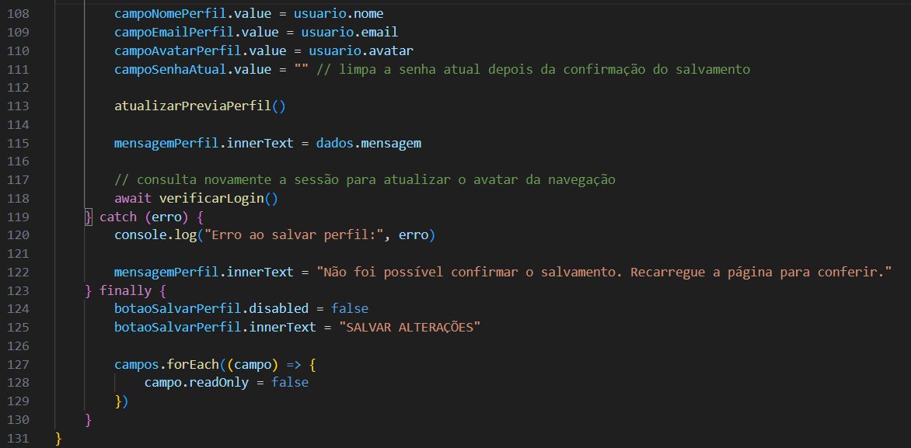

**Print do perfil atualizado:**

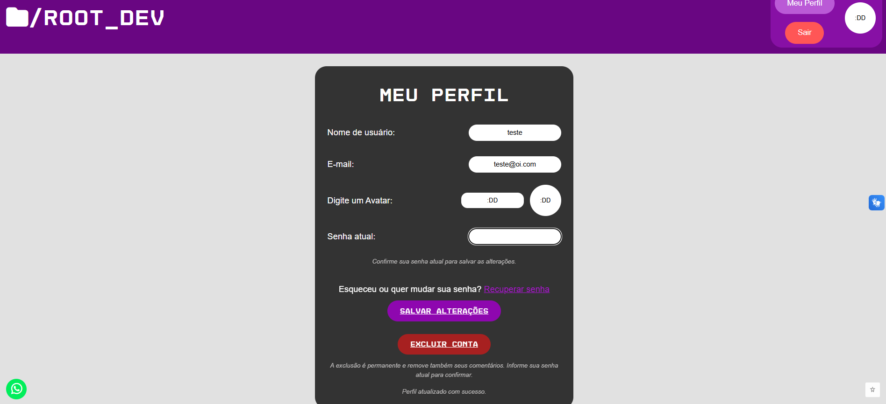

## Como a exclusão é solicitada

Em **public/scripts/perfil.js**, **excluirPerfil()** é chamada pelo botão Excluir conta.

A função começa verificando se os botões indicam alguma operação em andamento.

Depois, lê a senha atual. Se o campo estiver vazio, mostra uma mensagem, posiciona o foco nele e encerra a chamada.

Se houver senha, **window.confirm** pede confirmação para excluir a conta e seus comentários.

Cancelar essa confirmação encerra a função sem enviar a requisição.

**Print da preparação da exclusão:**

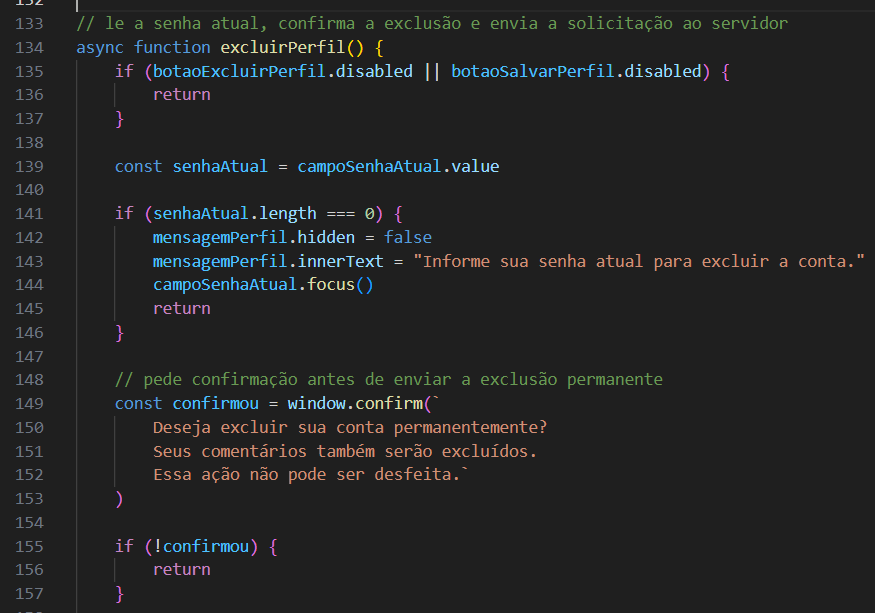

## Como a requisição de exclusão é enviada

Em **public/scripts/perfil.js**, **excluirPerfil** bloqueia os campos e os botões enquanto aguarda a resposta.

A variável **contaExcluida** começa como falsa. Ela indica se o navegador recebeu a confirmação de que a conta foi excluída.

A requisição utiliza **DELETE /usuarios/perfil** e envia somente a senha atual:

```js
body: JSON.stringify({
    senhaAtual: senhaAtual
})
```

Nenhum id de usuário é enviado para escolher a conta que será removida.

**Print do envio da exclusão:**

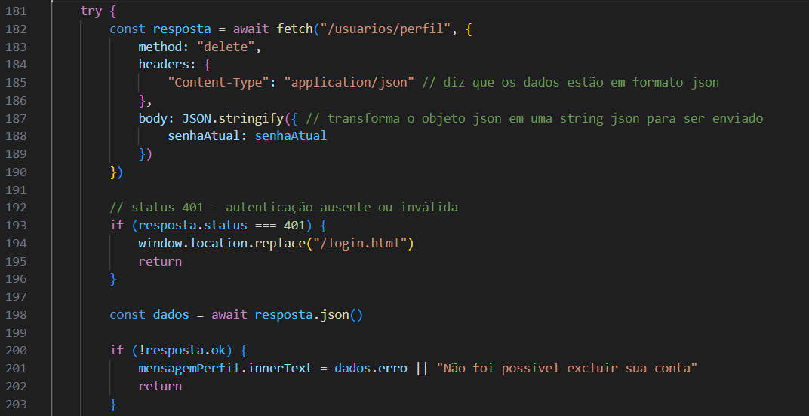

## Como o servidor autoriza a exclusão

Em **controller/userController.js**, **excluirPerfil(req, res)** verifica a sessão e o formato JSON.

Depois, obtém o id por **req.session.usuario.id** e lê **senhaAtual** do corpo.

A função verifica o tipo, o preenchimento e o limite de bytes da senha.

Em seguida, consulta o hash por **buscarSenhaPorId**, de **model/userModel.js**, e compara com **bcrypt.compare**.

- Sem sessão: 401.
- Corpo fora do formato esperado: 415.
- Senha ausente ou em formato inválido: 400.
- Senha incorreta: 403.
- Falha na consulta ou comparação: 500.

A confirmação exibida pelo navegador ajuda a evitar cliques acidentais. A autorização da operação é feita por essas verificações no servidor.

**Print da confirmação da senha para excluir:**

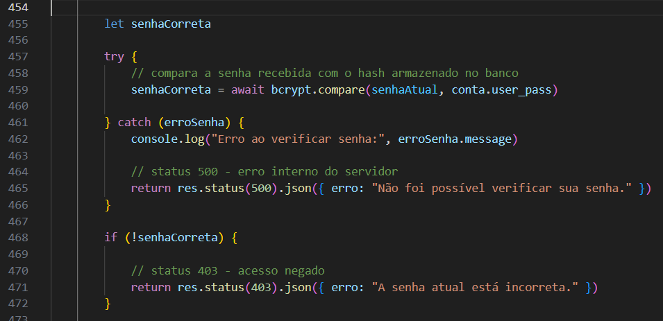

## Como a conta é removida no banco

Em **controller/userController.js**, depois de confirmar a senha, **excluirPerfil** chama **userModel.excluirUsuario(id, callback)**.

Em **model/userModel.js**, **excluirUsuario** utiliza:

```sql
DELETE FROM tb_usuarios
WHERE user_id = ?
```

O model recebe o id identificado pela sessão e devolve o resultado pelo callback.

Em **controller/userController.js**, uma falha na exclusão recebe status 500. Quando **affectedRows** é 0, a função responde com 404.

**Print da exclusão no model:**

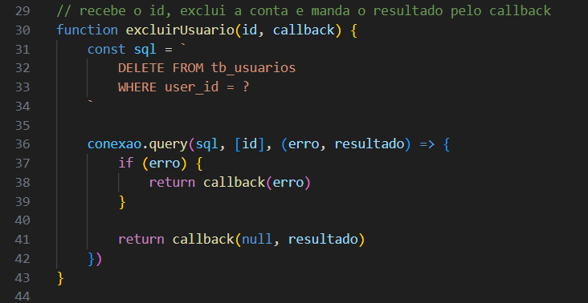

## O que acontece com os registros vinculados

Em **model/userModel.js**, **excluirUsuario** remove somente o registro de **tb_usuarios** diretamente.

O tratamento dos registros vinculados depende das regras configuradas no banco:

- **tb_comentarios:** a chave estrangeira utiliza **ON DELETE CASCADE**, removendo os comentários da conta.
- **tb_recuperacoes:** a chave estrangeira utiliza **ON DELETE CASCADE**, removendo as recuperações vinculadas.
- **tb_logs_acesso:** a chave estrangeira utiliza **ON DELETE SET NULL**, mantendo os logs e removendo o vínculo com a conta.

Essas regras precisam estar presentes no SQL e no MER utilizados para recriar o banco em outro computador.

Se os relacionamentos forem recriados sem essas configurações, a exclusão pode ser impedida por registros vinculados.

Os logs preservados continuam contendo sua descrição e data. O campo de vínculo com o usuário passa a ser **null**.

## Como a exclusão é registrada no log

Em **controller/userController.js**, depois de remover a conta, **excluirPerfil** prepara:

```js
const log = {
    userId: null,
    acao: `Conta excluída pelo próprio usuário. ID: ${id}`
}
```

**userId** recebe **null** porque o registro do usuário já foi removido. Tentar usar esse id como chave estrangeira impediria a gravação do log.

O id é mantido no texto da ação para identificar qual conta foi excluída.

A função chama **registrarLog**, de **model/logModel.js**. Se a gravação falhar, o erro é mostrado no terminal, mas a conta já foi removida.

## Como a sessão é encerrada após a exclusão

Ainda em **controller/userController.js**, **excluirPerfil** chama **req.session.destroy** e limpa o cookie **connect.sid**.

Depois, responde com a mensagem de confirmação.

Se ocorrer uma falha ao encerrar a sessão nesse trecho, o código registra o erro no terminal, limpa o cookie e ainda envia a confirmação da exclusão.

A conta removida não volta a existir por causa de uma falha na gravação do log ou no encerramento da sessão.

**Print do log e do encerramento da sessão:**

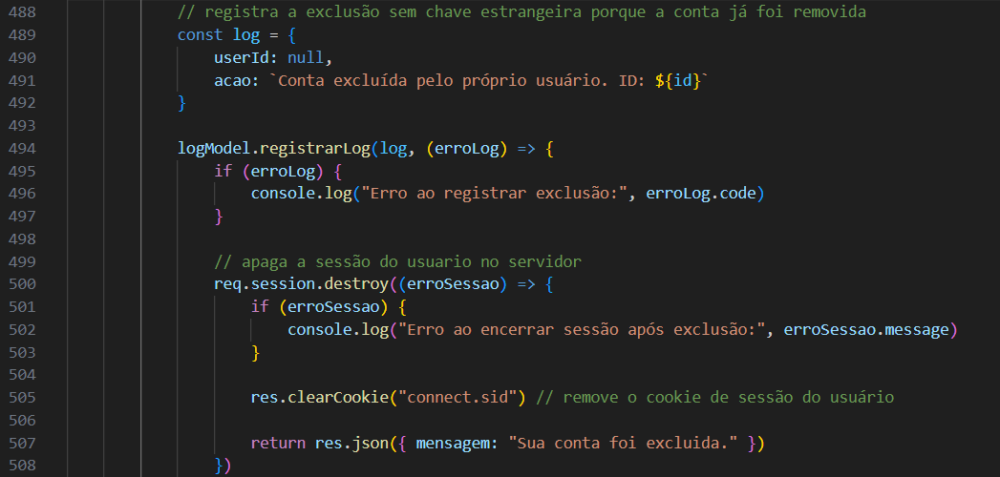

## Como a página termina a exclusão

Em **public/scripts/perfil.js**, depois de receber sucesso, **excluirPerfil**:

- Marca **contaExcluida** como verdadeira.
- Limpa o campo de senha.
- Mostra a mensagem recebida.
- Encaminha o navegador para **/** usando **window.location.replace**.

No **finally**, os controles só são liberados quando **contaExcluida** permanece falsa.

Se houver uma falha de comunicação, a página informa que não foi possível confirmar a exclusão. Nesse caso, é necessário verificar o estado da conta, pois o servidor pode ter concluído a operação antes de a resposta ser interrompida.

## Responsividade da página

Em **public/perfil.html**, o formulário reutiliza classes e estruturas das páginas de cadastro e login.

Em **public/styles/cadastro-login.css**, as regras adaptam os campos para diferentes larguras:

- Até **688 pixels**, os elementos de **.campo** ficam em coluna.
- Até **475 pixels**, a caixa recebe ajustes de espaço.
- Até **428 pixels**, a largura e os textos recebem outras adaptações.
- A partir de **430 pixels** e **900 pixels**, são aplicados limites de largura à caixa.

O header e o footer utilizam **public/styles/global.css**, explicado em **DOC_GLOBAL.md**.

**Print do perfil em tela de celular:**

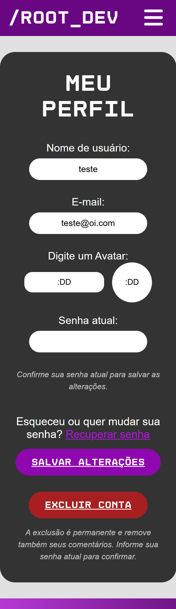

## Como manter a funcionalidade

Em **public/perfil.html** e **public/scripts/perfil.js**, mantenha os ids correspondentes. Alterar somente um deles pode impedir a busca dos elementos.

Em **validacoes/usuarioValidacao.js**, mudanças nas regras também podem afetar cadastro e edição do admin, pois a função é compartilhada.

Para adicionar outro campo editável ao perfil, considere:

- O campo em **public/perfil.html**.
- O carregamento e o envio em **public/scripts/perfil.js**.
- A leitura e a validação em **controller/userController.js**.
- A consulta e o UPDATE em **model/userModel.js**.
- O campo correspondente no banco e no MER.

O id da conta deve continuar sendo obtido pela sessão. O tipo de usuário não faz parte dos campos editáveis dessa página.

As alterações e exclusões precisam manter a integração com os logs, conforme **DOC_LOGS.md**.