# Recuperação de senha

Este documento explica como o usuário solicita um código por e-mail, confirma esse código e define uma nova senha.

Os caminhos começam na pasta principal do projeto, onde está **index.js**. As linhas indicadas para os prints consideram os arquivos comentados utilizados nesta documentação. Se o código mudar, use também o nome da função para localizar o trecho.

## Objetivo da recuperação

Em **public/password-recover.html**, a recuperação acontece na mesma página, com formulários exibidos conforme o avanço da operação.

O fluxo possui 3 etapas:

- Informar o e-mail cadastrado.
- Digitar o código recebido.
- Informar e confirmar a nova senha.

O servidor verifica o código e cria uma autorização temporária na sessão. Essa autorização permite alterar a senha da conta correspondente.

Mostrar o formulário da nova senha no navegador não autoriza a alteração por si só. A autorização precisa existir no servidor.

**Print da página inicial da recuperação:**

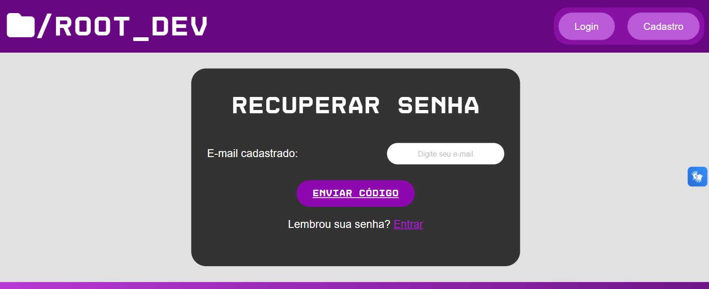

## Arquivos que participam do funcionamento

- **public/password-recover.html:** formulários das etapas e área de mensagens.
- **public/scripts/recuperacao.js:** envio dos dados e troca dos formulários visíveis.
- **routes/recuperacaoRoutes.js:** rotas e limites de tentativas.
- **controller/recuperacaoController.js:** validação do e-mail, do código e da autorização para redefinir a senha.
- **model/recuperacaoModel.js:** gravação, consulta e conclusão da recuperação.
- **model/userModel.js:** busca da conta pelo e-mail.
- **config/email.js:** configuração do Nodemailer.
- **service/emailService.js:** montagem e envio da mensagem.
- **validacoes/usuarioValidacao.js:** verificação da nova senha.
- **model/logModel.js:** registro das etapas concluídas e do resultado do envio.
- **index.js:** carregamento das configurações, sessão e encaminhamento das rotas.
- **public/styles/cadastro-login.css:** responsividade dos formulários.

## Como os formulários são organizados

Em **public/password-recover.html**, os elementos principais são:

- **form-recuperacao:** recebe o e-mail.
- **form-codigo:** recebe o código.
- **form-nova-senha:** recebe a senha e sua confirmação.
- **mensagem-recuperacao:** apresenta as mensagens.
- **recuperacao-concluida:** mostra os controles disponíveis após a conclusão.

Os formulários de código e nova senha começam escondidos com **hidden**.

Em **public/scripts/recuperacao.js**, os eventos de envio são ligados às funções:

```js
formRecuperacao.addEventListener("submit", solicitarCodigo)
formCodigo.addEventListener("submit", verificarCodigoInformado)
formNovaSenha.addEventListener("submit", salvarNovaSenha)
```

Cada função utiliza **preventDefault()** para impedir o envio comum do HTML. As requisições são feitas com fetch.

**Print dos eventos dos formulários:**

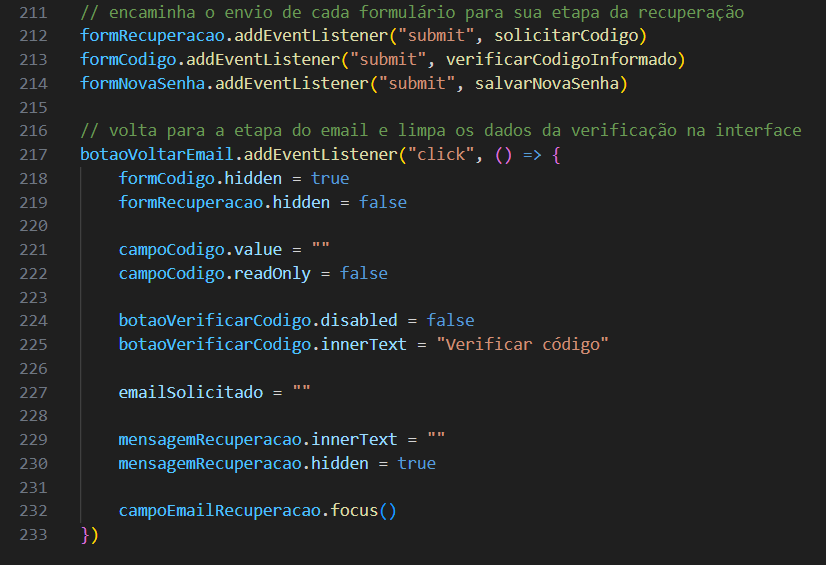

## Como o envio de e-mail é configurado

Em **index.js**, **dotenv.config()** carrega as configurações antes dos módulos que dependem delas.

Em **config/email.js**, o Nodemailer é configurado com:

```js
const email = nodemailer.createTransport({
    service: "gmail",
    auth: {
        user: process.env.SMTP_USER,
        pass: process.env.SMTP_PASS,
    }
})
```

- **SMTP_USER:** conta utilizada para enviar as mensagens.
- **SMTP_PASS:** senha de app da conta de envio.
- **service: "gmail":** identifica o serviço utilizado.

O objeto criado é exportado para ser usado por **service/emailService.js**.

O arquivo **.env** fornecido com o projeto contém as credenciais da conta criada para enviar os e-mails de recuperação. O professor não precisa criar outra conta nem gerar uma senha de app para utilizar essa configuração.

Em **config/email.js**, o servidor lê esses valores por **process.env.SMTP_USER** e **process.env.SMTP_PASS**.

As instruções para executar o projeto estão no **README.md**.

**Print da configuração do Nodemailer:**

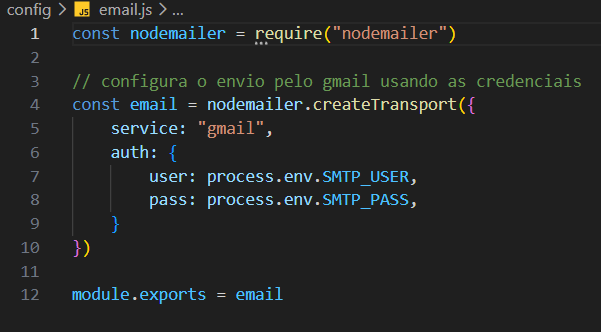

## Como as rotas são organizadas

Em **index.js**, o grupo de recuperação é ligado ao início **/recuperacao**.

Em **routes/recuperacaoRoutes.js**, as operações são:

- **POST /recuperacao/solicitar:** recebe o e-mail e inicia a solicitação.
- **POST /recuperacao/verificar:** recebe o e-mail e o código.
- **POST /recuperacao/redefinir:** recebe a nova senha e sua confirmação.

Cada rota possui limitadores antes da função do controller.

**Print das rotas de recuperação:**

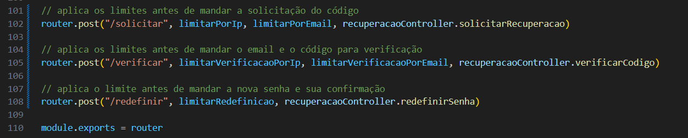

## Como os limites de tentativas funcionam

Em **routes/recuperacaoRoutes.js**, os limites são separados por operação.

Para solicitar códigos:

- **limitarPorIp:** 10 tentativas por IP em 15 minutos.
- **limitarPorEmail:** 3 tentativas por e-mail em 15 minutos.

Para verificar códigos:

- **limitarVerificacaoPorIp:** 20 tentativas por IP em 15 minutos.
- **limitarVerificacaoPorEmail:** 5 tentativas por e-mail em 15 minutos.

Para definir a nova senha:

- **limitarRedefinicao:** 10 tentativas por IP em 15 minutos.

Quando um limite é atingido, a biblioteca responde com status 429 antes de executar o controller correspondente.

A contagem considera tentativas, não apenas operações concluídas.

Nos limites por e-mail, **keyGenerator** utiliza:

```js
return req.body.email.trim().toLowerCase()
```

Isso mantém a mesma identificação na contagem mesmo quando o e-mail é enviado com espaços nas pontas ou diferenças entre letras maiúsculas e minúsculas.

A opção **skip** evita usar um e-mail ausente ou inadequado como identificador dessa contagem. A validação do controller continua responsável por recusar os dados inválidos.

**Print do limitador por e-mail:**

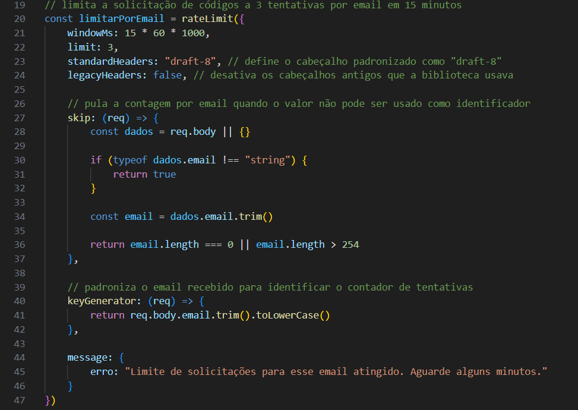

## Como o e-mail é enviado pelo formulário

Em **public/scripts/recuperacao.js**, **solicitarCodigo(evento)** recebe o envio do formulário inicial.

A função lê o e-mail com **trim()**, desabilita o botão e deixa o campo como somente leitura durante a consulta.

Depois, envia **POST /recuperacao/solicitar** com o corpo:

```js
body: JSON.stringify({ email: email })
```

O cabeçalho informa **application/json**.

Ao receber uma resposta de sucesso, a função:

- Guarda o e-mail em **emailSolicitado**.
- Esconde o formulário inicial.
- Mostra o formulário de código.
- Limpa o campo de código.
- Posiciona o foco nesse campo.

**emailSolicitado** fica na memória do script da página. Ele permite enviar o mesmo e-mail na etapa seguinte.

**Print da solicitação no navegador:**

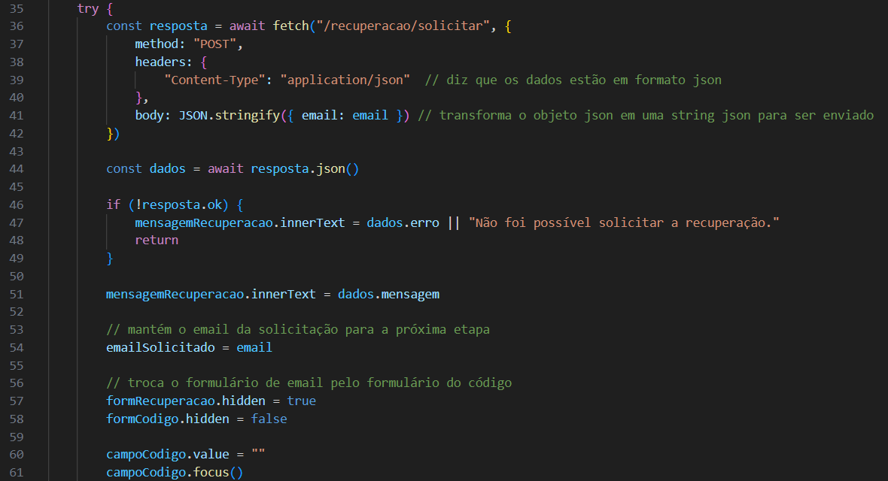

## Como o servidor valida a solicitação

Em **controller/recuperacaoController.js**, **solicitarRecuperacao(req, res)** lê o corpo da requisição.

A função verifica se o e-mail:

- É um texto.
- Possui um formato básico aceito pela expressão utilizada.
- Tem no máximo 254 caracteres depois de **trim()**.

Dados inválidos recebem status 400.

Quando o formato é aceito, o controller prepara um código:

```js
const codigo = crypto.randomBytes(4).toString("hex").toUpperCase()
```

**randomBytes(4)** gera 4 bytes aleatórios.

**toString("hex")** representa esses bytes com 8 caracteres, utilizando números e letras de **A** até **F**.

**toUpperCase()** mantém as letras em maiúsculas.

## Por que a solicitação recebe uma resposta genérica

Em **controller/recuperacaoController.js**, **solicitarRecuperacao** responde com status 202 antes de concluir a busca da conta e o envio do e-mail.

A mensagem informa que, se o e-mail estiver cadastrado, serão enviadas as instruções.

Depois dessa resposta, o código continua a consulta com **buscarPorEmail**, de **model/userModel.js**.

- Se houver erro, registra a falha no terminal e interrompe o processamento.
- Se a conta não existir, encerra o processamento.
- Se a conta existir, cria a recuperação e tenta enviar a mensagem.

A resposta não informa diretamente se aquele e-mail pertence a uma conta.

O status 202 significa que a solicitação foi aceita para processamento. Ele não confirma a entrega da mensagem.

Como a resposta já foi enviada, falhas posteriores no banco ou no envio não são devolvidas nessa mesma requisição ao navegador.

**Print da geração do código e da resposta inicial:**

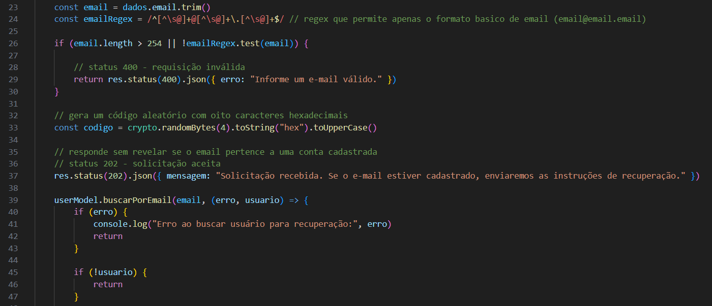

## Como a recuperação é salva

Em **controller/recuperacaoController.js**, depois de encontrar a conta, **solicitarRecuperacao** envia o id do usuário e o código para **criarRecuperacao**, de **model/recuperacaoModel.js**.

O model gera o hash do código:

```js
const codigoHash = await bcrypt.hash(recuperacao.codigo, 10)
```

O código original será enviado por e-mail. O banco armazena seu hash.

A consulta utiliza:

```sql
INSERT INTO tb_recuperacoes
    (tb_usuarios_user_id, rec_codigo, rec_expiracao)
VALUES (?, ?, DATE_ADD(NOW(), INTERVAL 10 MINUTE))
```

O banco calcula a expiração como 10 minutos depois do momento da gravação.

Os campos envolvidos são:

- **rec_id:** id da recuperação.
- **tb_usuarios_user_id:** conta vinculada.
- **rec_codigo:** hash do código.
- **rec_expiracao:** prazo de validade.
- **rec_usado:** indicação de uso, iniciada com 0 pelo banco.

Como **rec_codigo** guarda o hash, seu tamanho no banco é **varchar(255)**, mesmo que o código recebido por e-mail tenha 8 caracteres.

**Print da gravação da recuperação:**

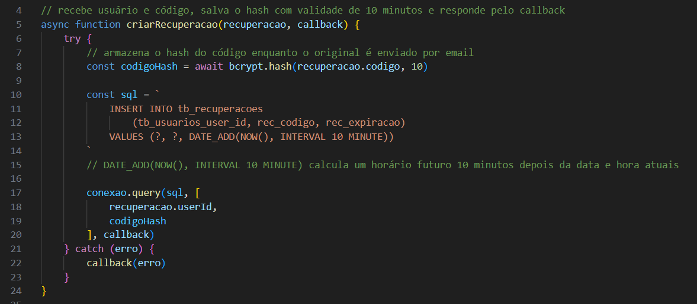

## Como a mensagem é montada

Em **service/emailService.js**, **enviarCodigoRecuperacao(destinatario, codigo, callback)** recebe:

- O e-mail da conta encontrada.
- O código original.
- O callback que receberá o resultado do envio.

A função monta o remetente, o destinatário, o assunto e o texto da mensagem.

O remetente utiliza **SMTP_USER**, e o conteúdo inclui o código e a informação de validade.

Depois, executa:

```js
email.sendMail(mensagem, callback)
```

O objeto **email** vem de **config/email.js**.

O callback informa o resultado da tentativa de envio. Ele não confirma que o destinatário abriu a mensagem.

**Print da montagem do e-mail:**

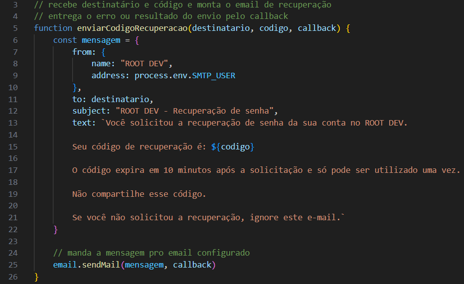

## Como o resultado do envio é registrado

Em **controller/recuperacaoController.js**, **solicitarRecuperacao** registra uma ação conforme o resultado do serviço de e-mail.

A descrição indica:

- Código encaminhado ao serviço de e-mail.
- Falha no envio do código.

O vínculo do log utiliza o id da conta encontrada.

A recuperação é salva antes da tentativa de envio. Uma falha no e-mail não remove automaticamente esse registro do banco.

**Print do resultado do envio nos logs:**

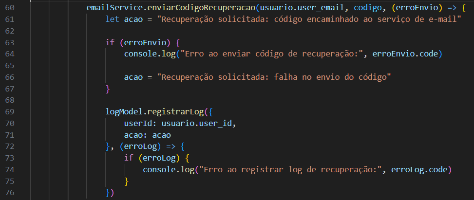

## Como o código informado é enviado

Em **public/scripts/recuperacao.js**, **verificarCodigoInformado(evento)** recebe o envio do formulário de código.

A função verifica se **emailSolicitado** está preenchido, lê o código e aplica **trim().toUpperCase()**.

Depois, bloqueia os controles durante a operação e envia **POST /recuperacao/verificar** com:

```js
body: JSON.stringify({
    email: emailSolicitado,
    codigo: codigo
})
```

O servidor recebe o código junto com o e-mail utilizado na solicitação.

**Print do envio do código:**

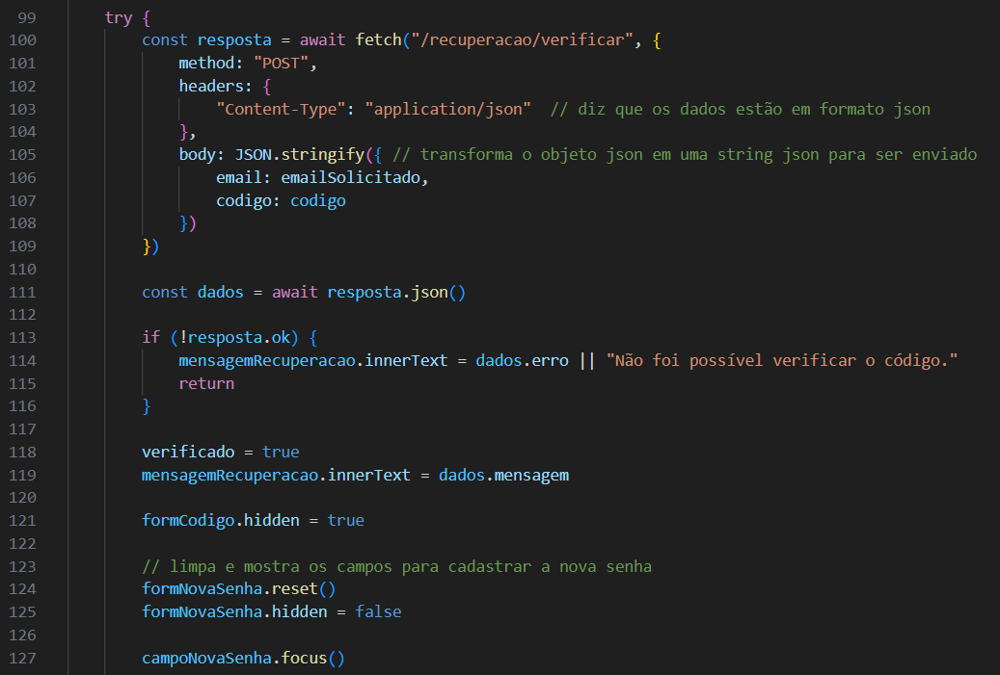

**Print da etapa de código:**

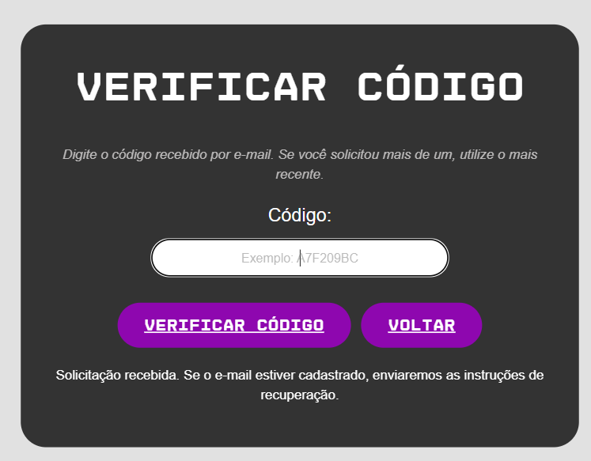

## Como o controller verifica o formato do código

Em **controller/recuperacaoController.js**, **verificarCodigo(req, res)** começa removendo uma autorização anterior de recuperação da sessão:

```js
delete req.session.recuperacao
```

Depois, verifica se e-mail e código são textos.

O código passa por **trim().toUpperCase()** e precisa corresponder a:

```js
/^[A-F0-9]{8}$/
```

A expressão exige exatamente 8 caracteres, utilizando **A** até **F** ou **0** até **9**.

Embora o campo HTML aceite um preenchimento inicial a partir de 6 caracteres, o controller exige 8. A regra efetiva para aceitar o código está no servidor.

Dados recusados recebem status 400 com a mensagem de código inválido ou expirado.

## Como a recuperação mais recente é localizada

Em **controller/recuperacaoController.js**, **verificarCodigo** busca a conta pelo e-mail.

Depois, chama **buscarUltimaRecuperacao**, de **model/recuperacaoModel.js**.

A consulta utiliza:

```sql
WHERE tb_usuarios_user_id = ?
ORDER BY rec_id DESC
LIMIT 1
```

O maior **rec_id** identifica o registro mais recente daquela conta.

O callback devolve esse registro ou **undefined**, caso não exista recuperação.

A função não procura um código antigo ainda válido. Ela considera somente a recuperação mais recente.

Depois que outra recuperação é gravada para a mesma conta, o código anterior deixa de ser aceito por esse fluxo.

**Print da busca da recuperação mais recente:**

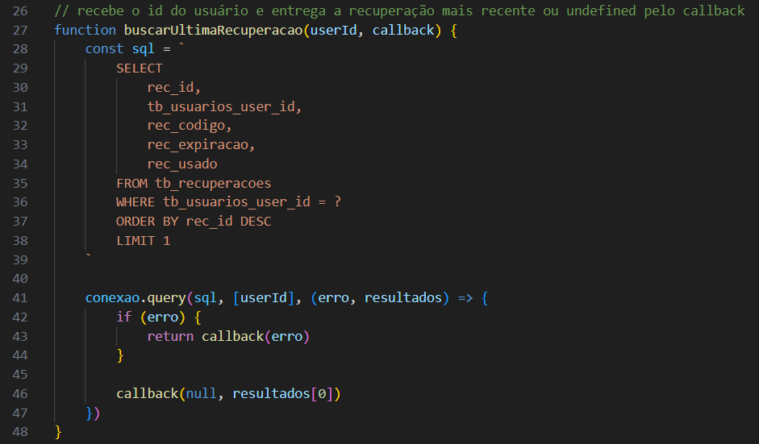

## Como o uso e a expiração são conferidos

Em **controller/recuperacaoController.js**, **verificarCodigo** recusa a recuperação quando ela não existe ou quando **rec_usado** é diferente de 0.

A expiração é convertida para um valor de tempo:

```js
const expiracao = new Date(recuperacao.rec_expiracao).getTime()
```

A função verifica se o resultado é finito e se ainda está no futuro em relação a **Date.now()**.

Depois, compara o código informado com o hash:

```js
bcrypt.compare(codigo, recuperacao.rec_codigo, (erro, codigoCorreto) => {
```

Se o código não corresponder ao hash, a verificação é recusada.

A expiração é conferida novamente depois da comparação, pois essa operação também consome tempo.

**Print da verificação do prazo e do código:**

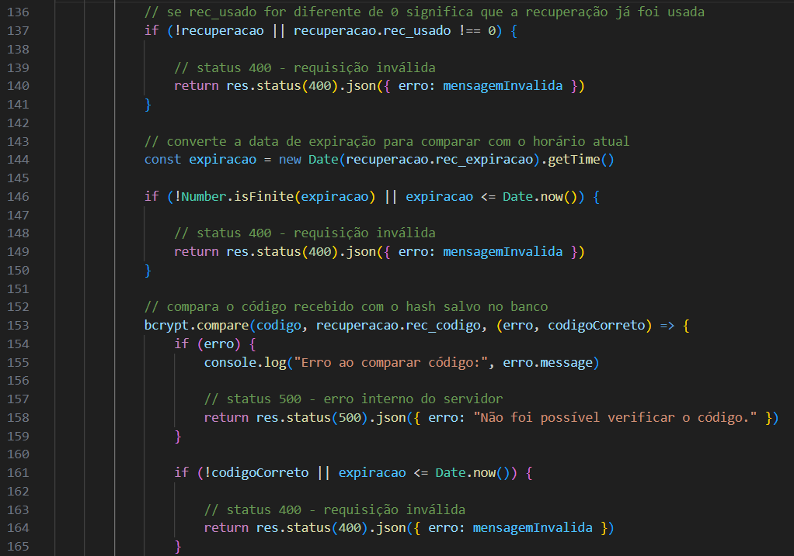

## Como a autorização de recuperação é criada

Em **controller/recuperacaoController.js**, quando o código é aceito, **verificarCodigo** chama **req.session.regenerate**.

Essa operação cria uma nova sessão para a continuação da recuperação.

Depois, a função guarda:

```js
req.session.recuperacao = {
    recId: recuperacao.rec_id,
    userId: usuario.user_id,
    email: usuario.user_email,
    expiracao: expiracao
}
```

Esses valores identificam a recuperação autorizada e seu prazo.

O código original não é guardado nesse objeto.

A função chama **req.session.save** e aguarda o resultado antes de confirmar a verificação.

Se a sessão não puder ser salva, remove a autorização e responde com status 500.

A nova sessão não recebe **req.session.usuario** nesse fluxo. Validar o código não realiza o login comum da conta.

**Print da autorização na sessão:**

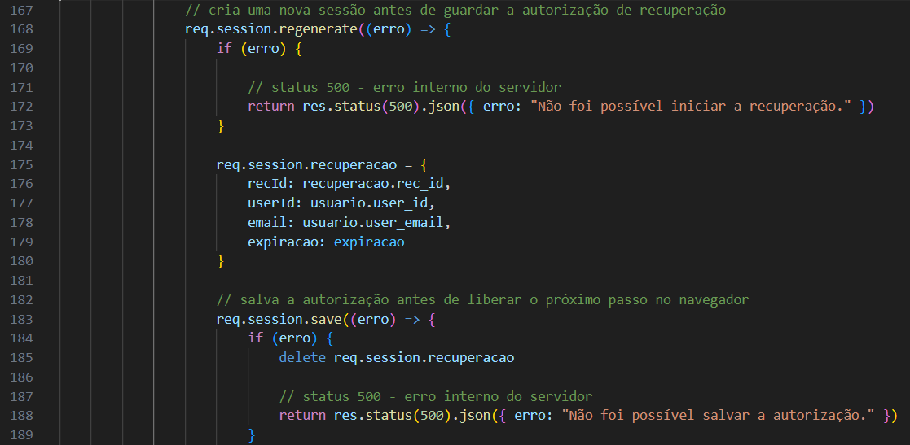

## Como o formulário de nova senha aparece

Em **controller/recuperacaoController.js**, depois de salvar a autorização, **verificarCodigo** registra **Código de recuperação validado** e envia a mensagem de sucesso.

Em **public/scripts/recuperacao.js**, **verificarCodigoInformado** recebe essa resposta e:

- Marca **verificado** como verdadeiro.
- Esconde o formulário de código.
- Limpa o formulário de nova senha com **reset()**.
- Mostra esse formulário.
- Posiciona o foco no campo da nova senha.

O código ainda não é marcado como usado nessa etapa. Ele será consumido quando a alteração da senha for concluída no banco.

O prazo também não é reiniciado. A autorização mantém a expiração da recuperação original.

**Print da etapa de nova senha:**

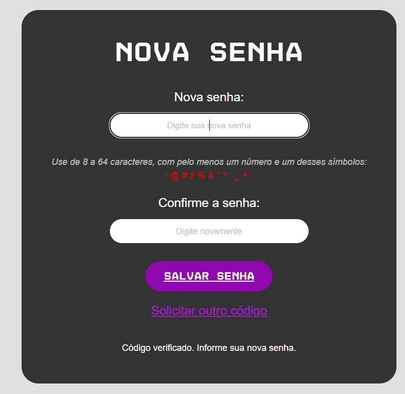

## Como a nova senha é enviada

Em **public/scripts/recuperacao.js**, **salvarNovaSenha(evento)** recebe o envio do formulário.

A função lê a senha e sua confirmação sem aplicar **trim()**.

Antes de enviar, verifica se os valores são iguais. Quando são diferentes, mostra uma mensagem e encerra a chamada.

Durante a operação, bloqueia os campos e o botão.

O envio utiliza **POST /recuperacao/redefinir** com:

```js
body: JSON.stringify({
    senha: senha,
    confirmarSenha: confirmarSenha
})
```

O navegador não envia o id do usuário nem o id da recuperação nessa etapa. Esses dados vêm da autorização guardada na sessão.

**Print do envio da nova senha:**

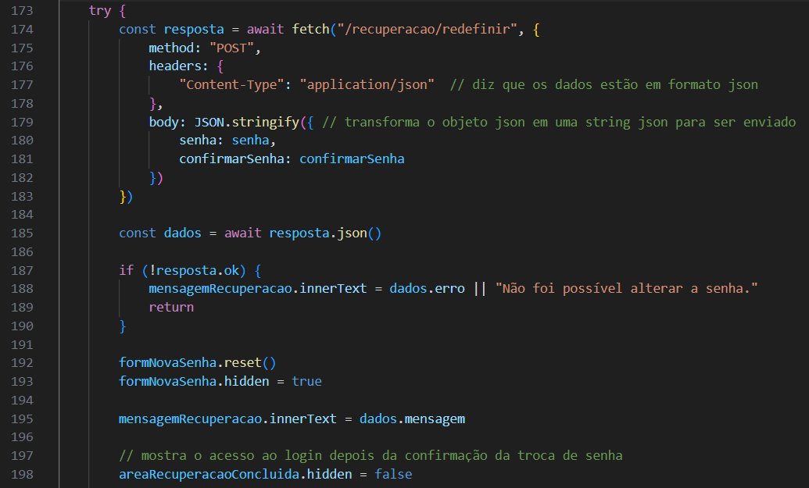

## Como o servidor autoriza a alteração da senha

Em **controller/recuperacaoController.js**, **redefinirSenha(req, res)** exige corpo em JSON.

Se o formato não for aceito, responde com status 415.

Depois, obtém:

```js
const recuperacao = req.session.recuperacao
```

A função verifica se a autorização existe, se o prazo é um valor válido e se ainda não expirou.

Se a autorização for recusada, ela é removida e a resposta recebe status 401.

A nova senha e sua confirmação passam por **validarSenha**, de **validacoes/usuarioValidacao.js**.

São as mesmas regras utilizadas no cadastro, incluindo tamanho, número, símbolo aceito, limite de bytes e igualdade da confirmação.

Os detalhes dessa validação estão em **DOC_CADASTRO_LOGIN.md**.

**Print da autorização para redefinir a senha:**

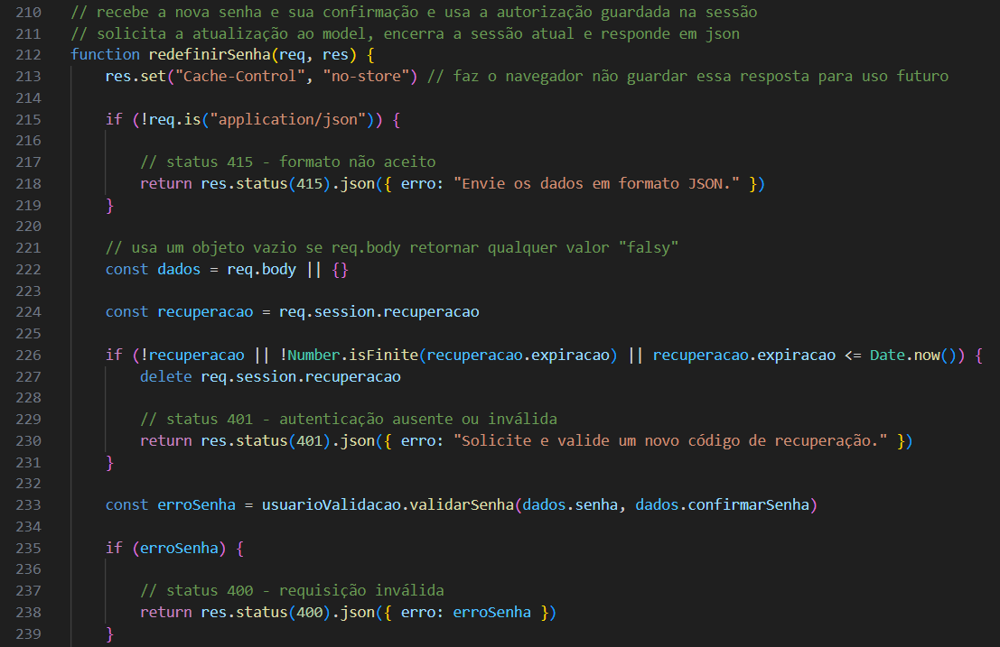

## Como a alteração é preparada no model

Em **model/recuperacaoModel.js**, **concluirRecuperacao(recuperacao, novaSenha, callback)** recebe a autorização e a senha escolhida.

A função cria o hash da nova senha:

```js
const senhaHash = await bcrypt.hash(novaSenha, 10)
```

Depois, prepara uma consulta que atualiza a senha e marca a recuperação como usada na mesma instrução.

A consulta relaciona **tb_usuarios** com **tb_recuperacoes** e utiliza os nomes **usuario** e **recuperacao** para identificar essas tabelas dentro do SQL.

## Como o SQL impede o uso de uma recuperação antiga

Ainda em **model/recuperacaoModel.js**, **concluirRecuperacao** procura uma recuperação com id maior:

```sql
LEFT JOIN tb_recuperacoes AS mais_recente
    ON mais_recente.tb_usuarios_user_id = usuario.user_id
    AND mais_recente.rec_id > recuperacao.rec_id
```

Se existir outra recuperação mais recente, esse relacionamento encontra o registro.

A condição **mais_recente.rec_id IS NULL** exige que nenhuma recuperação posterior tenha sido encontrada.

Assim, uma autorização criada antes de uma nova solicitação não é suficiente para concluir a alteração com um registro antigo.

## Quais condições precisam ser atendidas no UPDATE

Em **model/recuperacaoModel.js**, **concluirRecuperacao** exige:

- O id correto do usuário.
- O mesmo e-mail guardado na autorização.
- O id correto da recuperação.
- **rec_usado** igual a 0.
- **rec_expiracao** maior que **NOW()**.
- Ausência de uma recuperação mais recente.

Quando as condições são atendidas, o SQL modifica:

```sql
SET
    usuario.user_pass = ?,
    recuperacao.rec_usado = 1
```

A senha é gravada como hash, e a recuperação passa a estar usada.

Essa conferência no banco é necessária porque o estado pode mudar depois da validação do código. O prazo pode terminar ou outra recuperação pode ser criada antes do salvamento.

**Print da atualização da senha e do uso do código:**

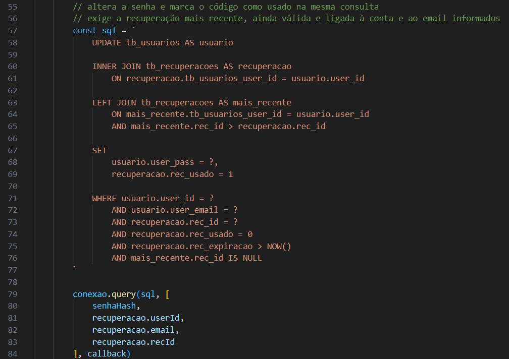

## Como o resultado da alteração é interpretado

Em **controller/recuperacaoController.js**, **redefinirSenha** recebe o resultado pelo callback.

Se ocorrer uma falha na consulta, responde com status 500.

Se **resultado.affectedRows** for 0, as condições necessárias não foram atendidas. A função remove a autorização e responde com status 409, solicitando outro código.

O código verifica se o resultado é 0. Ele não exige que o valor seja exatamente 1, pois a consulta altera dados de usuário e recuperação.

Quando a operação funciona, registra **Senha redefinida por recuperação de e-mail** por **model/logModel.js**.

## Como a recuperação é encerrada

Em **controller/recuperacaoController.js**, depois do sucesso, **redefinirSenha** remove **req.session.recuperacao**, encerra a sessão atual e limpa o cookie **connect.sid**.

A resposta orienta entrar com a nova senha.

Em **public/scripts/recuperacao.js**, **salvarNovaSenha**:

- Limpa os campos com **reset()**.
- Esconde o formulário de nova senha.
- Mostra a mensagem recebida.
- Exibe a área **recuperacao-concluida**.

O sistema não realiza login automático após a redefinição.

Esse trecho encerra a sessão utilizada na recuperação. Ele não percorre nem encerra automaticamente outras sessões da conta em outros navegadores.

**Print do encerramento da recuperação:**

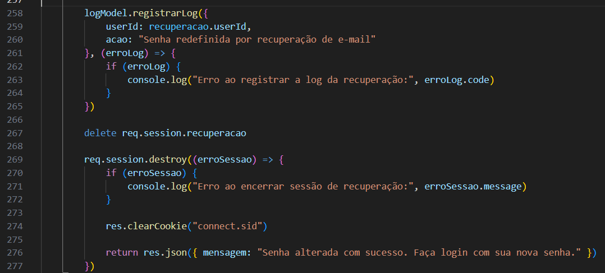

**Print da recuperação concluída:**

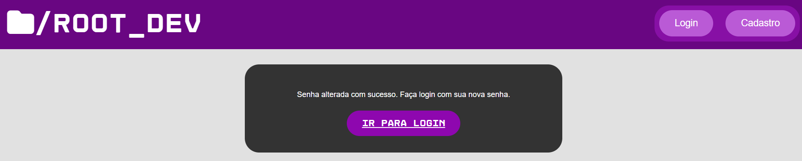

## Como o botão Voltar funciona

Em **public/scripts/recuperacao.js**, o evento de **botaoVoltarEmail**:

- Esconde o formulário de código.
- Mostra o formulário de e-mail.
- Limpa o código digitado.
- Libera os controles de verificação.
- Limpa **emailSolicitado**.
- Limpa e esconde a mensagem.
- Posiciona o foco no campo de e-mail.

Essa ação altera a interface. Ela não exclui os registros de recuperação que já foram gravados no banco.

Se a página for recarregada, as variáveis do script também são reiniciadas. O código atual não possui uma consulta para restaurar automaticamente a etapa que estava aberta.

## Responsividade da recuperação

Em **public/password-recover.html**, os formulários utilizam as estruturas compartilhadas de cadastro e login.

Em **public/styles/cadastro-login.css**, as regras ajustam a largura da caixa, o tamanho dos textos e a organização dos campos.

Até 688 pixels, os elementos de **.campo** são organizados em coluna. Outros limites ajustam o formulário em telas menores.

O header e o footer utilizam **public/styles/global.css**, explicado em **DOC_GLOBAL.md**.

**Print da recuperação em tela de celular:**


## Como manter o funcionamento

Em **config/email.js**, o Nodemailer utiliza as credenciais fornecidas no arquivo **.env**. Ao copiar o projeto para outro computador, mantenha esse arquivo na pasta de **index.js**, preservando os nomes **SMTP_USER** e **SMTP_PASS**.

Se a conta de envio ou sua senha de app mudar, atualize os valores no **.env** e reinicie o servidor.

Em **model/recuperacaoModel.js**, o prazo é definido no INSERT. Se ele mudar, atualize também o texto de **service/emailService.js** e a documentação.

Se o formato do código mudar, mantenha correspondência entre:

- A geração em **controller/recuperacaoController.js**.
- A expressão de validação nesse controller.
- Os limites do campo em **public/password-recover.html**.
- As orientações da página e do e-mail.

O banco deve continuar armazenando o hash em **rec_codigo**.

As verificações de uso, expiração e recuperação mais recente precisam permanecer na conclusão da operação, mesmo que o código já tenha sido aceito na etapa anterior.

## Principais respostas da recuperação

Em **controller/recuperacaoController.js** e **routes/recuperacaoRoutes.js**, os principais resultados são:

- **202:** solicitação aceita para processamento.
- **400:** e-mail, código ou nova senha recusados pelas validações.
- **401:** autorização de recuperação ausente ou expirada.
- **409:** recuperação indisponível no momento da atualização.
- **415:** formato do corpo não aceito na redefinição.
- **429:** limite de tentativas atingido.
- **500:** falha interna na verificação ou na alteração.
- **200:** código validado ou senha alterada, conforme a etapa.

Falhas ocorridas depois da resposta 202 aparecem no terminal e, quando o fluxo chega ao registro correspondente, nos logs do sistema.