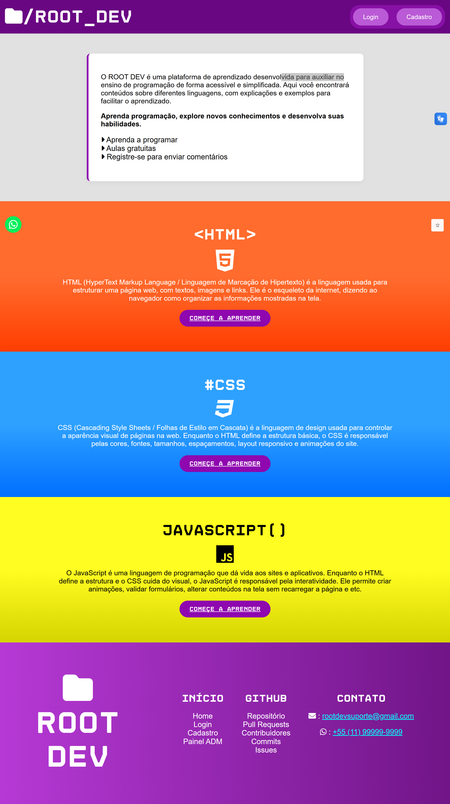
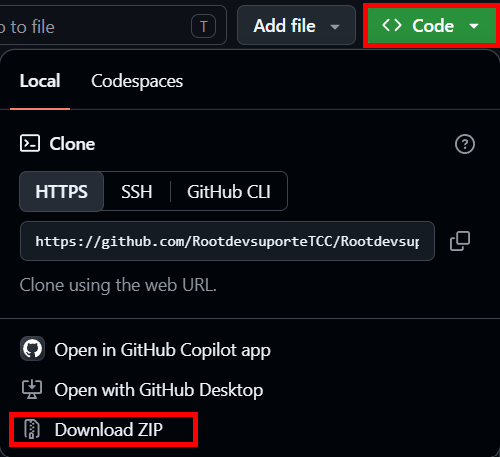
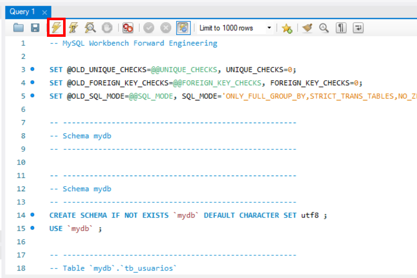
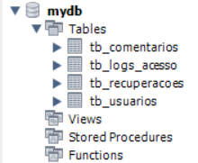
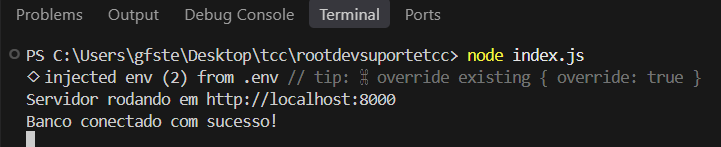
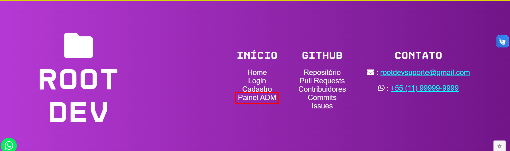
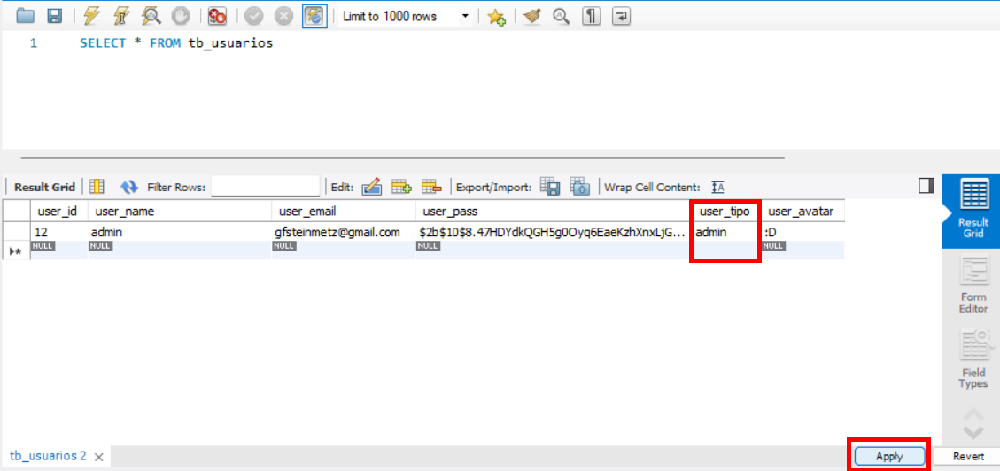
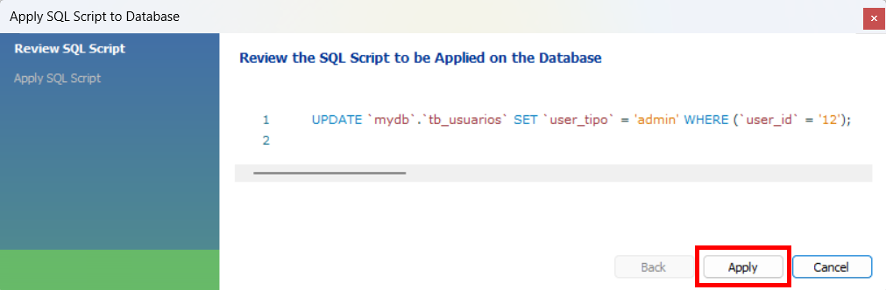

# ROOT DEV

O ROOT DEV é uma plataforma de conteúdos didáticos sobre HTML, CSS e JavaScript, desenvolvida como projeto do TCC do curso de Desenvolvimento de Sistemas. As aulas ficam em arquivos Markdown, os dados dos usuários e suas interações são armazenados no MySQL.

**Página inicial:**



## Funcionalidades

- Cadastro, login, edição e exclusão de perfil.
- Recuperação de senha por e-mail.
- Aulas organizadas por categorias e tópicos.
- Pesquisa de conteúdos.
- Publicação, consulta e exclusão de comentários.
- Página do admin com pesquisa e paginação de usuários, comentários e logs.
- Registro de logs do sistema.
- Responsividade e bibliotecas de acessibilidade.

O projeto funciona da forma correta em navegadores baseados em Chromium, como Chrome e Edge.

## Tecnologias e bibliotecas

- **HTML, CSS e JavaScript:** interface e interações.
- **Node.js e Express:** servidor e rotas.
- **MySQL e mysql2:** armazenamento e acesso ao banco.
- **bcrypt:** hash de senhas e códigos de recuperação.
- **express-session:** sessões dos usuários.
- **express-rate-limit:** limitação de requisições.
- **Nodemailer e Gmail:** envio de e-mails.
- **dotenv:** leitura das configurações do arquivo **.env**.
- **Markdown, Marked e DOMPurify:** escrita, conversão e filtragem das aulas.
- **Font Awesome:** ícones.
- **VLibras e @pigmilcom/a11y:** recursos de acessibilidade.

## Estrutura MVC

O projeto utiliza a estrutura MVC:

- **Model:** fazem as consultas no banco.
- **View:** páginas e recursos da interface nas pastas public e private.
- **Controller:**, recebe as solicitações, verifica os dados e organiza as respostas.

A pasta routes encaminha as requisições para os controllers. As aulas ficam em content, e a documentação do código fica em Doc.

## Programas necessários

- Node.js
- MySQL Workbench
- Navegador baseado em chromium

## Instalação

### Baixando o projeto

No repositório, clique no botão verde "Code", depois Download ZIP, baixe e extraia o arquivo.



A pasta principal é a que tem o arquivo **index.js**.

### Preparando o banco

1. Abra o MySQL Workbench e abra alguma conexão.
2. Copie o código do arquivo "comandoSQL.sql"
3. Cole o código no workbench e execute



O arquivo **MER tcc.mwb** contém o modelo do banco e pode ser aberto no Workbench para visualizar os relacionamentos.

Em **config/database.js**, configure **host**, **port**, **user**, **password** e **database** conforme o MySQL do seu computador.

**Print do banco:**



### Dependências e e-mail

A pasta **node_modules** já vem com as bibliotecas instaladas. Se estiver faltando ou for necessário reinstalar as dependências, execute:

```
npm install
```

O arquivo **.env** tem as configurações da conta criada para enviar os e-mails do projeto. Não é necessário criar outra conta para utilizar as credenciais.

O envio de e-mails e os recursos carregados por links externos precisam de internet.

## Iniciando o servidor

Abra um terminal na pasta principal do projeto (onde tem o arquivo **index.js**), pode ser via CMD, PowerShell ou pelo terminal do VS Code.

Execute:

```
node index.js
```

Mantenha o terminal aberto e acesse:

http://localhost:8000

Para fechar o servidor, pressione **Ctrl + C** no terminal. O site deve ser aberto por esse link, abrir o HTML direto ou pelo Live Server não se conecta ao back-end.

**Print do servidor:**



## Criando o 1º admin

1. Cadastre uma conta pelo site.
2. No MySQL Workbench, selecione o banco do projeto.
3. Execute:

```sql
SELECT * FROM tb_usuarios;
```

4. No resultado, encontre a conta cadastrada.
5. De 2 cliques no bloco de **user_tipo** dessa conta e substitua **usuario** por **admin**.
6. Clique em **Apply**.
7. Confira o comando e clique em **Apply**. Depois em **Finish**.

O cadastro continuará utilizando o mesmo e-mail e senha.

Abra a página de login do admin:



**Print da alteração do tipo:**



**Print da confirmação:**



## Documentação

A pasta **Doc** explica os códigos e os fluxos de cadastro, login, perfil, conteúdos, comentários, admin, logs, recuperação de senha e banco de dados.

As instruções para adicionar aulas estão em **DOC_CONTEUDOS.md**. Após alterar as aulas, reinicie o servidor para atualizar o cache utilizado pela pesquisa.